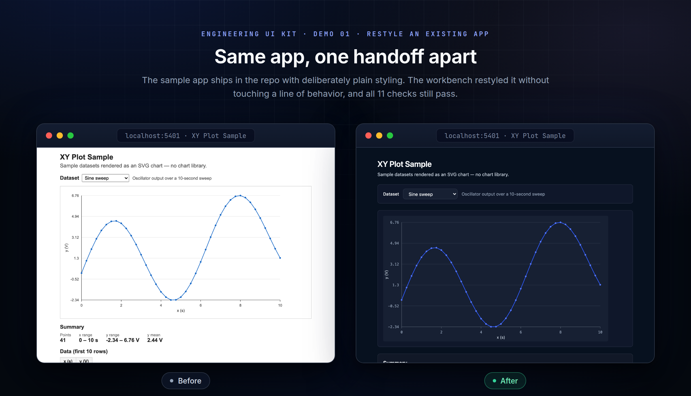
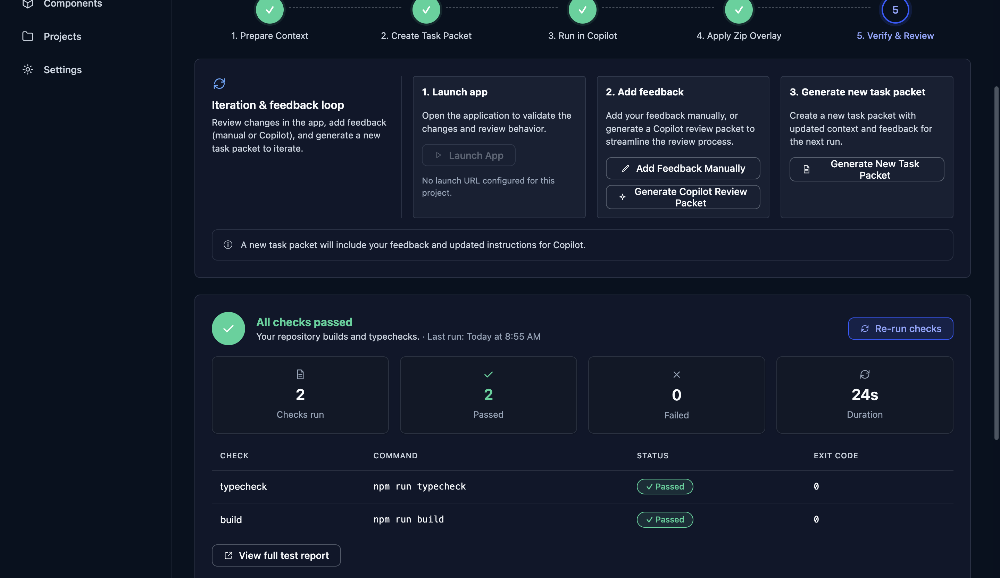
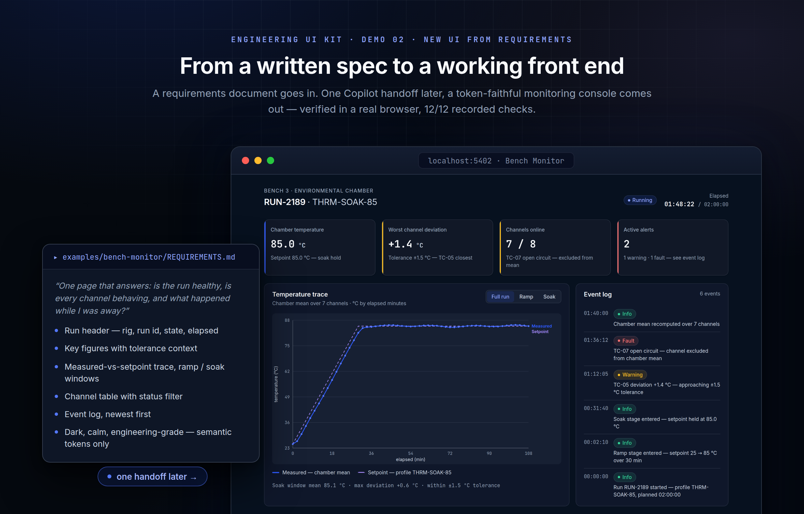
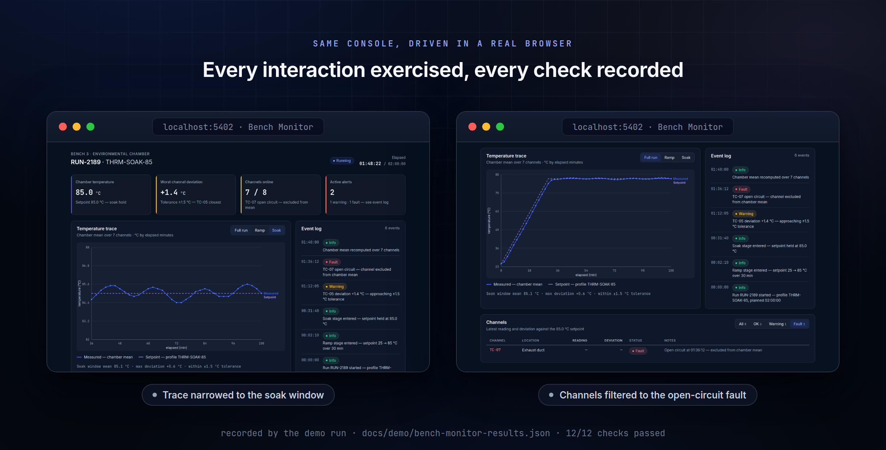

# Engineering UI Kit

A dark-first engineering UI standard plus a local desktop workbench for preparing,
applying, and verifying **Microsoft 365 Copilot UI handoffs** — built evidence-first:
every phase gated on a real, measured trial rather than documentation alone.

**The workflow in one line:** package a repo and task into a two-file Copilot
upload (dragged straight from the app) → receive a `ui-overlay.zip` of changed
files → inspect it against deterministic safety rules → apply it
non-destructively → verify with your own build commands and before/after
screenshots → approve or iterate.

## What's in the box

| Piece | What it is |
|---|---|
| `standards/` | The standards package (v0.4.0): dark-first visual language, 85 semantic token leaves, 68-component manifest, reference architecture, Copilot handoff contracts, prompts, and validation checklists |
| `packages/core` | GUI-independent workflow library + CLI: repo flatfile builder with deterministic exclusions, packet builders, zip-overlay inspector (hard blockers AI-HANDOFF-030…039), non-destructive applier, verification runner, persistence — 44 tests |
| `apps/desktop` | Electron main + sandboxed preload exposing a narrow typed IPC bridge (no generic filesystem access) |
| `apps/gui` | React renderer: five-step handoff workflow, task templates, recipes, component reference, projects, settings |
| `examples/` | Demo target apps: `xy-plot-sample` (restyle demo), `bench-monitor` (requirements-to-UI demo, built from its `REQUIREMENTS.md` alone), `work-orders-monolith` (PlantOps — a fully usable multi-page legacy monolith made to be restyled; ideal first target with ready-made evidence views like `#/orders`, `#/reports`), and `gauge-lab` (GaugeLab — a full monolithic web app, React frontend + Node JSON-API server with file persistence, produced end to end by the workbench's *Create a monolithic web app* handoff from its `REQUIREMENTS.md`; `npm run build` then `npm start` → http://127.0.0.1:5410) |
| `trials/` | The evidence-first vertical-slice trial records (13/13 blocking acceptance criteria) |

Front-end completeness is documented element-by-element in
[`apps/gui/AUDIT-MANIFEST.md`](apps/gui/AUDIT-MANIFEST.md); end-to-end evidence
(screenshots + machine-readable check results) lives in
`apps/desktop/validation-evidence/` and `apps/gui/validation-evidence/`.
The canonical human and LLM workflows, structural benchmark, local telemetry
boundary, and migration audit are documented in
[`docs/USABILITY-OVERHAUL.md`](docs/USABILITY-OVERHAUL.md).

## Installation

### Prerequisites

- **Node.js 20+** and npm 10+ (`node --version`)
- **Git**
- macOS, Windows, or Linux. (Python 3.10+ is only needed if you want to run the
  standards validators.)

### 1. Clone and install

```bash
git clone https://github.com/tim-a-wood/engineering-ui-kit.git
cd engineering-ui-kit
npm install
```

`npm install` downloads the Electron binary via its postinstall step. If your npm
configuration blocks lifecycle scripts, run it explicitly afterwards:

```bash
node node_modules/electron/install.js
```

### 2. Build

```bash
npm run build --workspaces
```

This compiles the core library (`packages/core/dist`), the Electron main/preload
(`apps/desktop/dist`), and the renderer bundle (`apps/gui/dist`).

### 3. Launch the workbench

```bash
npx electron apps/desktop
```

First run opens the Copilot Handoff Hub. Click **+ New Project**, point it at a
React/Vite/TypeScript repo, and the handoff starts immediately:

1. **Prepare Context** — builds `repo-flatfile.txt` + `repo-inventory.json` with
   deterministic exclusions (git metadata, dependencies, build output, binaries,
   env/secret files never leave your machine). Review the context summary and
   warnings before continuing.
2. **Create Task Packet** — pick a task template (standards refresh, new UI from
   requirements, new UI on an existing API, monolithic web app, add a screen) or a
   screen recipe, tweak the sections, preview the rendered packet, export.
3. **Run in Copilot** — drag the upload chip (repo flatfile + combined
   task-and-standards pack) straight onto the Copilot chat, or use Copy Files;
   "Open Copilot" puts the recommended prompt on your clipboard. Download
   `ui-overlay.zip` when Copilot finishes.
4. **Apply Zip Overlay** — the inspector blocks unsafe archives outright (absolute
   paths, traversal, `.git`, dependencies, secrets, repo dumps); warnings require
   your explicit acceptance; nothing is ever deleted.
5. **Verify & Review** — run your project's typecheck/build, launch the app,
   capture feedback, generate a Copilot review packet, approve or iterate.

All run artifacts persist under the app's user-data workspace in typed JSON shapes.

### Development mode

```bash
npm run dev --workspace @engineering-ui-kit/gui   # renderer at http://localhost:5300 with an in-memory mock bridge
npm test  --workspace @engineering-ui-kit/core    # 44 unit/fixture tests (hostile-zip fixtures included)
node packages/core/scripts/reproduce-trial.mjs    # replays the vertical-slice trial via library calls
```

To run Electron against the dev server: `EUIK_DEV_SERVER_URL=http://localhost:5300 npx electron apps/desktop`.

### Standards validation (optional)

```bash
python3 -m venv .venv
.venv/bin/pip install -r requirements-dev.txt
.venv/bin/python standards/validation/validate-phase-2-contracts.py
.venv/bin/python standards/validation/validate-phase-3-standards.py
```

### Packaging (Windows-first)

`apps/desktop/electron-builder.yml` defines NSIS + zip targets. On Windows:

```powershell
npm install; npm run build --workspaces
npx electron-builder --config apps/desktop/electron-builder.yml --win
```

## Demos

Two recorded demos, both reproducible from what is checked into the repo. Every
image below is composed from real captures of the running apps, and every claim
links to machine-readable check results in [`docs/demo/`](docs/demo).

### Demo 01 — restyle an existing app in one handoff

The repo ships a sample target app, [`examples/xy-plot-sample`](examples/xy-plot-sample):
an XY plot (three datasets, SVG chart, summary stats, data table) with intentionally
plain baseline styling.



The transformation is one pass of the workbench's own workflow — no hand-editing of
the sample app:

1. **+ New Project** → point it at `examples/xy-plot-sample`.
2. **Prepare Context** → 9 files in, 64 excluded, 0 warnings.
3. **Create Task Packet** → one click on the *Apply UI Kit standards to an existing
   UI* template.
4. **Apply Zip Overlay** → [`docs/demo/ui-overlay.zip`](docs/demo/ui-overlay.zip)
   (a new `src/tokens.css` + restyled `src/styles.css`, nothing else) — inspected,
   warning-accepted, applied.
5. **Verify & Review** → `npm run typecheck` + `npm run build` pass inside the
   workbench; approve.



Behavior is untouched: dataset switching, point tooltips, stats, and the data table
all still work — verified by the recorded checks in
[`docs/demo/demo-results.json`](docs/demo/demo-results.json) (11/11, including a
zero-light-surface sweep of the transformed app).

Reproduce it yourself: `npm run dev --workspace xy-plot-sample`, run the workbench
against the sample, and select the shipped overlay zip at the Apply step (or upload
the packet to Microsoft 365 Copilot and use its overlay instead).

### Demo 02 — from written requirements to a polished front end

No baseline app this time. [`examples/bench-monitor`](examples/bench-monitor)
starts as a one-page requirements document —
[`REQUIREMENTS.md`](examples/bench-monitor/REQUIREMENTS.md), written in plain
product-owner language ("one page that answers: is the run healthy, is every
channel behaving, and what happened while I was away?") — and ends as a dark-first
test-bench monitoring console: run header, KPI tiles with tolerance context, a
measured-vs-setpoint temperature trace with ramp/soak windows, a filterable
thermocouple table, and an event log, all on the standards package's semantic
tokens.



The requirements doc is the **entire specification** — no wireframes, no mockups,
no component list. In the workbench this is the *Build a new UI from requirements
(no backend)* task template:

1. **Write the requirements** — the six numbered requirements in
   `REQUIREMENTS.md` (plus the standards package) are all the UI is built from.
2. **+ New Project** → point it at the repo that should receive the new UI.
3. **Create Task Packet** → *Build a new UI from requirements (no backend)*
   template, requirements pasted into the functional-scope section.
4. **Run in Copilot → Apply Zip Overlay → Verify & Review** — same gated flow as
   Demo 01.

The checked-in console is the demo's recorded result, and it is verified the same
evidence-first way as everything else in the repo — built, then driven in a real
browser: stage tabs narrow the trace window, the status filter isolates the
open-circuit fault, the chart's crosshair tooltip reports exact
measured/setpoint/deviation values by pointer *and* by keyboard (arrow keys, Home,
Escape), deviation bars scale with tolerance, bundled fonts load, and a
zero-light-surface sweep passes. 17/17 recorded checks in
[`docs/demo/bench-monitor-results.json`](docs/demo/bench-monitor-results.json);
raw full-page capture in
[`docs/demo/bench-monitor-full.png`](docs/demo/bench-monitor-full.png).



Run it yourself: `npm run dev --workspace bench-monitor` → http://127.0.0.1:5402.

## Safety posture

- **Strict three-file upload budget** — enforced when packets are built, with a
  SHA-256 manifest per upload set.
- **Deterministic context exclusions** — dependencies, VCS metadata, build output,
  binaries, and env/secret files never enter a flatfile; secret-like content
  patterns surface as review warnings, and the UI reminds you that company policy
  governs what may be uploaded.
- **Overlay inspection before extraction** — nine hard-blocker classes refuse
  unsafe archives before a single byte is written; overwrites demand explicit
  acceptance; file absence never means deletion.
- **Narrow IPC boundary** — the renderer is sandboxed with `contextIsolation`; every
  privileged operation is a specific typed method.

## Evidence

The project gates on measured trials, not claims:

- Vertical-slice trial: 13/13 blocking acceptance criteria, zero manual corrections
  ([`trials/vertical-slice-01/phase-3/phase-3-trial-report.md`](trials/vertical-slice-01/phase-3/phase-3-trial-report.md))
- Core library reproduces the trial GUI-free (6/6 steps)
- Real-app end-to-end walkthroughs: first-run 23/23, audit pass 18/18, template
  flow 10/10 (JSON results beside the screenshots in `validation-evidence/`)
- Requirements-to-monolith experiment: three full workflow passes drove the real
  Electron app (Playwright, `apps/desktop/e2e/`) from `REQUIREMENTS.md` to the
  working GaugeLab app — iterations-to-green converged 2 → 1 → 1 across passes as
  workflow findings were folded back into the product
  ([`apps/desktop/validation-evidence/monolith-e2e/IMPROVEMENTS.md`](apps/desktop/validation-evidence/monolith-e2e/IMPROVEMENTS.md))

## Repository notes

Internal planning sources (PRD, research, phase specifications, decision log, and
the approved hi-fi mockups) are intentionally kept outside this repository; the
standards package in `standards/` is the public contract derived from them. The
Phase 2 visual-reference pack artifacts are withheld for the same reason (their
hashes remain recorded in the trial evidence).

No license has been granted yet — all rights reserved until a license file is added.
