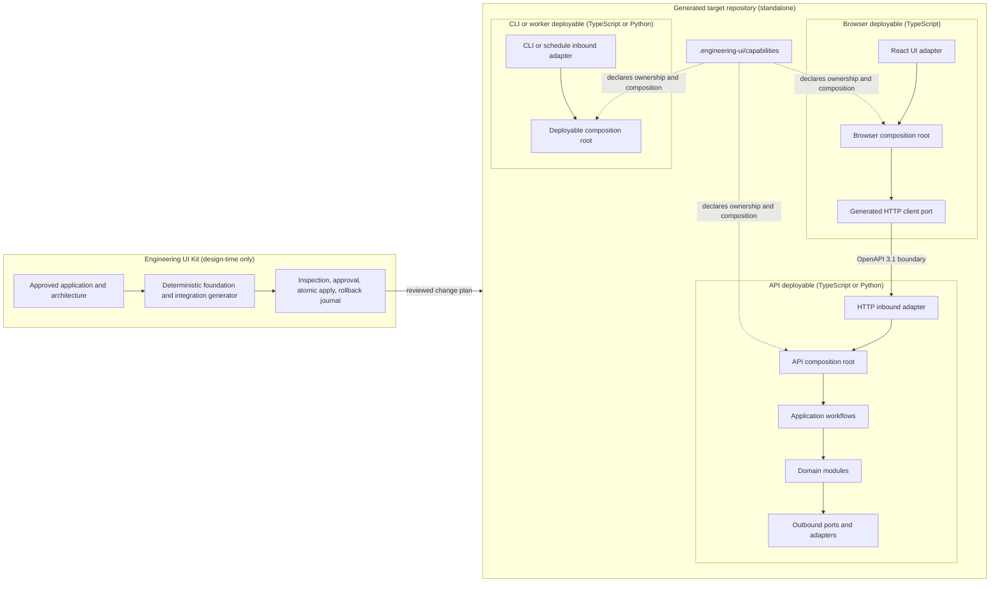
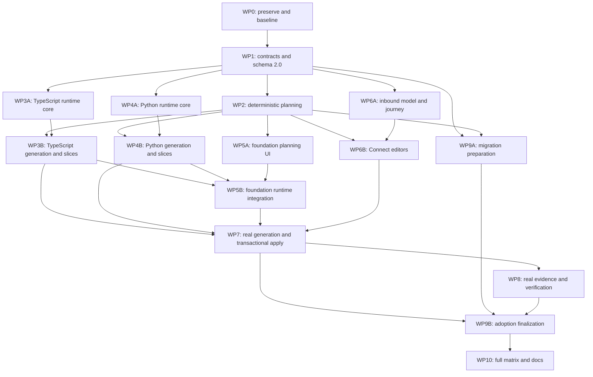

# Capabilities executable reference architecture — Claude Code implementation handoff

## 1. Document control

| Field | Value |
|---|---|
| Document ID | `CAP-ERA-001` |
| Status | Approved design; optimized for Opus orchestration, Sonnet implementation agents, and bounded Fable escalation |
| Decision date | 2026-07-15 |
| Product | Engineering UI Kit — Capabilities (Experimental) |
| Target | Executable TypeScript and Python reference architecture for UI and headless applications |
| Inputs | User decisions 1–50, all remaining recommendations accepted |
| Normative language | MUST, MUST NOT, SHOULD, and MAY have RFC 2119 meaning |
| Implementation model | Dependency-directed work packages, parallel subagent lanes, and wave integration gates |

This handoff is normative. It is deliberately self-contained so Claude Code can implement it without replaying the product discussion. Paths marked **existing** were observed in this repository on 2026-07-15. Paths marked **proposed** are the required target locations unless repository discovery produces a safer target-project path and the user approves that path during the integration review.

## 2. Outcome

Capabilities must stop producing descriptive module manifests that merely look implementable. It must produce a real, repeatable application foundation and detailed module implementation specifications that converge on an executable architecture.

After this work:

1. Design identifies deployables, their runtime language, module allocation, and inbound entry points.
2. The product generates a reviewable application foundation immediately after Design approval and before module implementation handoffs.
3. TypeScript and Python modules implement explicit contracts against versioned runtime packages.
4. Connect creates or updates real UI, HTTP, CLI, or scheduled/background integration code; it is never just a random preview or a persisted mapping record.
5. Verify proves an actual trigger reached an operation through the generated composition root and inbound adapter.
6. Generated applications run independently of Engineering UI Kit, Claude Code, Cursor, Copilot, and the desktop process after their dependencies have been installed.

The reference architecture is a constrained modular monolith by default. It uses ports and adapters, one explicit composition root per executable deployable, in-process application modules, and adapters for external systems. It does not prescribe business algorithms or vendor infrastructure.

## 3. Relationship to existing specifications

This document extends `docs/CAPABILITIES-IMPLEMENTATION-SPEC.md` and supersedes its narrower implementation assumptions where they conflict.

The following clauses are specifically superseded:

- Connect is no longer frontend-only.
- “No UI” no longer completes or skips Connect; it changes Connect to headless entry-point configuration.
- The local `runtime.mjs`/`runtime.js` `operations` export is a legacy compatibility path, not the target runtime architecture.
- Generic HTTP is in scope for the reference foundation.
- A connection packet or approved `FrontendBinding` is not proof of integration.
- A simulated operation invocation is not sufficient connection evidence.
- Reference architecture guidance under `standards/reference-architecture/` is not sufficient until executable runtime packages, generators, and conformance tests exist.

Existing application-plan, architecture, module, freshness, impact, verification, and handoff refinements remain prerequisites. In particular, the uncommitted work present when this document was authored adds preserved module interview data, structured operation/data contracts, repository context, and richer implementation briefs. The Opus coordinator MUST retain or reconcile that work in WP0; it MUST NOT discard it.

## 4. Current-state findings

The implementation must begin from these observed facts:

| Area | Current behavior | Required correction |
|---|---|---|
| Runtime | `packages/core/src/capabilities/localRuntimeHost.ts` loads local JavaScript files and invokes an `operations` map. | Introduce language-specific runtime packages and explicit deployable composition roots; keep a migration adapter for legacy modules. |
| Connect | `apps/gui/src/views/capabilities/GuidedConnect.tsx` persists and approves a `FrontendBinding`. It builds a connection packet but discards the result. | Generalize to inbound bindings, generate an integration overlay, inspect it, apply it atomically, and run it. |
| No UI | Journey state treats `no-ui` as Connect satisfied. | Route the user to HTTP, CLI, scheduled/background, or explicit embedded-library configuration. |
| Verification | Desktop can invoke an operation directly without proving target application wiring. | Require real trigger-to-composition-root-to-operation evidence. |
| Apply | `packages/core/src/overlay.ts` writes inspected files sequentially with no transaction or rollback journal. | Stage all writes, verify preimages, swap atomically where possible, and record rollback material. |
| Schema | Capability records require exact schema version `1.0`. | Add a reviewable `1.0` to `2.0` migration and future-version read-only behavior. |
| Registry | Deterministic provider resolution exists. | Retain it as a generated validation/diagnostic projection, not a runtime service locator. |
| Reference guidance | Existing standards are primarily frontend documentation. | Add executable TypeScript and Python reference packages plus generated application-local code. |

## 5. Locked product decisions

The following decisions are approved and are not open implementation questions.

### 5.1 Scope and hosts

- TypeScript and Python are both first-release languages.
- First-release hosts are React web UI, Electron UI/main, HTTP API, CLI, and scheduled/background worker.
- Greenfield and existing repositories are both supported.
- Applications may be UI-based or headless.
- The same operation may be exposed through multiple inbound entry points.
- Operations are private by default. Every inbound exposure is explicit.
- A deployable is incomplete until it has an inbound entry point, unless Design explicitly classifies it as an embedded library.

### 5.2 Architecture and generation

- The system uses three layers:
  1. versioned TypeScript or Python runtime packages;
  2. generated, committed, do-not-edit contracts, composition, bindings, and metadata in the target application;
  3. editable domain, workflow, adapter, and UI code.
- Every executable deployable has exactly one explicit, statically inspectable composition root.
- Every deployable uses one runtime language. A single composition root MUST NOT mix TypeScript and Python modules.
- A browser UI may call a Python host through a generated OpenAPI 3.1 HTTP client/server boundary.
- Modules within a deployable run in process. Remote services and external systems are adapters.
- Design auto-proposes deployables, language allocation, hosts, and module allocation. It asks only when evidence is genuinely ambiguous.
- The generated foundation is prepared after Design approval and before module handoffs.
- A project has one application-wide composition model and an incrementally regenerated composition root for each deployable.

### 5.3 Contracts and runtimes

- JSON Schema 2020-12 is the canonical data-contract format.
- TypeScript types and Python/Pydantic v2 models are generated from canonical schemas.
- HTTP contracts use OpenAPI 3.1 generated from the same operation contracts.
- TypeScript baseline is Node.js 22 LTS, ESM, and TypeScript 5.8 or the repository’s compatible later pinned version.
- Python baseline is Python 3.11 or later, Pydantic v2, FastAPI for HTTP, and Uvicorn for the default ASGI launcher.
- Exact dependency versions are resolved and pinned in the target lockfile. The generator MUST NOT use floating `latest` dependencies.
- Runtime upgrades use an explicit preview with migration notes; generation never silently upgrades a runtime.
- A small project-owned composition container is preferred to a heavyweight dependency-injection framework.

### 5.4 Connect and verification

- Connect configures an inbound adapter: UI, HTTP, CLI, scheduled/background, or embedded-library declaration.
- “No UI” switches Connect to headless configuration; it does not skip Connect.
- Connect automates obvious operation and field mappings and asks only about real ambiguity.
- Connect produces a real, reviewable integration overlay and an explicit dependency/change summary.
- Apply is atomic from the user’s perspective and produces rollback information.
- Real end-to-end evidence must start at the actual inbound trigger and traverse the actual composition root.
- Simulations never satisfy final connection verification.
- If an external dependency is unavailable, an approved faithful test adapter may prove local behavior, but live external evidence remains outstanding and visible.
- A user may defer Connect, but the affected deployable remains `Needs attention` and cannot be fully verified.

### 5.5 Compatibility, operations, and safety

- Legacy approved modules remain readable. The product reports readiness gaps and asks for a renewed interview only when the missing information is materially ambiguous.
- Generated file ownership is tracked by hash. Modified generated files block regeneration until the user reviews the conflict.
- Existing repositories receive a reviewable migration overlay and retain legacy compatibility until conformance passes.
- Secret values never enter capability records, generated files, packets, or logs. Only secret references are generated and resolved at runtime.
- The common runtime includes dispatch, validation, typed outcomes, configuration, secret references, logging, tracing hooks, health/readiness, cancellation, timeouts, and graceful shutdown.
- Lifecycle registrations are explicit: `singleton`, `request-job`, or `transient`.
- Authorization provides hooks and ports and defaults protected operations to deny. It does not provide an identity provider or policy engine.
- Persistence provides standard ports, transaction/lifecycle semantics, in-memory test adapters, error contracts, and test harnesses. It does not select a production database.
- Telemetry is vendor-neutral. JSON console logging and correlation are the default; project adapters may export to a vendor.
- Built-in outbound adapter foundations cover generic HTTP, filesystem, process/command, and persistence ports. Vendor-specific adapters remain project code.
- Generated build, test, launch, health, and shutdown behavior is in scope. Cloud provisioning and deployment automation are out of scope.
- Development support is Windows and macOS; CI/server support is Linux.
- Generated applications work offline after packages have been installed once.
- Capabilities remains Experimental until the full TypeScript and Python matrices pass.

## 6. Target architecture



The desktop product is a design-time orchestrator only. It must not become a hidden production runtime, proxy, service locator, or required launcher for generated applications.

## 7. Three-layer repository model

### 7.1 Versioned runtime packages

#### TypeScript package

Create **proposed** `packages/capabilities-runtime-ts/` with package name `@engineering-ui-kit/capabilities-runtime` and these exports:

- `.` — framework-neutral contracts, dispatcher, outcomes, validation interfaces, lifecycle container, configuration and secret-reference interfaces, cancellation and timeout support.
- `./node` — HTTP, CLI, scheduled worker, process lifecycle, Node filesystem/process/HTTP adapter foundations, JSON console telemetry, health/readiness.
- `./browser` — browser-safe dispatcher/client interfaces, configuration boundary, correlation propagation.
- `./react` — thin hooks/controllers over framework-neutral generated clients; no operation or domain logic.
- `./testing` — in-memory persistence, fake clock, test secret resolver, adapter contract harnesses, trigger harnesses.

The runtime MUST NOT depend on the desktop or GUI packages. Browser exports MUST NOT import Node built-ins.

#### Python package

Create **proposed** `runtimes/python/` with distribution name `engineering-ui-capabilities-runtime` and import package `engineering_ui_capabilities_runtime`:

- `core` — dispatcher, outcomes, validation protocol, composition registrations, lifecycle scopes, configuration/secret protocols, cancellation and timeouts.
- `http` — FastAPI router/host integration and OpenAPI consistency checks.
- `cli` — argparse-based command host integration unless target conventions select a compatible existing CLI framework.
- `worker` — five-field cron schedule model, injected clock, job lifecycle, graceful shutdown.
- `adapters` — generic HTTP, filesystem, process/command, and persistence port foundations.
- `telemetry` — JSON logging, correlation/contextvars, tracing hooks, health/readiness.
- `testing` — in-memory adapters and conformance harnesses.

The Python runtime MUST NOT invoke Node or the desktop process. Generated Python apps MUST build and run with standard Python tooling.

### 7.2 Generated application-local code

Generated files are committed so applications remain inspectable and reproducible. They carry a do-not-edit header and are owned through `.engineering-ui/capabilities/generated-ownership.json`.

The generator produces, per target repository:

- canonical JSON schemas;
- generated TypeScript and/or Python types;
- operation interfaces and typed outcomes;
- deployable composition manifests;
- explicit composition roots;
- inbound adapter configuration and source;
- framework-neutral clients and optional React bindings;
- startup, health/readiness, and graceful-shutdown source;
- conformance and integration tests;
- generation metadata and rollback journal references.

Generated code MUST contain no business rules and no secret values.

### 7.3 Editable project code

The user or implementation agent owns:

- domain algorithms and policies;
- workflow orchestration;
- vendor adapters;
- production persistence implementation;
- UI presentation and interaction design;
- identity-provider and authorization-policy integration;
- cloud deployment and provisioning.

Module implementation briefs must name the generated interfaces to implement, editable paths, acceptance cases, prohibited paths, and commands that prove conformance.

## 8. Target repository metadata

Every managed repository contains this control plane:

```text
.engineering-ui/
  capabilities/
    workspace-version.json
    reference-profile.json
    application-composition.json
    generation-plan.json
    generated-ownership.json
    migrations/
    evidence/
      connections/
      verification/
    rollback/
```

This directory is data, not a runtime dependency. Runtime code MUST be able to start without reading Engineering UI Kit’s user-data workspace. It MAY read committed target-local composition metadata when this improves diagnostics, but composition itself remains explicit source code.

## 9. Canonical contracts

Add the following contracts after the existing `CAP-CONTRACT-001` through `CAP-CONTRACT-022`. Each contract requires a TypeScript type, JSON Schema, valid and invalid fixture set, parser/validator, parity registration, persistence round-trip test, hash stability test, and redaction test where applicable.

### CAP-CONTRACT-023 — ReferenceArchitectureProfile

Required fields:

- `schemaVersion`, `profileId`, `profileVersion`;
- supported runtime languages and versions;
- supported host kinds;
- canonical contract format and HTTP format;
- generated/editable directory policies;
- runtime package coordinates and pinned version policy;
- lifecycle, telemetry, secret, authorization, persistence, and error policies;
- generator version and compatibility range.

Invariant: a profile is immutable at a given `profileId` and `profileVersion` hash.

### CAP-CONTRACT-024 — DeployableSpecification

Required fields:

- `deployableId`, `name`, `kind` (`browser`, `electron-main`, `http-api`, `cli`, `worker`, `embedded-library`);
- `runtimeLanguage` (`typescript` or `python`) and compatible runtime version;
- allocated module IDs;
- inbound binding IDs;
- composition-root target path;
- build, test, launch, health, and shutdown commands;
- configuration and secret references;
- proposed repository locations with evidence and approval status.

Invariants:

- non-library deployables have at least one explicit inbound binding before final verification;
- all allocated in-process modules use the deployable language;
- each module allocation belongs to a known approved architecture revision.

### CAP-CONTRACT-025 — GenerationPlan

Required fields:

- input record IDs, revisions, and hashes;
- generator and reference-profile versions;
- target repository identity and clean/dirty state;
- proposed dependency changes;
- ordered file changes with action, owner, generated/editable classification, preimage hash, postimage hash, and reason;
- commands to run;
- warnings, blockers, ambiguity questions, and rollback strategy;
- deterministic plan hash.

Invariant: Apply operates only on the exact inspected plan hash and matching preimages.

### CAP-CONTRACT-026 — GeneratedOwnershipManifest

Required fields:

- generated file relative path;
- content hash;
- generator/profile versions;
- source contract hashes;
- deployable and module ownership;
- last applied generation plan ID;
- safe deletion flag.

Invariant: modified generated files block regeneration of those files until a conflict decision is recorded. The generator MUST NOT silently overwrite them.

### CAP-CONTRACT-027 — CompositionManifest

Required fields:

- application and architecture revision;
- deployables;
- registrations with contract ID, implementation target, lifecycle (`singleton`, `request-job`, `transient`), provider module, and dependencies;
- operation routes;
- inbound and outbound adapter references;
- configuration, secret, telemetry, health, and authorization hook references;
- deterministic composition hash.

Invariants:

- provider resolution is unambiguous;
- there are no undeclared dependencies or cycles forbidden by the architecture;
- an inbound route resolves to exactly one operation version;
- registry diagnostics and generated composition source resolve identically.

### CAP-CONTRACT-028 — InboundBinding

This replaces frontend-only binding as the canonical target while preserving compatibility.

Common required fields:

- `bindingId`, `version`, `projectId`, `deployableId`, `kind`;
- operation ID/version;
- input/output mappings;
- validation, rejection, technical failure, timeout, cancellation, retry, and duplicate-submission behavior where relevant;
- exposure visibility (`private`, `protected`, `public`) with `private` default;
- generated targets and approval state.

Discriminated variants:

- `ui`: stable UI marker/source evidence, event trigger, loading/error/result presentation, generated client/controller targets, and transport (`browser-local`, `electron-ipc`, or generated HTTP client); Electron IPC additionally identifies renderer/main deployables and the typed channel contract;
- `http`: method, path, request/response mapping, status/error mapping, auth requirement;
- `cli`: command, arguments/options/stdin mapping, exit-code/output mapping;
- `schedule`: portable five-field cron expression, timezone, overlap policy, misfire policy, payload/config mapping;
- `embedded-library`: explicit declaration, exported callable contract, and reason no executable inbound host applies.

Invariant: a binding is descriptive until its matching integration plan is applied and real connection evidence exists.

### CAP-CONTRACT-029 — ConnectionVerificationRecord

Required fields:

- binding, deployable, operation, architecture, composition, generated-ownership, and source hashes;
- actual launch command and trigger kind;
- redacted trigger input and typed outcome summary;
- trace/correlation ID;
- observed path: inbound adapter, composition root, workflow, operation, outbound adapters;
- timestamps, duration, process exit/health state, test-adapter use, and external evidence status;
- evidence artifact references;
- pass/fail/partial status and reason codes.

Invariant: `pass` requires an actual target process and inbound trigger. Direct desktop dispatcher invocation and simulation are never `pass`.

### CAP-CONTRACT-030 — CapabilityMigrationPlan

Required fields:

- source and target workspace/profile/runtime versions;
- record and target-file transformations;
- compatibility shims;
- data-loss assessment;
- blocked ambiguities;
- preview hashes;
- backup and rollback instructions;
- post-migration conformance commands.

Invariant: migration is previewed and explicitly approved. It never silently changes target code or approved facts.

### CAP-CONTRACT-031 — ModuleImplementationSpecification

Promote the preserved interview outcome into the canonical implementation input. Required fields:

- module identity, type, runtime language, deployable allocation, owned/editable paths;
- responsibility and explicit non-responsibilities;
- provided and required operation/port contracts;
- canonical schemas and generated type targets;
- rules, invariants, examples, edge cases, failure semantics, performance constraints, cancellation, timeout, and concurrency expectations;
- lifecycle registration;
- configuration and secret references;
- persistence/transaction expectations;
- telemetry and health expectations;
- implementation steps tied to repository evidence;
- acceptance tests and commands;
- unresolved items with materiality classification.

Invariant: an implementation handoff MUST contain this specification plus referenced generated contracts. It MUST NOT ask the implementation agent to return the module manifest as its main output.

## 10. Runtime behavior

### 10.1 Operation shape

The canonical operation model is language-neutral:

```text
Operation<Input, Success, DomainRejection, TechnicalFailure>
  execute(input, context) -> Outcome

Context
  correlationId
  cancellation
  deadline
  principal/auth context hook
  configuration reader
  secret resolver reference
  logger/tracer

Outcome
  success(value)
  rejected(code, details)
  failed(code, safeMessage, retryable, causeReference?)
  cancelled(reason)
  timedOut(deadline)
```

Thrown exceptions are caught at the dispatcher boundary and converted to safe technical failures. Domain rejection is not an exception. Secret values and unsafe exception details are never serialized to clients or evidence.

### 10.2 Composition and lifecycle

Generated composition roots use explicit imports and registrations. They may use the small runtime container for lifecycle management, but registration must remain statically inspectable.

- `singleton`: one instance for the process lifetime; must be concurrency safe.
- `request-job`: one instance per HTTP request, CLI invocation, scheduled job, or equivalent UI dispatch scope.
- `transient`: a new instance at every resolution.

Startup validates configuration references, provider uniqueness, composition consistency, and required adapter availability. Shutdown stops inbound acceptance, cancels/drains active work within the configured deadline, disposes scopes in reverse order, flushes telemetry hooks, and exits deterministically.

### 10.3 Host behavior

- HTTP: generated OpenAPI 3.1, request/response validation, health/readiness routes, safe error mapping, correlation propagation, graceful drain.
- CLI: generated help, typed parsing, nonzero exit codes for rejection/failure, stdout for results, stderr for diagnostics, cancellation on process signals.
- Schedule: portable five-field cron, explicit timezone, overlap and misfire policy, injected clock in tests, request-job scope per run.
- React UI: framework-neutral generated client plus thin React hook/controller; loading, validation, rejection, failure, cancellation, and duplicate submission behavior are explicit.
- Electron: renderer remains browser-safe; Electron main is a separate Node deployable. Generated typed renderer/preload/main IPC adapters validate request/outcome schemas, propagate correlation and cancellation, expose no unrestricted Node capability to the renderer, and receive real end-to-end verification through the packaged boundary.

### 10.4 UI source association

UI integration MUST use stable source evidence without React-internal APIs:

- New/generated UI receives a stable `data-euik-id` marker.
- Development metadata maps the marker to a repository-relative source target.
- Existing UI receives a proposed marker/source change in the integration overlay.
- If one visible element maps to multiple plausible sources, Connect asks the user to choose.
- React Fiber internals, runtime monkey-patching, brittle DOM traversal as identity, and production source-map dependence are forbidden.

## 11. Generator and safe apply

### 11.1 Pure generator boundary

Create **proposed** `packages/core/src/capabilities/generation/` containing pure, filesystem-independent planning functions:

- `profile.ts` — reference-profile selection and compatibility;
- `repositoryDiscovery.ts` — evidence-based convention detection;
- `deployables.ts` — deployable and language proposal;
- `contracts.ts` — canonical schema and language-type planning;
- `composition.ts` — composition model, registration validation, source planning;
- `inbound.ts` — UI/HTTP/CLI/schedule/library adapter planning;
- `typescript.ts` and `python.ts` — deterministic virtual file production;
- `ownership.ts` — hash and conflict rules;
- `plan.ts` — canonical ordering and `GenerationPlan` construction;
- `migration.ts` — legacy and version migration planning;
- `index.ts` and `browser.ts` — safe exports.

Given identical canonical inputs, target repository evidence, and generator/profile versions, the generator MUST produce byte-identical virtual files and plan hashes independent of input ordering, host OS path separators, locale, clock, or random IDs. IDs and timestamps are supplied by the caller and recorded as non-content metadata where necessary.

Privileged filesystem operations remain in the desktop main process. The GUI never writes target files directly.

### 11.2 Repository path proposal

For first adoption, repository discovery proposes code locations based on package manifests, source roots, test conventions, language tooling, and existing architecture. The user approves the initial locations in the foundation review. Later generation reuses the approved paths unless repository evidence indicates they no longer exist.

Hard-coded universal `src/` assumptions are forbidden. Ambiguity is surfaced with evidence and two or more concrete choices.

### 11.3 Atomic apply protocol

Replace sequential writes with this protocol:

1. Revalidate target root, plan hash, preimage hashes, ownership hashes, symlinks, traversal safety, dependency-file scope, and dirty-worktree warning acknowledgement.
2. Materialize every postimage in a target-local staging directory.
3. Run schema and generator self-validation against staged content.
4. Save overwritten/deleted preimages in a target-local rollback bundle and write a rollback journal.
5. Apply all changes using atomic renames where supported; use a transaction journal for cross-directory replacements.
6. If any change fails, restore every changed preimage and remove every newly created file.
7. Verify postimage hashes and ownership manifest.
8. Run the plan’s approved validation commands.
9. Return applied files, command results, rollback ID, and resulting hashes.

The product does not automatically commit target changes. Rollback is explicit and reviewable. Generated dependency changes are allowed only when listed in the inspected plan.

## 12. Workflow refinement

The visible five stages remain Plan, Design, Build, Connect, Verify. This is a refinement, not a new top-level workflow.

### 12.1 Plan

No structural change. Capture whether known outcomes imply UI, headless, or mixed delivery, but do not force a host decision before evidence exists.

### 12.2 Design

After architecture interview import, the product:

1. derives module types, ports, operation contracts, and dependencies;
2. proposes deployables and module allocation;
3. infers runtime language from the repository and deployable, with an explicit override;
4. proposes inbound entry-point kinds;
5. asks only materially ambiguous questions;
6. includes those answers in architecture approval;
7. prepares the foundation generation plan.

Architecture approval and foundation apply are distinct approvals. The architecture can be approved before files are written.

### 12.3 Build

Build begins with an internal foundation prerequisite:

1. Review reference profile, deployables, paths, dependencies, and generated file plan.
2. Apply the foundation atomically.
3. Prove generated composition, startup, health, and test scaffolds build before issuing module handoffs.
4. Generate one `ModuleImplementationSpecification` per module.
5. Implement modules into editable paths against generated interfaces.
6. Revisit and re-run module interviews when requirements change.

The UI does not add a sixth stage. It shows “Application foundation” as a Build prerequisite and blocks implementation handoff creation until its gate passes.

For UI modules, “Build UI with agent” generates a detailed UI requirement specification from the approved module specification, opens Build & Test, selects “From spec,” and pre-fills that specification. This UI-agent route still targets the same generated client/port contracts.

### 12.4 Connect

Connect starts with “How is this capability triggered?” rather than “Choose a UI.”

Available choices are:

- existing or new UI element;
- HTTP endpoint;
- CLI command;
- scheduled/background job;
- embedded library;
- decide later.

When the application has no UI, the UI choice is hidden or de-emphasized and the headless choices remain. The step then:

1. selects a deployable and one approved operation;
2. proposes a private inbound exposure and obvious field/error mappings;
3. resolves only material ambiguity;
4. produces an integration generation plan;
5. previews source and dependency changes;
6. applies them atomically after approval;
7. launches the actual deployable;
8. triggers the actual adapter;
9. stores connection evidence.

Multiple bindings may target the same operation. Connect remains complete only when every required deployable has a valid entry point or an approved embedded-library declaration.

### 12.5 Verify

Verify evaluates:

- approved application, architecture, module, and binding freshness;
- generated ownership integrity;
- composition and registry agreement;
- type/schema conformance;
- runtime-package compatibility;
- build, typecheck, unit, integration, startup, health, readiness, and shutdown results;
- actual connection evidence for every required inbound binding;
- use of test adapters and outstanding live evidence;
- secret leakage and protected-operation defaults;
- stale impact-scoped records after change.

Deferred integration may be viewed in Verify, but final status remains incomplete with an actionable `Needs attention` item.

## 13. Change and freshness behavior

Any approved contract change computes an impact set across:

- providing and consuming modules;
- deployable composition roots;
- generated language types;
- inbound bindings and clients;
- OpenAPI documents;
- implementation briefs;
- connection and verification evidence.

Only impacted outputs become stale. Regeneration produces a scoped plan. Unaffected generated files retain their hashes and evidence. A change to ordering alone does not produce churn.

## 14. Legacy and existing-repository migration

### 14.1 Workspace schema

Introduce capability workspace schema `2.0`.

- Read `1.0` records without mutation.
- Build a `CapabilityMigrationPlan` preview.
- Back up capability workspace records before apply.
- Convert `FrontendBinding` to `InboundBinding` with `kind: ui` without data loss.
- Promote preserved raw module interview responses and structured briefs to `ModuleImplementationSpecification` where possible.
- Infer missing deployables, runtime, lifecycle, and entry points from repository evidence.
- Mark materially ambiguous values unresolved; do not fabricate them.
- Retain future-version read-only behavior.
- Make migration idempotent and rollback tested.

### 14.2 Legacy runtime compatibility

Existing `runtime.mjs`/`runtime.js` modules remain invocable through a compatibility adapter during migration. They are not considered reference-architecture conformant until they implement generated contracts and are registered through a deployable composition root.

Legacy direct invocation evidence does not satisfy new real-connection verification. The UI must explain the gap and offer a migration plan rather than invalidating the module without a route forward.

### 14.3 Existing source repositories

Existing repositories receive a proposed path/dependency/file migration plan. Generated code is additive where possible. Existing entry points are wrapped or extended through explicit edits, never replaced wholesale without a hard blocker and user approval.

Ambiguous UI source adoption, package-manager conflicts, incompatible runtime versions, and existing composition frameworks are user decisions. Formatting, obvious imports, conventional source roots, and unambiguous mappings are automated.

## 15. Security and operational requirements

### 15.1 Secrets and configuration

- Contracts store references such as environment-variable names or project-defined secret-provider keys, never values.
- Runtime secret resolution occurs at the latest practical point and returns redaction-aware values.
- Generated examples use placeholders that cannot be mistaken for credentials.
- Logs, traces, evidence, exceptions, process arguments, and generated test snapshots are scanned with secret canaries.

### 15.2 Authorization

- Every inbound binding has an exposure visibility.
- Protected operations default to deny until an authorization hook is registered.
- Public exposure requires explicit approval in the integration review.
- The runtime defines principal and authorization protocols, but no identity-provider integration or business policy.

### 15.3 Process and filesystem safety

- All target paths are repository-relative, normalized, and checked against traversal and symlink escape.
- Process/command adapters use argument arrays, explicit executables, allowed working roots, bounded output, timeout, and cancellation. Shell interpolation is not the default.
- Filesystem adapters use configured roots and explicit read/write capabilities.
- Generic HTTP adapters validate URLs, bound redirects/timeouts/body size, and redact credentials.

### 15.4 Observability and health

- Correlation IDs cross inbound, workflow, domain, and outbound boundaries.
- TypeScript uses `AsyncLocalStorage` for Node request/job context; Python uses `contextvars`.
- JSON console logs are the default standalone sink.
- Tracing is exposed through vendor-neutral hooks; no exporter is mandatory.
- Liveness means the process event loop is functioning. Readiness means required configuration and mandatory adapters are available.

## 16. Repository file map

### 16.1 Existing files expected to change

| Area | Existing paths |
|---|---|
| Contracts and validation | `packages/core/src/capabilities/types.ts`, `parity.ts`, `validation.ts`, `redaction.ts`, `hash.ts` |
| Persistence and migration | `packages/core/src/capabilities/persistence.ts`, `migration.ts`, `filesystem.ts` |
| Architecture and generation inputs | `architectureInterview.ts`, `architectureProjection.ts`, `moduleInterview.ts`, `implementationBrief.ts`, `repositoryContext.ts`, `packets.ts` |
| Composition/runtime compatibility | `registry.ts`, `localRuntimeHost.ts`, `runtime.ts`, `verification.ts`, `freshness.ts`, `impact.ts`, `attention.ts`, `journeys.ts` |
| Public exports | `packages/core/src/capabilities/index.ts`, `browser.ts`, `packages/core/src/index.ts`, `browser.ts` |
| Apply safety | `packages/core/src/overlay.ts`, `packages/core/src/types.ts`, `packages/core/src/cli.ts` |
| Desktop boundary | `apps/desktop/src/capabilities/ipc.ts`, `apps/desktop/src/bridgeApi.ts`, `apps/desktop/src/preload.cts`, `apps/desktop/src/ipc.ts` |
| GUI bridge/state | `apps/gui/src/bridge.ts`, `mockBridge.ts`, `views/capabilities/capabilitiesUiState.ts`, `CapabilitiesView.tsx` |
| GUI stages | `ArchitectureInterview.tsx`, `ArchitectureView.tsx`, `GuidedBuild.tsx`, `ModulesView.tsx`, `GuidedConnect.tsx`, `BindingEditor.tsx`, `CapabilityPreview.tsx`, `PreviewBindingPicker.tsx`, `VerificationPanel.tsx`, `NeedsAttention.tsx` |
| GUI guidance/style | `apps/gui/src/guides.tsx`, Capabilities styles in `apps/gui/src/styles.css`, relevant GUI tests |
| Standards | `standards/schemas/capabilities/`, `standards/copilot-handoff/capabilities/`, `standards/reference-architecture/`, `standards/validation/` |
| Workspace/build | root `package.json`, package lockfile, workspace-specific package manifests and CI definitions |

### 16.2 Proposed new paths

```text
packages/core/src/capabilities/generation/
packages/core/test/capabilities/generation/
packages/capabilities-runtime-ts/
runtimes/python/
standards/schemas/capabilities/reference-architecture-profile.schema.json
standards/schemas/capabilities/deployable-specification.schema.json
standards/schemas/capabilities/generation-plan.schema.json
standards/schemas/capabilities/generated-ownership-manifest.schema.json
standards/schemas/capabilities/composition-manifest.schema.json
standards/schemas/capabilities/inbound-binding.schema.json
standards/schemas/capabilities/connection-verification-record.schema.json
standards/schemas/capabilities/capability-migration-plan.schema.json
standards/schemas/capabilities/module-implementation-specification.schema.json
examples/capabilities-ts-reference/
examples/capabilities-python-reference/
examples/capabilities-react-python-reference/
examples/capabilities-existing-repo-fixture/
examples/capabilities-existing-python-repo-fixture/
examples/capabilities-existing-react-python-repo-fixture/
```

The implementation agents may split files further when a file would become difficult to review, but they must preserve these package boundaries and public concepts.

## 17. Accelerated multi-agent execution model

Claude Code MUST run this initiative as a coordinated multi-agent program, not as one long serial task. Work-package numbering describes logical scope and final integration order; the dependency graph below determines what may run concurrently.

The Opus coordinator may advance automatically whenever an objective gate is green. It MUST NOT wait for human approval between work packages unless it discovers a material contradiction affecting scope, safety, standalone operation, language parity, migration losslessness, or real end-to-end proof. All ordinary technical recommendations and the product decisions in this document are already approved.

### Claude Code model topology

Use this fixed hierarchy:

| Role | Model | Effort | Concurrency | Purpose |
|---|---|---|---:|---|
| Main integration coordinator | `claude-opus-4-8` | `xhigh`; use `max` only for a named correctness gate | 1 | Own architecture context, task graph, shared files, integration, gates, and user escalation |
| Bounded implementation agents | `claude-sonnet-5` | `high` | Up to 4 | Implement disjoint code/test/doc packets in exact worktrees |
| Read-only scouts | `claude-sonnet-5` | `medium` | Up to 4 within the total Sonnet cap | Repository mapping, failure/log reduction, and focused research |
| Fresh-context verifiers | `claude-sonnet-5` | `high` | Up to 2 within the total Sonnet cap | Review a completed packet against contracts and tests |
| Bounded complexity escalation | `claude-fable-5` | `high` | 1 | Solve one sharply bounded problem Opus cannot resolve efficiently |

Project-scoped definitions are supplied under `.claude/agents/`. Start the main session with:

```bash
claude --agent cap-opus-orchestrator --effort xhigh
```

This works for WP0 and foreground agents with the Claude Code version installed when this handoff was authored (`2.1.170`). Before Wave 2 uses parallel write-enabled background agents, upgrade to Claude Code `2.1.203` or later so permission prompts and background task behavior are reliable. If upgrade is unavailable, keep write-enabled agents in the foreground and run them sequentially; read-only scouts may remain concurrent. On `2.1.203` or later, the user MAY launch with `--effort ultracode` for standing dynamic-workflow orchestration. The explicit rules in this document remain authoritative in either mode. Do not delay WP0 solely to upgrade Claude Code.

Do not set `CLAUDE_CODE_SUBAGENT_MODEL`. That environment variable overrides per-agent model selections and would accidentally run Sonnet and Fable packets on the same model.

#### Opus-to-Fable escalation protocol

Fable is not a second coordinator and does not receive the whole initiative by default. Opus may invoke `cap-fable-escalation` only when all of these are true:

1. the blocking problem is reproduced or expressed as a concrete design/proof obligation;
2. Opus has reduced it to one deliverable with explicit inputs, invariants, allowed paths, and an acceptance command;
3. a normal Sonnet packet failed, or Opus identifies that the problem requires materially stronger first-shot reasoning than a Sonnet packet;
4. Opus attempted one focused diagnosis or review and still cannot establish a safe answer;
5. no other independent lane needs to wait while the escalation runs.

The escalation packet MUST contain:

- `BOUNDED_PROBLEM` — one sentence;
- `WHY_OPUS_IS_BLOCKED` — evidence, not a general statement that the work is hard;
- `INPUT_ARTIFACTS` — exact files, fixture, logs, and relevant spec sections;
- `INVARIANTS` — conditions that may not change;
- `ALLOWED_PATHS` and exact `WORKTREE_ROOT`;
- `DELIVERABLE` — design decision, proof, patch, or focused commit;
- `ACCEPTANCE_COMMANDS`;
- `TURN_LIMIT` — normally 8 or fewer;
- `NO_DELEGATION` — Fable must not create subagents or absorb other packets.

Fable runs once at `high` effort. After Fable returns, Opus reviews the result and either integrates it or hands the resulting bounded design to Sonnet for implementation. If the result still exposes a material unresolved correctness issue, Opus records it and uses its own `max` effort for one bounded synthesis; it does not silently rerun Fable with a different static agent configuration. Fable never declares a work-package or wave gate.

If Fable is unavailable, refused, or disallowed by workspace retention policy, Opus uses `max` for one bounded attempt and records that fallback. Fable requires 30-day data retention, so the coordinator MUST confirm the repository is permitted in that workspace before the first Fable invocation.

### 17.1 Coordinator responsibilities

One primary Opus 4.8 agent acts as integration coordinator. The coordinator:

1. owns the execution graph, contract freezes, shared integration files, and final gate status;
2. establishes a safe baseline in WP0 before any write-enabled subagent starts;
3. creates bounded subagent task packets with explicit dependencies, allowed paths, acceptance tests, and deliverables;
4. launches the maximum useful number of independent subagents supported by the environment;
5. prevents two write-enabled agents from owning the same file at the same time;
6. integrates small commits continuously rather than waiting for an entire wave to finish;
7. runs affected tests after each integration and the full required suite at wave gates;
8. resolves integration conflicts centrally rather than asking feature agents to rewrite unrelated work;
9. maintains a short machine-readable execution ledger at `docs/capabilities-execution-ledger.md` containing task, agent, branch/worktree, dependencies, owned paths, commit, tests, and status;
10. stops and escalates only under the material-conflict rule above.

The coordinator SHOULD spend most of its time integrating, validating, and unblocking. It SHOULD delegate self-contained feature implementation and investigation.

### 17.2 Worktree and branch isolation

WP0 runs in the current worktree because it must classify and preserve the existing dirty state. Before creating any new worktree, the coordinator MUST:

1. inspect every current change;
2. preserve unrelated user work;
3. establish the WP0 tested baseline;
4. record the baseline commit and branch.

After WP0, each write-enabled subagent MUST use its own Git worktree and branch based on the packet’s immutable base commit. Suggested branch names are `claude/cap-era-<packet-id>`. The coordinator creates the worktree and passes its exact absolute path as `WORKTREE_ROOT`; the subagent MUST refuse to edit when this value is absent or does not match its current target. If the environment cannot provide worktrees, write-enabled packets run sequentially in a clean coordinator worktree and the coordinator commits before transferring ownership. Only read-only scouts/verifiers may run concurrently against that shared checkout.

Subagents MUST NOT merge, rebase, push, or modify the coordinator’s branch. They return a focused commit hash and handoff. The Opus coordinator cherry-picks or merges commits in dependency order. Sonnet and Fable agents are not given the `Agent` tool and therefore cannot recursively delegate.

### 17.3 Shared-file ownership

The following high-conflict integration files are coordinator-owned unless a task packet explicitly transfers exclusive ownership:

- root `package.json` and package lockfiles;
- workspace/CI configuration;
- `packages/core/src/index.ts` and `packages/core/src/browser.ts`;
- `packages/core/src/capabilities/index.ts` and `packages/core/src/capabilities/browser.ts`;
- `apps/desktop/src/bridgeApi.ts` and `apps/desktop/src/preload.cts`;
- `apps/gui/src/bridge.ts` and `apps/gui/src/mockBridge.ts`;
- central test registries, evidence indexes, and this handoff.

Feature agents that need a shared-file change MUST include a small integration note or patch fragment in their handoff. They MUST NOT broaden their path ownership just to add an export or dependency.

Canonical contract files have one temporary **contract steward** at a time:

- `packages/core/src/capabilities/types.ts`;
- `packages/core/src/capabilities/parity.ts`;
- `packages/core/src/capabilities/validation.ts`;
- capability JSON Schemas and canonical fixtures.

Other agents consume the frozen contract surface and submit change requests to the steward. This prevents TypeScript, Python, generator, and GUI implementations from independently inventing incompatible shapes.

### 17.4 Recommended agent lanes

The Opus coordinator creates Sonnet agents from these lanes as capacity becomes available. Fable receives only a bounded escalation extracted from a lane; it never owns a lane.

| Lane | Primary ownership | Default agent | Effort | Typical work |
|---|---|---|---|---|
| Contract steward | Core types, schemas, parity, canonical fixtures | Sonnet implementer + Opus review | `high` | WP1 and approved contract amendments |
| Generator | `packages/core/src/capabilities/generation/` and generator tests | Sonnet implementer | `high` | WP2, language-neutral plan/composition generation |
| TypeScript runtime | `packages/capabilities-runtime-ts/` and TypeScript reference examples | Sonnet implementer | `high` | WP3A/WP3B |
| Python runtime | `runtimes/python/` and Python reference examples | Sonnet implementer | `high` | WP4A/WP4B |
| Foundation workbench | Design/Build capability UI plus its dedicated IPC implementation | Sonnet implementer | `high` | WP5A/WP5B |
| Connect experience | Binding/journey model and Connect UI/tests | Sonnet implementer | `high` | WP6A/WP6B |
| Integration/apply | Inbound source generators and transactional overlay subsystem | Sonnet implementer + Opus review | Sonnet `high`; Opus `xhigh` review | WP7 subpackets |
| Evidence/verification | Launchers, connection evidence, freshness, impact, verification UI | Sonnet implementer/verifier | `high` | WP8 subpackets |
| Migration/adoption | Workspace 2.0 adoption, legacy runtime compatibility, existing-repo fixture | Sonnet implementer + Opus review | `high` | WP9 preparation/finalization |
| Matrix/docs | Platform test harnesses, reference docs, evidence indexes | Sonnet scout/verifier | `medium` or `high` | Continuous preparation and WP10 finalization |

An agent may own more than one lane sequentially, but it MUST NOT combine unrelated lanes in one commit.

### 17.5 Dependency graph and execution waves



Execute the graph in these waves:

#### Wave 0 — safe baseline

- One write-enabled Opus coordinator performs WP0.
- Concurrent `cap-sonnet-scout` agents MAY inspect contract gaps, TypeScript runtime conventions, Python packaging, GUI seams, and CI/platform constraints.
- Scouts return file maps and risks only; they do not edit the dirty worktree.

#### Wave 1 — contract freeze

- One `cap-sonnet-implementer` acts as contract steward and implements WP1; Opus performs the contract-freeze review.
- Read-only lane agents refine their task packets against the proposed contracts.
- The coordinator integrates WP1, runs the full current suite, publishes the frozen contract hash, and releases Wave 2.

#### Wave 2 — maximum independent foundation work

Run concurrently:

- one Sonnet packet for WP2 deterministic planning and repository discovery;
- one Sonnet packet for WP3A TypeScript runtime core, using canonical fixtures but no generator dependency;
- one Sonnet packet for WP4A Python runtime core, using the same canonical fixtures;
- one Sonnet packet for WP6A inbound binding/journey state where capacity permits.

WP3A and WP4A prove equivalent core outcomes through shared fixtures. Neither waits for the other’s implementation.

After WP2 integrates, release WP9A migration preparation without waiting for the other Wave 2 lanes.

#### Wave 3 — generated vertical slices and workbench surfaces

Run concurrently after the required Wave 2 inputs land:

- WP3B TypeScript generators and executable slices;
- WP4B Python generators and executable slices;
- WP5A Design/Build foundation planning experience;
- WP6B generalized Connect editors;
- WP9A legacy/migration preparation and existing-repository fixture work when capacity remains.

The coordinator continuously integrates narrow commits and owns shared exports, dependencies, bridge signatures, and mocks.

#### Wave 4 — real integration

Split WP7 into parallel packets after WP3B, WP4B, WP5B, and WP6B are integrated:

1. transactional staging/apply/rollback;
2. TypeScript HTTP/CLI/schedule inbound generation;
3. Python HTTP/CLI/schedule inbound generation;
4. React stable-marker/source adoption and generated client integration;
5. composition/registry equivalence and OpenAPI artifact integration.

These packets receive disjoint paths. The coordinator integrates transactional apply first, then language generators, then composition and UI integration, running focused tests after each commit.

#### Wave 5 — evidence, adoption, and hardening

Run concurrently:

- TypeScript real-host launch/evidence;
- Python real-host launch/evidence;
- freshness/impact/attention/verification aggregation;
- security, rollback-failure, and platform harnesses;
- documentation and evidence-index updates.

Release WP9B legacy-adoption finalization only after WP8 evidence is integrated. WP9B may then overlap remaining independent security/platform/documentation hardening, but never the WP8 dependency it consumes.

WP10’s final gate remains last, but its documentation and CI scaffolding SHOULD be updated continuously to avoid a serial documentation tail.

### 17.6 Contract-freeze protocol

At the end of WP1, the coordinator records a canonical contract hash. Runtime and UI agents implement against that frozen surface.

If an agent finds a contract defect:

1. it writes a concise change request with failing fixture, affected contracts, and compatibility impact;
2. it continues unaffected work;
3. the contract steward updates the canonical schema/types/fixtures once;
4. the coordinator publishes the new hash and notifies affected agents;
5. agents rebase/cherry-pick the contract commit and run their contract suite.

No feature agent may patch only its language representation to work around a canonical contract defect.

### 17.7 Subagent task-packet template

Every write-enabled subagent receives a task in this form:

```text
Packet: <WP/subpacket ID and title>
Base commit: <immutable commit hash>
Depends on: <integrated packet IDs and contract hash>
Assigned agent/model/effort: <named Claude agent and explicit effort>
Objective: <one independently testable outcome>
Relevant spec sections: <only the sections this agent must load>
WORKTREE_ROOT: <absolute path created from Base commit>
Allowed paths: <exclusive path list>
Forbidden/shared paths: <paths owned by coordinator or another agent>
Required contracts/fixtures: <IDs and locations>
Tasks: <bounded checklist>
Acceptance tests: <exact commands and test IDs>
Required handoff: commit hash, changed files, test output summary,
contract-change requests, shared-file integration notes, remaining risks
Escalation output: return `ESCALATE_OPUS` with evidence and the smallest unresolved problem;
never invoke another agent directly
Stop conditions: material product/safety contradiction or missing/invalid worktree only
```

A packet should normally fit one focused commit and one agent context. If it cannot, the coordinator splits it before assignment.

### 17.8 Subagent completion contract

Every write-enabled subagent returns:

- a focused commit hash based on the assigned base;
- the exact files changed;
- exact commands run and pass/fail counts;
- any skipped platform-only check;
- shared-file changes the coordinator must make;
- canonical contract change requests;
- known limitations or follow-on packets.

When a Sonnet agent cannot complete safely, it returns this instead of repeatedly consuming turns:

```text
ESCALATE_OPUS
Packet: <ID>
Reproduction/evidence: <exact command, failure, or contradiction>
Completed work: <what is already proven and its commit, if safe>
Smallest unresolved problem: <one sentence>
Relevant artifacts: <minimal file/log/fixture list>
Candidate acceptance command: <one or more exact commands>
```

Opus decides whether to re-bound the task for Sonnet, solve it directly, or construct the Fable packet. Sonnet agents cannot invoke Fable.

“Implemented” without a commit and test evidence is not a usable handoff. Subagents MUST NOT claim a wave gate; only the coordinator evaluates integrated gates.

Read-only scouts and verifiers return evidence, exact commands, pass/fail status, and the smallest follow-up packet; they do not create or claim a commit.

### 17.9 Fast integration loop

For each completed packet, the coordinator:

1. checks path scope and commit ancestry;
2. inspects the diff for generated/editable boundary violations and hidden desktop dependencies;
3. integrates the commit;
4. applies shared exports/dependencies centrally;
5. runs the smallest affected test set immediately;
6. updates the execution ledger;
7. releases newly unblocked packets without waiting for the rest of the wave.

At a wave gate, run the complete repository build, typecheck, existing tests, new contract suites, and all platform-independent tests added in that wave. Platform-specific matrix jobs may continue asynchronously, but a known failure blocks dependent final gates.

### 17.10 Context and latency optimization

Only the Opus coordinator must keep this entire handoff in active context. Each Sonnet or Fable subagent receives:

- its task packet;
- the exact relevant specification sections and contract IDs;
- the frozen contract fixtures it consumes;
- the latest execution-ledger row and repository map for its lane;
- the non-negotiable invariant card below.

Do not make every subagent independently rediscover the repository or reread the entire document. Read-only scouts perform the broad mapping once in Wave 0, and the coordinator records reusable findings in the execution ledger.

**Invariant card supplied to every agent:**

```text
Preserve user work. Stay inside assigned paths. Generated targets are standalone.
No desktop/GUI production-runtime dependency. Canonical JSON Schema is authoritative.
No secret values. Private exposure by default. No silent generated-file overwrite.
Mocks do not satisfy real E2E. TypeScript/Python behavior must match shared fixtures.
Return a focused commit and exact test evidence; report contract/shared-file needs instead
of editing outside ownership. Never delegate. Return ESCALATE_OPUS when blocked.
```

For speed without sacrificing gates:

- subagents run the smallest targeted tests that prove their packet;
- the coordinator runs affected integration tests after each cherry-pick and full suites only at wave gates;
- package-manager, TypeScript, Python, and test caches SHOULD be reused across isolated worktrees when safe;
- generated fixtures and dependency installations SHOULD be shared through immutable caches, never copied as untracked source;
- only the Opus coordinator may create subagents; Sonnet and Fable agents never delegate;
- when capacity is constrained, schedule the critical path first: WP0 → WP1 → WP2 → WP3B/WP4B → WP5B → WP7 → WP8 → WP9B → WP10;
- agents that finish early take the next unblocked packet from the execution ledger rather than waiting for their original wave;
- use read-only review subagents for the highest-risk diffs—contracts/migrations, transactional apply, secrets/authorization, and process launch—while the coordinator integrates an independent packet;
- a failed or stalled packet is split or reassigned without blocking unrelated lanes; partial untested edits are never integrated.

### 17.11 Logical work packages

The work packages below define scope, acceptance, and final dependency gates. Each ends with a commit-sized review boundary. A red dependency gate blocks only its downstream nodes; independent lanes continue.

### WP0 — Preserve and baseline the current implementation-handoff refinements

**Primary lane:** coordinator; scout agents are read-only.

**Objective:** establish a clean, tested prerequisite without losing existing uncommitted work.

Tasks:

1. Review every current modified/untracked file; distinguish the richer handoff work from unrelated user changes.
2. Preserve full interview responses, structured operation contracts, data schemas, repository context, and implementation briefs.
3. Confirm implementation packets no longer tell the agent to return a module manifest as the primary deliverable.
4. Add or update tests for preserved interview round-trip, repository context redaction, brief determinism, and explicit implementation instructions.
5. Build and run the existing suite.

Gate:

- no current user work is lost;
- current TypeScript build/typecheck passes;
- all existing tests pass;
- the diff is separately reviewable before executable-reference changes.

### WP1 — Schema 2.0 and canonical contracts

**Depends on:** WP0.

**Primary lane:** contract steward. No other write-enabled agent edits canonical contract files during this package.

**Objective:** add `CAP-CONTRACT-023` through `CAP-CONTRACT-031`, parity, persistence, and a lossless migration preview.

Tasks:

1. Add TypeScript types and JSON Schemas for all nine contracts.
2. Add valid/invalid fixtures and parity descriptors.
3. Add discriminated `InboundBinding`; retain `FrontendBinding` as a deprecated compatibility alias/adapter during migration.
4. Add schema `2.0` read/write paths with `1.0` reader and future-version read-only behavior.
5. Implement pure `1.0` to `2.0` migration planning and apply/rollback for capability records only.
6. Promote preserved module interview data to `ModuleImplementationSpecification` without losing the raw evidence reference.
7. Add canonical serialization and hashes.

Gate — proposed `CAP-TEST-042` through `CAP-TEST-047`:

- schema fixtures and TypeScript parity pass;
- every new record round-trips byte-stably after canonicalization;
- frontend binding migration is lossless;
- migration is idempotent and reversible;
- future versions stay read-only;
- secret canaries never survive redaction.

### WP2 — Reference profile, repository discovery, and deterministic planning

**Depends on:** WP1.

**Primary lane:** generator. May run concurrently with WP3A, WP4A, and WP6A. WP9A starts only after WP2 integrates.

**Objective:** turn approved architecture into deployable and generation proposals without writing files.

Tasks:

1. Implement `generation/profile.ts`, `repositoryDiscovery.ts`, `deployables.ts`, `ownership.ts`, and `plan.ts`.
2. Detect package manager, language versions, source roots, test roots, entry points, framework, existing composition patterns, and CI OS evidence.
3. Propose deployables, language, paths, runtime packages, and dependency changes.
4. Surface only material ambiguity with evidence-backed choices.
5. Generate deterministic virtual files and a `GenerationPlan` shell; no privileged writes.
6. Detect modified generated files by ownership hash.
7. Plan only exact dependency constraints, record the expected committed lockfile changes, and reject floating tags such as `latest`.

Gate — `CAP-TEST-048` through `CAP-TEST-053`:

- shuffled equivalent inputs yield byte-identical plans;
- Windows and POSIX path inputs yield canonical repository-relative output;
- greenfield and existing fixtures receive sensible proposals;
- user-approved path choices persist;
- ownership tampering blocks affected regeneration;
- no planning function reads outside supplied repository evidence;
- dependency plans use exact constraints, include lockfile resolution intent, and reject floating specifiers.

### WP3 — TypeScript runtime and executable TypeScript vertical slices

**Dependencies:** WP3A depends on WP1. WP3B depends on WP2 and WP3A. WP3A may run concurrently with WP2 and WP4A; WP3B may run concurrently with WP4B, WP5A, and WP6B.

**Primary lane:** TypeScript runtime.

**Objective:** deliver a standalone TypeScript runtime and generated examples for HTTP, CLI, schedule, React web, and Electron.

Tasks:

**WP3A — runtime core:**

1. Create `@engineering-ui-kit/capabilities-runtime` exports defined in section 7.
2. Implement outcomes, dispatch, JSON Schema validation with AJV, lifecycle container, cancellation/timeouts, configuration/secret protocols, telemetry, health/readiness, and shutdown.
3. Implement Node HTTP, CLI, schedule, generic HTTP/filesystem/process, persistence foundations, and test harnesses.
4. Implement browser client primitives, React hooks/controllers, and typed Electron renderer/preload/main IPC primitives.

**WP3B — generators and executable slices:**

1. Implement TypeScript schema/type and composition-root generators.
2. Create TypeScript headless, React+TypeScript web, and React+Electron vertical slices.

Gate — `CAP-TEST-054` through `CAP-TEST-061`:

- actual HTTP request, CLI invocation, and scheduled trigger reach operations through generated roots;
- React UI triggers a generated client through a real binding;
- Electron renderer interaction traverses the generated preload/main IPC boundary and composition root without renderer Node access;
- lifecycle, timeout, cancellation, health, shutdown, protected-operation deny, and secret-redaction tests pass;
- browser bundle contains no Node built-ins;
- examples run with the desktop stopped;
- offline run succeeds after dependency installation.

### WP4 — Python runtime and executable Python vertical slices

**Dependencies:** WP4A depends on WP1. WP4B depends on WP2 and WP4A. WP4 does not wait for the TypeScript implementation; both languages consume the same frozen fixtures and behavior contracts. Cross-language parity is checked after WP3B and WP4B integrate.

**Primary lane:** Python runtime.

**Objective:** provide behaviorally equivalent Python runtime support.

Tasks:

**WP4A — runtime core:**

1. Create the Python package and modules defined in section 7.
2. Implement FastAPI, CLI, worker, lifecycle, validation, outcomes, cancellation/timeouts, secrets, telemetry, health/readiness, and shutdown against the frozen canonical fixtures.
3. Implement generic adapter foundations and test harnesses.

**WP4B — generators and executable slices:**

1. Generate Pydantic v2 models and operation protocols from canonical schemas.
2. Create Python HTTP, CLI, and scheduled vertical slices.
3. Create React+Python via generated OpenAPI boundary.
4. Add cross-language contract fixtures proving equivalent accept/reject behavior.

Gate — `CAP-TEST-062` through `CAP-TEST-069`:

- real Python HTTP, CLI, and schedule triggers pass through generated composition roots;
- React calls a live Python host through generated HTTP artifacts;
- TypeScript and Python accept/reject the same canonical fixtures;
- lifecycle, safety, standalone, and offline-after-install behaviors match WP3;
- no Node or desktop process is required by Python examples.

### WP5 — Foundation orchestration in Design and Build

**Dependencies:** WP5A depends on WP1 and WP2. WP5B depends on WP3B, WP4B, and WP5A. WP5A may run concurrently with both language-runtime lanes and WP6B.

**Primary lane:** foundation workbench. The coordinator owns shared bridge signatures and applies the lane’s integration notes.

**Objective:** add deployable decisions and the foundation prerequisite to the existing five-stage workflow.

Tasks:

**WP5A — planning and user experience:**

1. Extend architecture interview/output/import with deployables, language, hosts, and allocations.
2. Auto-propose and explain allocations; ask only ambiguous questions.
3. Add the foundation review to Design approval output and Build prerequisite UI.
4. Enrich module implementation specifications with generated contract/path/command references.
5. Retain module revisit/re-interview behavior and impact-scoped staleness.

**WP5B — runtime and privileged integration:**

1. Add bridge/IPC calls for plan, inspect, apply, command validation, and rollback.
2. Block module handoff creation until the integrated TypeScript/Python foundation conformance gate passes.

Gate — `CAP-TEST-070` through `CAP-TEST-075`:

- UI and headless architecture imports produce deployable proposals;
- ambiguous allocation asks once and persists the answer;
- foundation apply is a separate approval from architecture approval;
- handoff is blocked before foundation readiness and enabled afterward;
- UI module handoff can launch Build UI with Agent in From-spec mode with a prefilled detailed spec;
- Guided and Design modes project the same canonical records.

### WP6 — Generalized Connect model and experience

**Dependencies:** WP6A depends on WP1. WP6B depends on WP2 and WP6A. Final bridge/runtime integration is completed with WP5B and WP7. This lane need not wait for language runtime implementation to build and test canonical state and editors.

**Primary lane:** Connect experience.

**Objective:** replace optional frontend connection with explicit multi-host inbound configuration.

Tasks:

**WP6A — canonical journey and state:**

1. Replace journey applicability logic based on UI module types with required deployable entry points.
2. Replace “No UI completes Connect” copy and behavior with headless host choices.
3. Default every new binding to private.
4. Permit multiple bindings per operation.

**WP6B — editors and interaction:**

1. Add UI, HTTP, CLI, schedule, embedded-library, and deferred editors over `InboundBinding`.
2. Automate obvious mappings and present only ambiguous fields.
3. Preserve the old binding editor as a UI-variant compatibility route during migration.
4. Update guidance, attention states, accessibility, and responsive layout.

Gate — `CAP-TEST-076` through `CAP-TEST-083`:

- no-UI applications cannot skip Connect as complete;
- HTTP, CLI, and schedule paths are keyboard accessible and persist canonical records;
- embedded-library exemption requires an explicit reason;
- deferred deployables remain incomplete and visible;
- public/protected exposure requires deliberate review;
- the same operation accepts multiple bindings;
- obvious mappings require no redundant interview;
- migrated frontend bindings render unchanged as UI bindings.
- Electron UI bindings identify both renderer and main deployables and a typed IPC transport.

### WP7 — Real integration generation and transactional apply

**Depends on:** WP3B, WP4B, WP5B, and WP6B.

**Primary lanes:** integration/apply coordinator plus separate TypeScript inbound, Python inbound, React adoption, and composition/OpenAPI packets as defined in Wave 4.

**Objective:** make Connect edit real target code safely.

Tasks:

1. Implement inbound generators for all variants and both runtime languages where applicable.
2. Generate or update explicit composition roots and registry diagnostic projections.
3. Generate OpenAPI/client artifacts from canonical contracts.
4. Implement stable React marker/source adoption, ambiguity handling, and typed Electron renderer/preload/main boundary generation.
5. Extend overlay inspection for ownership, preimages, dependency changes, generated/editable boundaries, and symlinks.
6. Implement staging, rollback bundles, transactional journal, failure restoration, and postimage verification.
7. Persist the applied generation plan and rollback ID.

Gate — `CAP-TEST-084` through `CAP-TEST-093`:

- UI/HTTP/CLI/schedule bindings create executable source; embedded-library declarations create an exported callable contract plus conformance evidence;
- forced failure after each transaction phase restores all preimages;
- stale preimage or modified generated file blocks apply;
- dependency additions match the inspected plan exactly, manifests contain no floating specifiers, and committed lockfiles resolve the approved versions;
- path traversal and symlink escape are blocked;
- source generation is deterministic;
- React integration never uses Fiber internals;
- registry resolution equals composition-root resolution;
- rollback restores generated ownership state;
- target repository remains runnable after apply and rollback.

### WP8 — Real connection evidence, freshness, and final verification

**Depends on:** WP7.

**Primary lanes:** evidence/verification, with separate TypeScript-host, Python-host, and canonical freshness/verification packets.

**Objective:** make real integration execution the verification authority.

Tasks:

1. Launch actual generated deployables using recorded commands.
2. Trigger actual web UI, Electron IPC, HTTP, CLI, and schedule adapters.
3. Capture redacted trace path and create `ConnectionVerificationRecord`.
4. Reject direct desktop dispatch and simulation as final evidence.
5. Track faithful test-adapter evidence separately from outstanding live evidence.
6. Add health/shutdown and process cleanup safeguards.
7. Update freshness, impact, attention, and verification aggregation.

Gate — `CAP-TEST-094` through `CAP-TEST-101`:

- every host kind, including Electron renderer-to-main IPC, produces actual traceable evidence;
- direct dispatcher evidence is classified simulation/insufficient;
- unavailable external dependency can use an approved test adapter but remains outstanding;
- contract/source/composition changes stale only impacted evidence;
- abandoned test processes are terminated;
- health and graceful shutdown are evidenced;
- deferred entry points prevent final completion;
- a fully wired target reaches verified status without the desktop acting as runtime.

### WP9 — Legacy adoption and existing-repository convergence

**Dependencies:** WP9A migration planning and fixture preparation depends on WP1 and WP2 and may run in Waves 2–3. WP9B final adoption/conformance depends on WP7, WP8, and WP9A.

**Primary lane:** migration/adoption.

**Objective:** migrate prior capability work and a realistic existing repository without destructive rewrites.

Tasks:

**WP9A — preparation:**

1. Implement the complete workspace and target-repository migration flow.
2. Add legacy local-runtime compatibility diagnostics and adapter.
3. Generate readiness gaps and targeted questions.
4. Migrate an existing React/TypeScript fixture with existing entry points and tests.
5. Migrate an existing Python fixture with existing package, entry-point, and test conventions.
6. Migrate an existing React/Python fixture without collapsing its generated HTTP boundary.

**WP9B — integrated convergence:**

1. Prove an incremental contract change regenerates only impacted artifacts.
2. Add explicit runtime/profile upgrade preview and migration notes.

Gate — `CAP-TEST-102` through `CAP-TEST-108`:

- legacy data is lossless and rollback tested;
- legacy modules continue to run during adoption;
- only material ambiguity causes user questions;
- existing React/TypeScript, Python, and mixed React/Python source conventions are preserved;
- incremental regeneration produces a minimal diff;
- runtime upgrade never occurs silently;
- conformance replaces compatibility only after all gates pass.

### WP10 — Platform matrix, documentation, and Experimental exit evidence

**Dependencies:** final gate depends on WP9B. Documentation, CI scaffolding, third-party notices, and evidence indexes are maintained incrementally from Wave 2 onward.

**Primary lane:** matrix/docs, with coordinator-owned final evidence sign-off.

**Objective:** prove the full foundation and publish operator/developer guidance.

Tasks:

1. Run the complete matrix in section 18.
2. Add reference-architecture documentation for generated and editable boundaries.
3. Document headless, UI, mixed React/Python, existing-repository, secrets, auth hooks, persistence, telemetry, migration, rollback, and troubleshooting.
4. Add evidence indexes linking requirements, tests, fixtures, and supported platforms.
5. Audit package licensing and third-party notices.
6. Record remaining limitations and decide whether the Experimental badge can be removed in a separate product decision.

Gate:

- all required matrix cells pass;
- no severity-1 or severity-2 conformance/security defects remain;
- standalone/offline-after-install proof is archived;
- docs match generated commands and paths;
- Capabilities remains Experimental unless the complete TypeScript and Python evidence set is green.

## 18. Required test matrix

| Scenario | Language/boundary | Greenfield | Existing repo | Windows dev | macOS dev | Linux CI/server | Real E2E required |
|---|---|---:|---:|---:|---:|---:|---:|
| React UI in one deployable | TypeScript | Yes | Yes | Yes | Yes | Yes | Yes |
| React UI to API | TypeScript to TypeScript HTTP | Yes | Yes | Yes | Yes | Yes | Yes |
| React UI to Python API | TypeScript to Python HTTP | Yes | Yes | Yes | Yes | Yes | Yes |
| Electron renderer to main | TypeScript IPC | Yes | Yes | Yes | Yes | Yes | Yes |
| HTTP API | TypeScript | Yes | Yes | Yes | Yes | Yes | Yes |
| HTTP API | Python | Yes | Yes | Yes | Yes | Yes | Yes |
| CLI | TypeScript | Yes | Yes | Yes | Yes | Yes | Yes |
| CLI | Python | Yes | Yes | Yes | Yes | Yes | Yes |
| Scheduled/background | TypeScript | Yes | Yes | Yes | Yes | Yes | Yes |
| Scheduled/background | Python | Yes | Yes | Yes | Yes | Yes | Yes |
| Legacy `runtime.js` adoption | TypeScript compatibility | No | Yes | Yes | Yes | Yes | Compatibility plus migrated E2E |

Every applicable cell also covers:

- deterministic generation;
- schema/type parity;
- private exposure default and protected denial;
- secret canary/redaction;
- timeout/cancellation;
- lifecycle scopes;
- health/readiness/shutdown;
- ownership tamper refusal;
- apply rollback;
- impact-scoped staleness;
- desktop-stopped standalone execution;
- offline execution after one successful dependency installation.
- exact manifest dependency constraints and committed lockfile resolution with no floating tags.

## 19. Definition of done

This initiative is complete only when all of the following are true:

1. A greenfield TypeScript app and a greenfield Python app are generated from approved capability records and run independently.
2. A real existing repository is adopted through a reviewable migration overlay without losing existing behavior.
3. React web UI, Electron IPC, HTTP, CLI, and scheduled/background triggers all have real end-to-end evidence.
4. React can invoke a Python capability through generated OpenAPI artifacts.
5. Module handoffs contain implementable specifications, generated contracts, paths, and tests rather than a manifest-return exercise.
6. Connect writes and verifies real integration code.
7. “No UI” produces a headless connection path.
8. Generated ownership conflicts, atomic failure rollback, secret leakage, authorization defaults, and runtime upgrades are tested.
9. TypeScript and Python conformance matrices pass on the supported platform set.
10. Generated targets run with Engineering UI Kit, Claude Code, Cursor, Copilot, and the desktop process closed.

## 20. Non-goals

The following are explicitly out of scope for this initiative:

- mixed TypeScript and Python modules inside one composition root;
- automatic decomposition into microservices or remote module deployment;
- Vue, Angular, Svelte, native mobile, or desktop UI frameworks beyond React/Electron integration points;
- queues, streams, webhooks, and filesystem watchers as first-release inbound hosts;
- a production database, broker, identity provider, authorization policy engine, or telemetry vendor;
- cloud accounts, infrastructure as code, CI deployment pipelines, or production rollout automation;
- automatic target-repository commits or pushes;
- a hidden Engineering UI Kit production runtime or proxy;
- arbitrary source rewriting when a safe, reviewable integration target cannot be identified;
- a general-purpose workflow/BPM engine;
- implementing business/domain algorithms from reference architecture alone.

## 21. Claude Code execution rules

The Opus coordinator and its bounded Claude agents must follow these rules throughout implementation:

1. Read this entire handoff and the current repository diff before editing.
2. Preserve user changes and isolate unrelated dirty files.
3. Maintain exactly one Opus coordinator and use Sonnet subagents for every independent bounded node in section 17’s dependency graph.
4. Give each subagent one bounded packet, one exclusive path set, and one focused commit; never assign overlapping write ownership concurrently.
5. Start each packet with the task-packet template and end it with the subagent completion contract.
6. Release downstream packets as soon as their dependencies are integrated; do not wait for unrelated work in the same wave.
7. Advance without human confirmation when objective gates pass; ask only for a material conflict defined in section 17.
8. Use existing capability contracts, diagnostics, hashes, persistence, bridge, and UI patterns where they remain valid.
9. Do not silently narrow TypeScript/Python, headless/UI, greenfield/existing, or platform scope.
10. Do not replace real integration with mocks in acceptance evidence.
11. Do not put secret values in fixtures, generated output, or logs; use canaries and references.
12. Keep pure planning/generation in core and privileged writes/process launch in desktop.
13. Keep generated targets standalone and prohibit imports from desktop/GUI packages.
14. Record any necessary deviation as a design note with alternatives, impact, and explicit approval before implementing it.
15. Do not mark a work package or wave complete while its gate is failing or skipped.
16. Keep independent lanes moving when one downstream path is blocked.
17. Never promote Fable to coordinator; invoke it only through the bounded escalation protocol.
18. Never let a Sonnet or Fable agent spawn another agent.
19. Keep no more than four Sonnet agents and one Fable agent active concurrently.
20. Do not set a global subagent-model environment override.

## 22. Paste-ready Claude Code kickoff

The project-scoped Opus agent starts automatically when launched with the command in the model-topology section. If an explicit prompt is needed, use this:

> Act as the sole Opus 4.8 integration coordinator for `docs/CAPABILITIES-EXECUTABLE-REFERENCE-ARCHITECTURE-CLAUDE-HANDOFF.md`. Use xhigh reasoning and the project agents under `.claude/agents/`. Begin with WP0 in the current worktree: inspect and classify the full dirty diff, preserve all user work, establish a tested baseline, and create `docs/capabilities-execution-ledger.md`. While WP0 runs, launch bounded read-only `cap-sonnet-scout` agents for contract, TypeScript, Python, GUI/IPC, and CI surfaces. After WP0 is committed, create exact-base worktrees and execute section 17’s dependency graph with no more than four Sonnet agents concurrently. Give every agent the complete section 17.7 packet, including its absolute WORKTREE_ROOT; enforce exclusive ownership, contract hashes, focused commits, and test evidence. Integrate packets continuously and own all shared files, lockfiles, bridges, ledger updates, and wave gates yourself. If Sonnet returns ESCALATE_OPUS, diagnose and re-bound once. Only if the bounded problem still exceeds safe Opus reasoning, invoke `cap-fable-escalation` at high effort with the complete Fable escalation packet, one-agent concurrency, no delegation, and normally no more than eight turns. Review every Fable result yourself. Do not wait for human approval between green gates and do not reopen accepted decisions. Ask only for a material contradiction affecting scope, safety, standalone operation, language parity, migration losslessness, or real end-to-end proof. Continue until WP10 is green or such a blocker is evidenced.

## 23. Final decision record

All recommendations discussed before this handoff are accepted. The Opus coordinator is authorized to choose ordinary implementation details inside the locked boundaries—function names, internal file splits, test helpers, and equivalent libraries compatible with the pinned runtimes—without reopening product questions. It must escalate to the user only for a material conflict affecting scope, safety, standalone operation, language parity, migration losslessness, or real end-to-end proof. Fable escalation is an internal reasoning escalation and does not require user approval when it meets section 17’s bounded protocol and workspace data-retention requirements.
