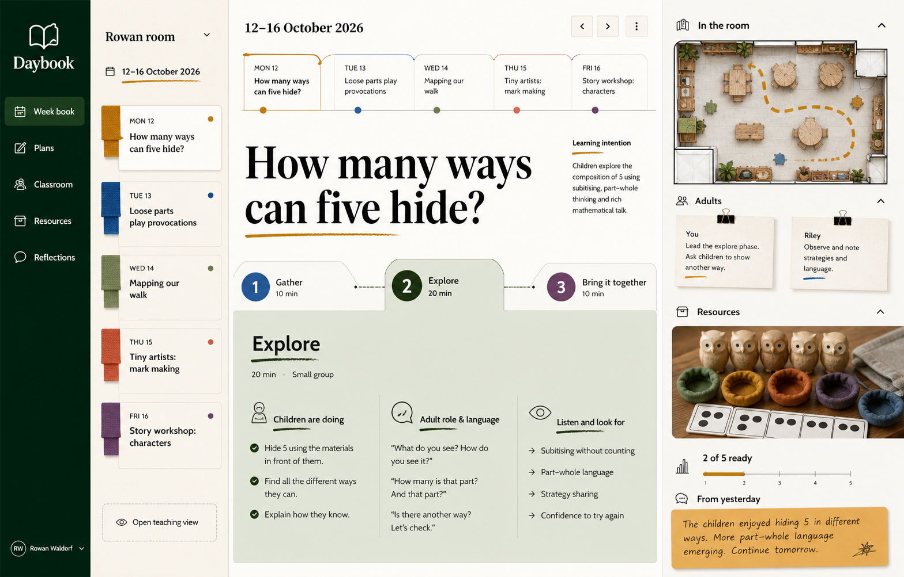

# Daybook — High-Level Product Requirements Document

| Field | Value |
| --- | --- |
| Status | Final v1.4 — requirements baseline and approved master visual direction |
| Date | 2026-08-03, amended 2026-08-05 (Section 24) |
| Portfolio position | Application 3 of 3 |
| Product | Daybook |
| Product type | Desktop-first early-years planning, teaching, classroom-provision, resource, and reflection studio |
| Initial market | Reception classes and group/school-based early-years settings in England |
| Primary users | Reception teachers, nursery teachers, early-years practitioners, room leaders, and teaching assistants |
| Primary platform | Modern desktop web browsers on macOS, Windows, and ChromeOS |
| Secondary access | iPhone Safari can open and inspect the complete desktop workspace using explicit Fit and zoom controls; mobile-first authoring is not an initial target |
| Purpose | Demonstrate that the UI Framework can generate a credible, humane professional tool outside software engineering and game development, with explicit ports, adapters, artifact generation, and diverse specialist UI |
| Normative visual reference | [Approved Week Book master direction](visual-benchmarks/01-week-book-master-direction.png) — the binding classroom-atelier art direction; coordinated workspace renders remain required |
| Normative structural reference | [Daybook interactive mockup source](../) in this repository, defining structure, content, navigation, and interaction promises (Section 12.2); hosted builds are convenience mirrors |

## 1. Product summary

Daybook is a desktop-first planning and teaching studio for early-years
educators. It helps a teacher move coherently from half-term intent to weekly
planning, individual lesson design, classroom and continuous-provision setup,
resource preparation, live teaching, reflection, and next-week adaptation.

The product is designed around the materials and judgements teachers actually
use:

- a weekly planning book;
- flexible lesson sequences rather than fixed forms;
- classroom-area and adult-deployment notes;
- real and printable resource packs;
- a distraction-reduced Teaching View;
- concise reflections, child voice, and supporting evidence; and
- explicit decisions about what to keep, change, and carry forward.

The initial reference week demonstrates five different kinds of early-years
teaching:

1. Guided mathematics.
2. Story and talk.
3. Outdoor inquiry.
4. Phonics.
5. Continuous provision.

These examples prove flexibility; they are not the only lesson types the
product may support. A teacher must be able to plan any developmentally
appropriate lesson, routine, intervention, workshop, inquiry, story session,
or provision invitation without forcing it into a prescribed pedagogy.

Daybook is not a nursery-management suite, learning journal, child-attainment
dashboard, parent-messaging platform, safeguarding-record system, or prompt-led
AI lesson generator.

## 2. Problem statement

Early-years planning crosses several artifacts that are often fragmented
across paper planners, word-processing templates, spreadsheets, shared drives,
messaging threads, learning-journal platforms, printable-resource sites, camera
rolls, and staff briefings.

A teacher may hold a half-term curriculum intention in one document, a weekly
grid in another, detailed activity notes elsewhere, a mental model of the room
setup, and resource lists on paper. During teaching, the plan is too dense to
scan quickly. After teaching, useful reflections and child language are either
lost or turned into disproportionate documentation.

Existing products are individually strong at areas such as learning journals,
setting management, activity catalogues, AI-generated weekly plans, or
printables. The missing workflow is a calm professional workspace that keeps
these six questions connected:

1. Why are we teaching this now?
2. What will children be doing?
3. What is the adult's role and language?
4. How should the room, people, and materials be prepared?
5. What does the teacher need during the live session?
6. What happened, and what should change next?

The product must reduce planning friction without turning planning into a
compliance exercise or replacing teacher judgement with generated text,
curriculum tick-boxes, or child-level scoring.

## 3. Product outcome

A teacher can map a coherent half term, assemble a week containing varied
lesson and provision types, develop any selected plan through direct editing,
brief adults, prepare and print resources, enter a readable Teaching View,
record a proportionate reflection, and carry the resulting decision into a
future plan without duplicating work.

The authoritative outcome is:

> A practical, editable teaching plan owned by the teacher and grounded in the
> setting, children, available adults, environment, and resources.

It is not an automated judgement about a child, a guarantee of learning, an
Ofsted-compliance verdict, or a replacement for professional observation.

For the UI Framework, Daybook must prove support for:

- a light, tactile, teacher-derived desktop design language;
- direct manipulation and progressive disclosure instead of form-heavy UI;
- several coordinated professional workspaces within one application;
- printable and rendered artifacts;
- spatial classroom-layout interaction;
- live timer and lesson-delivery state;
- team sharing, autosave, versioning, and comments;
- privacy-aware media and child references;
- curriculum and document adapters; and
- externally hosted access that remains inspectable on iPhone.

## 4. Target users and jobs

### 4.1 Primary users

**Reception teacher or nursery teacher**

- Shape a coherent week from curriculum intent and recent classroom knowledge.
- Plan whole-class, small-group, outdoor, and provision-based experiences.
- Prepare the environment, adults, and materials.
- Teach without repeatedly returning to a dense planning document.
- Record concise professional reflection and adapt future plans.

**Early-years practitioner or teaching assistant**

- Understand the learning intention, adult role, language, setup, and resources.
- Prepare a classroom area or pack without requiring a separate verbal handoff.
- Add a useful quick note or team response after teaching.

**Room leader or EYFS lead**

- See the relationship between half-term intent, weekly provision, planned
  teaching, and reflection.
- Share strong plans and templates without forcing identical delivery.
- Support consistency and development while preserving professional autonomy.

### 4.2 Secondary users

- Nursery managers reviewing educational provision without using Daybook for
  billing, ratios, rotas, or family administration.
- Student teachers and early-career teachers learning to connect intention,
  activity, adult interaction, environment, and reflection.
- SENCOs and inclusion leads advising on reasonable adaptations without turning
  the planner into an individual assessment system.
- School leaders evaluating planning workload and curriculum coherence.
- Technical teams evaluating the UI Framework's ability to generate specialist
  education software.

### 4.3 Core jobs to be done

1. What are we trying to help children encounter, practise, discuss, or
   understand this week?
2. How does today's lesson or provision relate to that wider intent?
3. What will children actually do, and what should adults do or say?
4. How must the room and resources be prepared before children arrive?
5. What does the teacher need to see at a glance while teaching?
6. What did children do or say that should influence the next plan?
7. Can another adult pick up the plan and contribute without reading pages of
   prose?
8. Can the teacher print, share, reuse, and adapt the work without reformatting
   it manually?

## 5. Product principles

1. **Teacher judgement is authoritative.** Daybook supports decisions; it does
   not make or score them.
2. **Planning exists to improve teaching.** The product must not reward longer
   plans, more fields, more evidence, or curriculum-tag density.
3. **Plan through direct editing, not form completion.** The primary objects are
   pages, sequences, cards, room areas, resources, and notes. Structured forms
   appear only where the data genuinely requires them.
4. **Any lesson can fit.** Teachers can add, rename, reorder, duplicate, or
   remove phases and choose only the structures relevant to the lesson.
5. **Environment and materials are pedagogical.** Classroom areas, adult
   deployment, transitions, and resources are first-class parts of the plan.
6. **Teaching and reflection remain connected.** The plan, live phase, quick
   note, reflection, and carry-forward decision share one traceable lineage.
7. **Professional language, not AI language.** The UI uses familiar teacher
   terms and does not centre chat, prompts, magic buttons, generated scores, or
   generic productivity dashboards.
8. **Proportionate documentation.** A teacher can record what changed their
   judgement without building an evidence file for routine learning.
9. **Child development is not a progress bar.** Child references, observations,
   and quotations are qualitative and contextual; no automated profiling,
   ranking, prediction, or deficit labelling is permitted.
10. **Print is a real output.** Plans, staff briefs, resource checklists, prompt
    cards, and reflection pages must remain useful away from the screen.
11. **Calm light-mode desktop density.** The product should feel like a
    well-organised teacher planning book: warm paper, curriculum tabs, ruled
    pages, practical labels, clear type, and restrained classroom colours.
12. **Frameworks are versioned references, not the curriculum.** EYFS and
    optional non-statutory guidance may be linked, but cannot constrain the
    richness of experiences or substitute for local curriculum design.

## 6. Real-world grounding

Daybook's product direction is grounded in current early-years practice and
existing product conventions:

- The EYFS statutory framework defines seven interconnected areas of learning
  and development, with three prime and four specific areas.
- The framework states that ELGs should not be used as a curriculum or to limit
  rich experiences.
- Ongoing assessment is part of teaching and learning, but routine written
  records and physical evidence are not required.
- Assessment should not create long breaks from interaction or excessive
  paperwork; professional knowledge and judgement are sufficient.
- Tapestry demonstrates the value of activity catalogues, planned activities,
  linked reflections, and setting-owned collections.
- Famly demonstrates the value of setting-owned curriculum structures and
  fast observational context, while also illustrating the broader management
  suite that Daybook deliberately avoids.
- PlayPlan and PlanPad demonstrate market demand for complete weekly planning,
  resource awareness, printables, classroom context, and editable outputs.
- MyTeachingStrategies demonstrates familiar daily and weekly planning
  structures in early-childhood settings.
- Department for Education workload guidance distinguishes purposeful planning
  for teaching from detailed planning produced for accountability.

Daybook does not clone these products. It concentrates on one integrated
Plan → Prepare → Teach → Reflect loop and preserves teacher ownership at each
stage.

### 6.1 Regulatory content baseline

At the PRD date, GOV.UK publishes separate EYFS framework versions that apply
until 31 August 2026 and from 1 September 2026. The reference academic year is
2026/27, so the initial England adapter must load the group and school-based
framework effective 1 September 2026. Framework content must be versioned by
provider type and effective date; it may not be hard-coded into UI labels.

Reception Baseline Assessment content, numerical scores, materials, and results
are outside Daybook's planning workflow. Daybook must not use the RBA framework
to guide teaching or treat it as formative or diagnostic data.

## 7. Initial vertical slice

### 7.1 Setting: Rowan room reference week

The initial reference fixture contains:

- one Reception cohort named Rowan & Foxes;
- 32 children and three adults;
- the week of 12–16 October 2026;
- one half-term curriculum intention;
- one linked classroom layout;
- five lesson or provision plans;
- one resource pack per plan;
- one completed Teaching View flow;
- three completed reflections and two not-yet-taught placeholders; and
- two carry-forward decisions for the following week.

### 7.2 Reference lessons

| Day | Plan | Type | Primary thread |
| --- | --- | --- | --- |
| Monday | How many ways can five hide? | Guided mathematics | Composition of five and mathematical talk |
| Tuesday | The storm whale: whose voice can we hear? | Story and talk | Inference, dialogue, and expressive language |
| Wednesday | Bridge builders: can the cart cross? | Outdoor inquiry | Structures, testing, explanation, and collaboration |
| Thursday | Sound detectives: /m/ around our room | Phonics | Phonemic discrimination and grapheme connection |
| Friday | The autumn market | Continuous provision | Shared narrative, purposeful marks, counting, and comparison |

### 7.3 Authoritative vertical-slice question

Can a Reception teacher plan, prepare, teach, reflect on, and carry forward a
varied week using one coherent product, while a second adult can understand
their role and resources without requiring a separate planning document?

## 8. Core workflow

1. Open Rowan room and confirm the academic term, week, team, and class context.
2. Review or edit the half-term intention and weekly focus.
3. Place, reuse, or create plans on the week map.
4. Open a plan and directly edit its title, intention, learning threads, phases,
   child activity, adult role/language, and observation focus.
5. Link the plan to classroom areas, adult deployment, transitions, and a
   resource pack.
6. Mark physical materials ready and add relevant printables to the print queue.
7. Share the week or print a staff-ready pack.
8. Open Teaching View for the active lesson.
9. Move through phases, run or pause the timer, inspect the adult prompt and
   resources, and capture a quick note.
10. Finish the lesson and open its reflection.
11. Record what happened, child voice or optional evidence, and decisions to
    keep, change, or try next.
12. Carry selected decisions into the next relevant plan or week.

## 9. Workspace requirements

### 9.1 Week Book

The Week Book is the default operational workspace. It must provide:

- persistent room/class and academic-week context;
- a five-day strip with lesson time, type, and selected state;
- a compact left-side list of the week's plans;
- a planning sheet, classroom-setup tab, and resources/print tab;
- direct editing of plan content;
- flexible lesson phases with minutes, child activity, adult role, and what to
  notice;
- learning-intention and curriculum-thread references;
- room-layout preview;
- adult deployment;
- physical and printable resource readiness;
- a concise prior-day or class note;
- print and team-share actions; and
- an entry point into Teaching View.

The Week Book must remain useful for whole-class, group, individual,
intervention, outdoor, routine, and continuous-provision planning.

### 9.2 Plans

The Plans workspace must support both long-range coherence and reuse:

- half-term intent;
- week-by-week focus and dates;
- plan cards within each week;
- curriculum threads that run across several weeks;
- selection and preview without opening the full plan;
- a library of teacher-owned plans and team templates;
- recent-use, ownership, and template context;
- duplicate, move, archive, and reopen actions; and
- creation of a blank plan without requiring a generated starting point.

### 9.3 Classroom

The Classroom workspace treats the environment as part of teaching. It must
support:

- a room or outdoor-area plan;
- named provision areas;
- today's invitation and learning intention for each area;
- link from an area to relevant plans;
- setup/reset checks;
- adult deployment and transitions;
- simple area readiness states;
- print-ready room briefing; and
- copy-forward of a setup to another day.

The room plan is an educational setup tool, not a certified safety, evacuation,
ratio, or facilities-management plan.

### 9.4 Resources

The Resources workspace must support:

- a resource pack linked to each plan;
- rendered sample or reference imagery;
- physical-item checklist;
- setting-owned resource library;
- reusable printable masters;
- print queue with size, colour/mono, copies, and destination;
- pack labels and staff-room print actions;
- readiness state and ownership;
- export of individual documents or a complete pack; and
- clear distinction between supplied, setting-authored, and generated
  resources.

### 9.5 Teaching View

Teaching View is a distraction-reduced delivery surface. It must provide:

- plan identity and class context;
- complete lesson sequence with current and completed phases;
- large current-phase title and child activity;
- current "listen and look for" prompt;
- adult role and language cue;
- resource-at-hand preview and checklist;
- start, pause, reset, and add-time timer actions;
- previous and next phase controls;
- a quick-note action;
- optional room-display mode containing only approved child-facing content;
- finish-and-reflect action; and
- safe continuation when connectivity is interrupted.

Teaching View is teacher-facing. Room display is a controlled projection of a
prompt, not a child account or child-operated application.

### 9.6 Reflections

The Reflections workspace must support:

- week completion context without performance scoring;
- plan-linked reflections;
- directly editable account of what happened;
- concise Keep, Change, and Try Next decisions;
- child language quoted in context;
- optional photo, audio, or work-sample evidence;
- comparison with the original "listen and look for" prompt;
- team response;
- explicit carry-forward notes; and
- trace from a carry-forward decision to the future plan where it was used.

A reflection can be complete without an attachment, curriculum tag, child-level
score, or extensive written record.

## 10. Pedagogical and evidence policy

### 10.1 Planning policy

- Teachers choose the level of plan detail appropriate to the lesson.
- The application may provide templates, but every section is optional unless
  required for a shared setting process.
- Templates cannot lock a teacher into a single lesson structure.
- Plans may reference EYFS areas and optional guidance, but the product cannot
  claim a plan is compliant, complete, high quality, or Ofsted-ready.
- ELGs may be referenced for statutory-profile context only and cannot be used
  as the plan's curriculum spine or to restrict experiences.

### 10.2 Observation and reflection policy

- Professional judgement belongs to the practitioner.
- Day-to-day observations need not produce written records.
- Evidence attachments are optional and purpose-specific.
- The product cannot infer a developmental level from a note, photo, resource,
  interaction, or plan.
- The product cannot rank children, predict outcomes, generate attainment
  bands, or recommend streaming/grouping from observed data.
- A quick note is pedagogical, not a safeguarding record. If a user attempts to
  record a safeguarding concern, the product must direct them to the setting's
  approved safeguarding process and avoid claiming Daybook is the system of
  record.

### 10.3 Resource policy

- Every generated or externally sourced resource must retain source and rights
  metadata where available.
- Generated images and printable content require adult review before printing
  or room display.
- The product must distinguish an illustrative setup render from a photograph
  of the actual classroom or pack.
- Daybook does not purchase materials, manage procurement, or recommend unsafe
  materials.
- Teachers remain responsible for age appropriateness, choking hazards,
  allergies, tool use, and local risk assessment.

## 11. Interaction and desktop UX requirements

### 11.1 Application shell

- Persistent left navigation for Week Book, Plans, Classroom, Resources, and
  Reflections.
- Persistent room/class identity and academic context.
- Central workspace remains the largest surface.
- Selected lesson and view remain stable when switching relevant modules.
- Common actions are available through visible controls and keyboard shortcuts.
- Autosave state is visible without dominating the workspace.
- Destructive or privacy-sensitive actions require confirmation proportional
  to risk.

### 11.2 Direct editing and progressive disclosure

- Titles, intentions, phase text, prompts, reflections, and notes are editable
  in place.
- The product avoids a persistent property inspector full of labelled fields.
- Selecting an object reveals only the controls relevant to it.
- Phase, room-area, resource, and reflection details expand contextually.
- Copy, duplicate, drag/reorder, and keyboard movement are supported where
  meaningful.
- Undo/redo is available for authoring changes.

### 11.3 Desktop and iPhone access

- The authoritative composition is designed for a 1280 px or wider desktop
  viewport and must remain strong at 1440 × 900 and 1920 × 1080.
- The public hosted demonstration must open in current iPhone Safari.
- On a narrow screen, the product preserves the desktop composition and offers
  explicit Fit, zoom-out, and zoom-in controls plus panning.
- The narrow-screen mode cannot silently reorganise the product into mobile
  cards that obscure the approved desktop information hierarchy.
- Production mobile authoring, camera capture, and touch-specific workflows are
  P2 unless separately approved.

### 11.4 Visual language

- Fixed light mode for the initial product.
- Warm off-white paper and neutral classroom surfaces.
- Forest green for primary actions and active teaching state.
- Ochre for planning-book context, notes, and selected-day tape.
- Muted blue, green, rose, amber, and aubergine for stable lesson or curriculum
  categories.
- Teacher-planner cues such as ruled paper, tabs, labels, checklists, clipped
  notes, print sheets, and restrained tactile shadows.
- Clear serif display typography paired with highly legible sans-serif body
  text.
- Moderate density and generous reading sizes; no critical text below 12 CSS px
  at 100% production desktop scale.
- Colour is never the only indicator.

The product must avoid generic AI design language, chat-first layouts, gradient
hero cards, glassmorphism, oversized metric tiles, excessive rounded cards,
neon accents, cartoon mascots, toy-store styling, and mobile-first form stacks.

## 12. Normative reference hierarchy

Daybook has two complementary reference sets. They are deliberately not
interchangeable.

### 12.1 Approved graphical master direction

The [classroom-atelier Week Book render](visual-benchmarks/01-week-book-master-direction.png)
is approved as Daybook's binding master visual direction.

The direction is defined by:

- a compact dark bottle-green primary-navigation rail and warm contextual week
  rail rather than a generic all-purpose sidebar;
- an asymmetric editorial desktop grid with a strong typographic lesson canvas;
- physical classroom cues expressed through woven index tabs, clipped teaching
  notes, restrained hand-marked underlines, and paper texture rather than a
  literal ring-bound-book simulation;
- a connected five-day ribbon and teaching-phase path that make time and lesson
  sequence spatially legible;
- a preparation rail combining a top-down room view, adult briefing slips,
  truthful resource photography, readiness, and prior-session context;
- warm chalk-white and oat surfaces with bottle green, ochre, mineral blue,
  sage, dusty coral, and aubergine accents;
- bold editorial serif display type paired with precise humanist sans-serif UI;
  and
- high contrast, disciplined spacing, practical density, and confident image
  scale without generic dashboard cards or generic AI-product decoration.

The alternative editorial-journal exploration and rejected first-pass renders
remain under `visual-concepts/` as non-normative process history. They cannot be
used to dilute or replace the approved classroom-atelier direction.

The approved master direction must now be developed into coordinated desktop
renders for Plans, Classroom, Resources, Reflections, and Teaching View. Those
workspace renders must interpret the same system for their specialist content
rather than repeat the Week Book layout mechanically.

The approved render is not a pixel specification and does not override
accessibility, responsive behaviour, real data states, or functional
requirements. Its microcopy, exact object placement, dates, counts, photographs,
and decorative details are illustrative unless supported elsewhere in the PRD.
It is nevertheless normative for visual ambition: matching only the current
interactive mockup's lower-fidelity styling is not sufficient for visual
acceptance.

### 12.2 Interactive structural and content benchmark

The canonical Daybook interactive mockup is the source in this repository at
[`docs/product-mockups/daybook/`](../), versioned together with this PRD.
Hosted builds, including the public gallery build and the original
externally hosted mockup (baseline implementation commit
`f916bbe0a23e8ae753d5f18bcea8473151f52dbb`), are convenience mirrors of the
repository source; where a mirror and the repository source differ, the
repository source governs.

The interactive mockup defines the approved desktop composition, navigation
model, content hierarchy, workspace relationships, interaction patterns,
states, and visible feature promises for:

1. Week Book and Planning Sheet.
2. Classroom Setup within a lesson.
3. Resources & Print within a lesson.
4. Half-Term Map and Plan Library.
5. Classroom provision planning.
6. Resource packs, shared library, and Print Queue.
7. Reflections and carry-forward decisions.
8. Teaching View.
9. Narrow-screen desktop Fit/zoom controls.

The rendered resource contact sheet at
[`../public/resource-samples.png`](../public/resource-samples.png) is normative
for the level of realism and feasibility expected from sample resources, but
not for literal owl count, exact materials, or exact crop.

The interactive mockup is **not normative** for:

- functional completeness: persistence, sharing, printing, notifications,
  collaboration, and assistance are simulated, and the simulation defines the
  intended interaction shape, not the implementation;
- visual fidelity, which Section 12.1 and the coordinated workspace renders
  govern; and
- sample content, which is illustrative unless identified as reference-fixture
  data in Section 7 or Section 13.

### 12.2.1 v2 interactive mockup

The [v2 interactive mockup](../v2/) is the v1 mockup taken forward. It is
built from the v1 source and keeps the v1 structure, content, and visual
language without change, so everything Section 12.2 approves remains true of
v2. On top of that baseline it adds a bounded set of behaviors from the
requirement tables:

- Finish & reflect closes Teaching View and opens the reflection for the
  taught lesson (TEA-008, REF-001).
- Quick notes are captured in Teaching View with a phase-relative time
  stamp (TEA-009) and reappear beside that lesson's reflection.
- The phase timer adds two minutes at any time, and expiry reads as a
  prompt, not a rule (TEA-006, TEA-013).
- Room display is a real full-screen projection that shows only the
  approved child-facing prompt, with an explicit exit (TEA-011).
- The half-term map marks where reflection carry-forwards land (REF-008).

Because v2 is derived from the v1 source, the v1 benchmark and v2 cannot
diverge structurally except through these listed additions. The simulation
limits in Section 12.2 apply to v2 unchanged.

### 12.3 Conflict resolution and review

When the references differ:

- the PRD requirements determine product scope, policy, data rules, and
  acceptance behaviour;
- the interactive mockup determines structure, content relationships,
  navigation, control intent, and promised states;
- the approved graphical master direction and workspace renders determine
  visual quality, material language, hierarchy, workspace character, and
  image-treatment ambition;
- a graphical detail not represented by a requirement or interactive promise is
  illustrative rather than a new feature; and
- lower fidelity in the interactive mockup cannot be used to reduce the visual
  bar established by the graphical renders.

Week Book visual implementation may proceed against the approved master render.
Final visual acceptance for each remaining workspace is blocked until its
coordinated render is approved. Acceptance requires side-by-side desktop review
of production screens against the relevant render at 1600 × 1000 or an
equivalent 16:10 viewport, plus checks at the supported production widths.
Reviewers judge equivalent quality and intent rather than pixel identity.

## 13. Requirements baseline and visual-promise register

### 13.1 Requirement contract

This section is the binding implementation baseline derived from the approved
reference hierarchy and product policy above.

| Level | Meaning |
| --- | --- |
| P0 | Required for vertical-slice acceptance. The product cannot be called complete without passing evidence. |
| P1 | Required for the public UI Framework demonstration. It may follow the first usable vertical slice, but it is not optional and cannot be silently dropped. |
| P2 | Approved later-scope requirement retained in the backlog but not required for the initial public demonstration. |
| Illustrative | Content used to demonstrate hierarchy or density; it does not prescribe a literal value, name, photograph, or implementation. |

Governance rules:

- Every delivered P0 or P1 requirement must link to automated test output,
  recorded interaction evidence, or an approved manual verification record.
- A static screenshot is not evidence of working behaviour unless the
  requirement is purely visual.
- A visible mockup element may be replaced by a demonstrably equivalent
  interaction, but the linked requirement ID and outcome must remain satisfied.
- Removing, deferring, or materially changing a P0 or P1 requirement requires a
  versioned PRD amendment.
- Example lesson titles, adults, child names, dates, and materials are
  illustrative unless explicitly identified as reference-fixture data.
- No interface may present generated or demo content as a real child record,
  statutory result, safeguarding record, curriculum verdict, or confirmed
  physical inventory.

### 13.2 Application shell and visual-quality requirements

| ID | Pri. | Requirement | Acceptance evidence |
| --- | --- | --- | --- |
| APP-001 | P0 | Provide a desktop-first web application supporting current Chrome, Edge, and Safari on macOS, Windows, and ChromeOS at 1280 px and wider. | Recorded execution at 1280 × 800, 1440 × 900, and 1920 × 1080 on target browsers. |
| APP-002 | P0 | Provide persistent Daybook identity, room/class context, navigation for all five workspaces, and the approved open-book logo. | Layout inspection and navigation recording. |
| APP-003 | P0 | Preserve active room, week, lesson, module, tab, selection, and unsaved draft context during normal navigation. | Cross-module state-retention test. |
| APP-004 | P0 | Provide visible autosave state, recoverable drafts, version history, and unsaved-change protection before navigation or browser close where a save has not completed. | Offline, delayed-save, reload, and recovery tests. |
| APP-005 | P0 | Provide undo and redo for plan, classroom, resource, and reflection authoring without rewriting published historical versions. | Multi-step edit/undo/redo and published-version test. |
| APP-006 | P0 | Provide print, share, duplicate, archive, and export actions only where supported, with truthful completion and error states. | Success, permission-denied, network-failure, and partial-export tests. |
| APP-007 | P0 | Use keyboard-accessible native controls, visible focus, logical tab order, skip navigation, and labelled interactive regions. | Keyboard-only and screen-reader smoke tests. |
| APP-008 | P0 | Mark examples, generated content, drafts, published plans, archived plans, and unavailable content distinctly. | Fixture inspection across each state. |
| APP-009 | P0 | Show no fabricated save, share, print, inventory, timer, or attachment state. | Two-user and failure-fixture state reconciliation. |
| APP-010 | P1 | Provide a command surface and configurable shortcuts for create/open, print, share, duplicate, undo/redo, and Teaching View. | Shortcut and command-search tests. |
| APP-011 | P1 | Open in current iPhone Safari with the complete desktop composition, default Fit state, panning, and explicit Fit/−/+ controls. | iPhone viewport recording in portrait and landscape. |
| APP-012 | P0 | Keep all critical interaction text readable at production desktop scale; the demonstration may scale for iPhone inspection but cannot make that scaled size the production desktop baseline. | Typography audit at 100% desktop scale. |
| VIS-001 | P0 | The production Week Book and planning workspace must meet `visual-benchmarks/01-week-book-master-direction.png`, including its asymmetric editorial hierarchy, classroom-atelier material language, connected day/phase sequences, practical density, and room/adult/resource preparation rail. | Side-by-side expert review at 1600 × 1000 plus 1280 × 800 and 1920 × 1080 implementation captures. |
| VIS-002 | P0 | The production Classroom workspace must meet the approved Classroom graphical benchmark in spatial clarity, credible physical-room cues, area differentiation, adult-route legibility, and selected-area focus while remaining an educational plan rather than CAD or a game map. | Side-by-side expert review using the Rowan fixture and selected Workshop area. Blocked until benchmark approval. |
| VIS-003 | P0 | The production Resources workspace must meet the approved Resources graphical benchmark in photographic/render quality, feasible classroom materials, pack differentiation, printable preview quality, provenance clarity, and selected-pack depth. | Side-by-side review of five demo packs, source/provenance labels, and print previews. Blocked until benchmark approval. |
| VIS-004 | P0 | The production Teaching View must meet the approved Teaching View graphical benchmark in classroom-distance hierarchy, calm focus, phase distinction, timer prominence, prompt separation, and at-hand resource visibility. | Side-by-side review plus classroom-distance legibility test on the reference desktop. Blocked until benchmark approval. |
| VIS-005 | P0 | All workspaces must share the approved classroom-atelier system: open-book identity, dark-green primary rail, warm contextual surfaces, woven/index cues, connected spatial sequences where relevant, bold serif/sans hierarchy, restrained hand annotations, subject accents, and large truthful imagery used consistently rather than decoratively. | Cross-workspace design-system audit and token inventory against Section 12.1. |
| VIS-006 | P0 | Production imagery must show feasible early-years materials with truthful `Illustration`, `Actual pack`, or `Printable preview` provenance and must avoid cartoon, luxury-product, toy-catalogue, or impossible classroom staging. | Resource-image art-direction and provenance review. |
| VIS-007 | P0 | No workspace may regress to generic AI-product language, including prompt-first composition, chat panels, sparkle motifs, gradient hero cards, glassmorphism, oversized metric tiles, or unexplained generated content. | Full-product visual and copy audit. |
| VIS-008 | P0 | Render parity cannot override accessibility: production typography, focus, contrast, target sizes, reduced motion, zoom, and non-colour state communication must pass the requirements in Sections 11 and 17.5. | Accessibility test results paired with any documented visual deviations. |
| VIS-009 | P0 | The production Plans workspace must receive and meet an approved classroom-atelier render that makes half-term intent, six-week structure, curriculum threads, and selected-plan reasoning visually distinct without becoming a spreadsheet, kanban board, or compliance grid. | Side-by-side expert review. Blocked until the coordinated Plans render is approved. |
| VIS-010 | P0 | The production Reflections workspace must receive and meet an approved classroom-atelier render that foregrounds teacher judgement, concise evidence, Keep/Change/Try Next decisions, child voice, carry-forward, and team response without looking like assessment analytics or a form stack. | Side-by-side expert review. Blocked until the coordinated Reflections render is approved. |

### 13.3 Week Book and lesson-planning requirements

| ID | Pri. | Requirement | Acceptance evidence |
| --- | --- | --- | --- |
| WKB-001 | P0 | Show the selected room/class, academic term, week range, team context, and five-day plan strip. | Rowan fixture inspection. |
| WKB-002 | P0 | Select a lesson from either the left weekly list or day strip and keep both selections synchronized. | Bidirectional selection recording. |
| WKB-003 | P0 | Create a blank lesson, duplicate an existing lesson, move it to another day/time, and archive it. | Create/duplicate/move/archive/reopen test. |
| WKB-004 | P0 | Directly edit title, type, day/time, group, learning intention, and optional learning/curriculum threads without opening a general-purpose form. | Keyboard and pointer editing test. |
| WKB-005 | P0 | Add, rename, reorder, duplicate, and delete arbitrary lesson phases. No fixed phase names or counts are required. | Build a four-phase lesson from blank and reopen it. |
| WKB-006 | P0 | Each phase supports duration, what children do, adult role/language, and optional listen/look-for prompt. | Field persistence and print-output comparison. |
| WKB-007 | P0 | Increment/decrement phase duration and show total planned duration without treating duration as a quality score. | Duration and total reconciliation. |
| WKB-008 | P0 | Provide plan-level classroom setup, adult deployment, resource pack, class/prior-day note, and relevant print output. | Rowan lesson round-trip across all three tabs. |
| WKB-009 | P0 | Support guided maths, story/talk, outdoor inquiry, phonics, and continuous provision fixtures without a special-case schema for each. | Five-fixture schema and interaction test. |
| WKB-010 | P0 | Allow any plan section except identity and ownership metadata to be omitted when not pedagogically relevant. | Minimal viable plan save/teach/print test. |
| WKB-011 | P0 | Show learning threads as optional references; absence or density of tags cannot produce warnings, scores, or compliance status. | Untagged and multi-tagged plan tests. |
| WKB-012 | P0 | Open Teaching View at the currently selected phase and return to the same planning context on exit. | Open, advance, exit, and context-restoration recording. |
| WKB-013 | P0 | Print a planning sheet, room brief, resource checklist, and blank reflection page with room/week/lesson identity. | PDF and physical-print review. |
| WKB-014 | P1 | Copy an approved plan or phase to another room/week while preserving attribution and severing live links unless explicitly selected. | Copy and edit independence test. |

### 13.4 Plans and curriculum-map requirements

| ID | Pri. | Requirement | Acceptance evidence |
| --- | --- | --- | --- |
| PLN-001 | P0 | Create and edit a half-term intent linked to one room/class and dated academic period. | Autumn 2 fixture round-trip. |
| PLN-002 | P0 | Display a six-week or configurable-duration map with week dates, focus, notes, and plan cards. | Six-week fixture and variable-duration test. |
| PLN-003 | P0 | Add, move, duplicate, remove, and open plan cards from the map. | Pointer and keyboard interaction recording. |
| PLN-004 | P0 | Define a curriculum thread spanning multiple weeks and link relevant plans without duplicating their content. | Thread-to-plan trace test. |
| PLN-005 | P0 | Preview selected plan type, dates, rationale, links, and readiness before opening its planning sheet. | Preview reconciliation with selected plan. |
| PLN-006 | P0 | Provide a plan library with teacher-owned plans, team templates, favourites, recent use, type, and last-used context. | Library fixtures and filter results. |
| PLN-007 | P0 | Reuse a plan as an editable copy; preserve source attribution and original version. | Template/copy lineage inspection. |
| PLN-008 | P0 | Archive and restore plans without deleting historical teaching sessions or reflections that reference them. | Archive/restore integrity test. |
| PLN-009 | P1 | Export and import a portable Daybook plan/template bundle through a versioned adapter. | Cross-workspace export/import round trip. |
| PLN-010 | P1 | Provide framework-reference links filtered by configured provider type, country, and effective date without claiming endorsement or compliance. | England 2025/2026 version-switch test. |

### 13.5 Classroom and provision requirements

| ID | Pri. | Requirement | Acceptance evidence |
| --- | --- | --- | --- |
| CLS-001 | P0 | Create and save a conceptual room or outdoor layout containing named educational areas. | Rowan layout create/reopen test. |
| CLS-002 | P0 | Select an area spatially and show its name, readiness, learning intention, current invitation, and linked plan. | Map-to-inspector synchronization test. |
| CLS-003 | P0 | Add, move, resize, rename, duplicate, and archive areas with keyboard-accessible alternatives. | Pointer and keyboard layout-authoring test. |
| CLS-004 | P0 | Configure setup/reset checks and toggle completion for the selected day without changing the reusable base area definition. | Daily-state versus base-definition test. |
| CLS-005 | P0 | Place adult assignments and describe transitions or movement between relevant areas. | Rowan adult-route fixture. |
| CLS-006 | P0 | Copy a day's area invitation and setup to another day, then edit the copy independently. | Copy/independent-edit test. |
| CLS-007 | P0 | Produce a print-ready room briefing containing areas, invitations, adult roles, transitions, resources, and notes. | Brief PDF review. |
| CLS-008 | P0 | Label the room plan as educational and non-authoritative for evacuation, statutory ratio, accessibility certification, or facilities compliance. | UI and export disclaimer inspection. |
| CLS-009 | P1 | Support multiple named layouts for room, garden, hall, and temporary setup within one room/class. | Multi-layout fixture. |
| CLS-010 | P2 | Import a bounded background image or floor plan with explicit scale and rights metadata. | Import, replace, remove, and export test. |

### 13.6 Resource and print requirements

| ID | Pri. | Requirement | Acceptance evidence |
| --- | --- | --- | --- |
| RES-001 | P0 | Create one resource pack per plan and allow reuse across plans without duplicating the underlying master items. | Five-pack reference fixture. |
| RES-002 | P0 | Store physical items, quantities/notes, readiness, location, owner, and optional safe-use note. | Pack checklist persistence test. |
| RES-003 | P0 | Show realistic rendered or photographic previews with an explicit `Illustration`, `Actual pack`, or `Printable preview` label. | Preview provenance inspection. |
| RES-004 | P0 | Maintain a setting-owned library with reusable materials and printable masters. | Add/reuse/archive library test. |
| RES-005 | P0 | Add and remove printable documents from a plan pack and print queue. | Queue synchronization test. |
| RES-006 | P0 | Configure page size, colour/mono, copies, and destination for each print job. | Print-job fixture and printer handoff review. |
| RES-007 | P0 | Print selected jobs or a complete pack and report success, cancellation, unavailable printer, and partial failure truthfully. | Print adapter state tests. |
| RES-008 | P0 | Mark a pack ready only through an explicit user action; readiness cannot be inferred from a render or plan completion. | Readiness mutation test. |
| RES-009 | P0 | Export printable files individually and as a complete plan pack with manifest and source metadata. | ZIP/PDF export inspection. |
| RES-010 | P0 | Preserve authorship, licence/source, generated status, creation date, and last review for every externally sourced or generated printable. | Metadata completeness test. |
| RES-011 | P0 | Require adult review before a generated printable can be marked approved for children or room display. | Generated-resource review gate. |
| RES-012 | P1 | Provide five feasible sample packs matching the normative visual quality: mathematics manipulatives, story/talk materials, bridge inquiry materials, phonics tokens, and market provision. | Expert review of supplied demo packs and printable files. |
| RES-013 | P2 | Connect to approved cloud drives or content libraries through adapters without granting them authority over plan structure or child data. | Capability and permission tests. |

### 13.7 Teaching View requirements

| ID | Pri. | Requirement | Acceptance evidence |
| --- | --- | --- | --- |
| TEA-001 | P0 | Open Teaching View from the active lesson and phase, showing plan identity, date/time, group, and lesson type. | Open-from-each-phase test. |
| TEA-002 | P0 | Display all lesson phases with current, completed, and upcoming states using text and shape as well as colour. | Three-state accessibility inspection. |
| TEA-003 | P0 | Display the current phase name and child activity at a size readable from normal teacher working distance on the reference desktop. | Classroom-distance manual review. |
| TEA-004 | P0 | Display the current listen/look-for prompt and adult role/language without requiring a popup. | Phase-switch content reconciliation. |
| TEA-005 | P0 | Show the linked resource preview and at-hand checklist. | Pack-to-teaching synchronization test. |
| TEA-006 | P0 | Provide start, pause, resume, reset, and add-two-minutes timer actions with visible running/paused/time state. | Timer state and elapsed-time test. |
| TEA-007 | P0 | Changing phase resets the timer to that phase's planned duration only after an explicit phase change. | Phase/timer transition test. |
| TEA-008 | P0 | Provide Previous and Next controls; final phase offers Finish & Reflect. | Full lesson walkthrough. |
| TEA-009 | P0 | Capture a timestamped quick note linked to the lesson and current phase without requiring child attribution. | Offline and online quick-note test. |
| TEA-010 | P0 | Continue displaying the loaded lesson, timer, resources, and unsynced quick notes during temporary connectivity loss. | Network-loss teaching-session test. |
| TEA-011 | P1 | Provide Room Display containing only an approved child-facing prompt or resource selected by the teacher; it exposes no adult notes, child records, comments, or navigation. | Mirrored-display privacy test. |
| TEA-012 | P0 | Exit Teaching View to the original plan, phase, and scroll/selection context. | Exit and restoration recording. |
| TEA-013 | P0 | Timer expiry and phase duration are prompts only; the UI cannot state that learning is complete or automatically advance the lesson. | Timer-expiry behavior inspection. |

### 13.8 Reflection requirements

| ID | Pri. | Requirement | Acceptance evidence |
| --- | --- | --- | --- |
| REF-001 | P0 | Create one plan-linked reflection manually or through Finish & Reflect. | Both creation paths tested. |
| REF-002 | P0 | Show week context and completed/not-yet-completed reflection state without scoring teacher performance or plan quality. | Mixed-state weekly fixture. |
| REF-003 | P0 | Directly edit What happened, Keep, Change, and Try Next content. | Edit/autosave/reopen test. |
| REF-004 | P0 | Add a contextual child quotation with optional child reference and date; attribution is never required for reflection completion. | Quoted and anonymous fixtures. |
| REF-005 | P0 | Attach an optional photo, audio note, or work sample with purpose, source, consent/lawful-basis status where applicable, and retention metadata. | Attachment metadata and permission tests. |
| REF-006 | P0 | Compare the reflection with the plan's original listen/look-for prompt and open the original plan. | Bidirectional trace recording. |
| REF-007 | P0 | Create, select, deselect, and remove carry-forward decisions. | Carry-forward mutation test. |
| REF-008 | P0 | Attach a carry-forward decision to a future plan and retain trace back to the originating reflection. | Reflection-to-future-plan lineage test. |
| REF-009 | P0 | Add team responses with author and timestamp; responses cannot overwrite the teacher's original reflection. | Two-user concurrency test. |
| REF-010 | P0 | Allow a reflection to be complete without attachments, curriculum links, child attribution, or a minimum word count. | Minimal reflection completion test. |
| REF-011 | P0 | Provide an explicit route to the setting's safeguarding process when note content is flagged by the user as a concern; do not store it as an ordinary reflection by default. | Safeguarding-route interaction and audit test. |
| REF-012 | P1 | Print or export a week reflection summary containing decisions and links while respecting attachment permissions and exclusions. | Permission-aware PDF/export test. |

### 13.9 Collaboration, persistence, and governance requirements

| ID | Pri. | Requirement | Acceptance evidence |
| --- | --- | --- | --- |
| COL-001 | P0 | Support Teacher/Practitioner, Room Lead/EYFS Lead, Setting Admin, and Read-only roles with least-privilege defaults. | Role-permission matrix tests. |
| COL-002 | P0 | Share a week, plan, room brief, pack, or reflection with selected setting users or teams; public link sharing is disabled by default. | Share, revoke, and unauthorized-access tests. |
| COL-003 | P0 | Retain author, created/updated timestamps, version, and publication state for plans, templates, resources, and reflections. | Audit metadata inspection. |
| COL-004 | P0 | Resolve concurrent edits without silent data loss; preserve recoverable conflicting text when automatic merge is unsafe. | Two-user collision fixture. |
| COL-005 | P0 | Publish an immutable plan version for a teaching session while allowing a later editable successor. | Publish/edit/version-lineage test. |
| COL-006 | P0 | Bind a teaching session and reflection to the exact published plan version used, while allowing comparison with the current version. | Version-reference integrity test. |
| COL-007 | P0 | Archive and restore records according to permissions; deletion of child-linked personal data follows configured retention and legal process. | Archive, restore, deletion, and legal-hold tests. |
| COL-008 | P0 | Provide audit history for access, sharing, export, attachment download, role changes, and deletion of personal-data-bearing records. | Audit-log fixture review. |
| COL-009 | P1 | Notify relevant team members of a newly shared/published week, direct response, or changed adult briefing without generating notification noise for autosaves. | Notification preference and event tests. |
| COL-010 | P2 | Support setting-approved external family sharing through a dedicated adapter and policy; it is not part of the initial product. | Future contract and consent tests. |

### 13.10 Curriculum, privacy, safeguarding, and responsible-assistance requirements

| ID | Pri. | Requirement | Acceptance evidence |
| --- | --- | --- | --- |
| GOV-001 | P0 | Version framework content by jurisdiction, provider type, publication version, and effective dates; the 2026/27 fixture uses England group/school-based EYFS effective 1 September 2026. | Framework-version fixture and date-switch tests. |
| GOV-002 | P0 | Represent the seven EYFS areas and their interconnected nature without converting them into completion quotas or coverage scores. | UI, data, and analytics audit. |
| GOV-003 | P0 | Label Development Matters and other non-statutory guidance accurately and separately from statutory requirements. | Content and source review. |
| GOV-004 | P0 | Do not use ELGs as a plan curriculum, lesson-quality rule, or experience-limiting checklist. | Rule-engine and UI audit. |
| GOV-005 | P0 | Do not ingest, expose, infer, or use RBA scores/materials for formative planning or child grouping. | Data-interface and adapter audit. |
| GOV-006 | P0 | Treat child names, quotations, images, audio, work samples, SEND context, and family context as personal data with purpose limitation and role-based access. | Data inventory and access tests. |
| GOV-007 | P0 | Require configurable lawful-basis/consent, permitted-use, retention, and opt-out metadata for identifiable child images or audio. | Upload, restriction, withdrawal, and deletion tests. |
| GOV-008 | P0 | Prevent restricted media from appearing in print, export, room display, templates, or shares outside its permitted audience. | Restricted-media leakage tests. |
| GOV-009 | P0 | Encrypt personal data in transit and at rest, support setting retention policies, data export, rectification, deletion, and subject-access workflows. | Security review and data-subject request fixtures. |
| GOV-010 | P0 | Complete a DPIA before production use involving child records or media and maintain an auditable data-processing inventory. | Approved DPIA and record-of-processing review. |
| GOV-011 | P0 | No automated function may assign developmental levels, diagnose needs, rank children, predict attainment, recommend streaming, or issue safeguarding judgements. | Model, rule, and UI audit. |
| GOV-012 | P1 | Optional drafting assistance may suggest plan wording, questions, adaptations, or resource ideas only after explicit user invocation; all output remains a labelled draft requiring teacher review. | Capability-off/on and acceptance/edit tests. |
| GOV-013 | P1 | Assistance using child-specific context is disabled by default and requires setting policy, approved provider terms, minimised data, transparent purpose, and no provider training on customer content. | Admin-policy and outbound-payload inspection. |
| GOV-014 | P0 | The interface cannot market plans or exports as Ofsted-ready, guaranteed compliant, personalised for a child, or evidence of progress unless a separate verified requirement explicitly supports that claim. | Copy and generated-output audit. |

### 13.11 Integration and adapter requirements

| ID | Pri. | Requirement | Acceptance evidence |
| --- | --- | --- | --- |
| INT-001 | P0 | Define versioned ports for identity, project/plan persistence, curriculum references, document rendering, printing, media storage, resource preview, sharing, audit, and time/timer services. | Contract tests using at least one alternate test adapter. |
| INT-002 | P0 | Each adapter declares capabilities such as offline access, version history, public sharing, media restrictions, print formats, cancellation, and progress; UI actions follow the declaration. | Capability-on/off fixtures. |
| INT-003 | P0 | Provide a project-native plan/template import/export adapter with schema versioning and actionable unsupported-version errors. | Current, prior, future, and malformed fixtures. |
| INT-004 | P0 | Provide browser print/PDF and file-download adapters for the reference product. | PDF, browser print, cancel, and download tests. |
| INT-005 | P0 | Provide secure object/media storage with signed access, audience checks, malware scanning, metadata extraction, and deletion propagation. | Valid, restricted, infected, expired-link, and deletion fixtures. |
| INT-006 | P0 | Provide authentication through a setting-approved identity adapter; local demo identity cannot appear as production authentication. | OIDC/test-adapter state tests. |
| INT-007 | P1 | Provide an approved cloud-drive export adapter for staff-owned printable artifacts without exposing child media by default. | Permission, export, and restriction tests. |
| INT-008 | P1 | Provide a framework-content adapter that can add a new jurisdiction/version without changing plan-domain code. | Alternate-framework contract test. |
| INT-009 | P1 | Provide an optional drafting-assistance port with explicit data policy, provenance, cancellation, refusal/error states, and teacher acceptance; no assistant is required for core planning. | Stub and approved-provider adapter tests. |
| INT-010 | P0 | Established libraries retain ownership of rich-text editing, file parsing, image processing, PDF generation, printing, authentication protocols, and low-level rendering. Daybook owns educational workflow, domain meaning, permissions, lineage, and interaction. | Architecture and dependency review. |

### 13.12 Visual-promise traceability

| Normative visual region | Requirement coverage | Disposition |
| --- | --- | --- |
| Approved classroom-atelier master direction and coordinated render set: finish, hierarchy, materiality, imagery, and workspace distinction | VIS-001–010 | P0 visual-quality gate; Week Book approved, other workspace renders pending |
| Daybook open-book logo, teacher-planner left rail, room/week context | APP-002, UX visual language in Section 11.4 | P0 |
| Week list and five-day strip with selected lesson | WKB-001–003 | P0 |
| Week header, save/print/share, week navigation | APP-003–006, WKB-001, WKB-013 | P0 |
| Planning-sheet tabs and Teaching View entry | WKB-008, WKB-012–013 | P0 |
| Lesson title, type, time/group, learning intention, and learning threads | WKB-004, WKB-010–011 | P0 |
| Flexible teaching flow, phase minutes, child activity, adult language, listen/look-for | WKB-005–007 | P0 |
| Lesson room preview, adults, rendered pack, checklist, prior-day note | WKB-008, CLS-002, RES-001–003 | P0 |
| Lesson classroom-setup diagram, adult pins, transition and room brief | CLS-001–008 | P0 |
| Resources & Print paper previews, pack contents, readiness, and print action | WKB-013, RES-001–009 | P0 |
| Plans half-term intent, six-week map, plan cards, thread path, selected preview | PLN-001–005 | P0 |
| Plan Library tabs, rows, type, last-used context, and Open action | PLN-006–008 | P0 |
| Classroom map, area states, invitations, linked plans, adult deployment, setup checks | CLS-001–009 | P0 except multiple layouts P1 |
| Resources photographed/rendered pack cards and dynamic selected-pack inspector | RES-001–004, RES-008, RES-012 | P0; five polished samples P1 |
| Physical pack checklist and printable sample pages | RES-002, RES-005, RES-010–012 | P0/P1 as identified |
| Print Queue job selection, format, copies, source, summary, and print | RES-005–007 | P0 |
| Reflections weekly list, completion state, What happened, Keep/Change/Try Next | REF-001–003, REF-010 | P0 |
| Reflection evidence, child voice, original-plan comparison, carry-forward, team response | REF-004–009, REF-012 | P0; week export P1 |
| Teaching View lesson sequence and learning intention | TEA-001–004 | P0 |
| Teaching View live timer and phase progress | TEA-006–007, TEA-013 | P0 |
| Teaching View child activity, listen/look-for, adult prompt, resources, quick note | TEA-003–005, TEA-009 | P0 |
| Teaching View previous/next, finish/reflection, room display, and exit | TEA-008, TEA-011–012 | P0; room display P1 |
| iPhone Desktop View bar with Fit/−/+ and panning | APP-011 | P1 public demonstration |

### 13.13 Acceptance-evidence contract

Before a requirement is marked complete, its evidence record must contain:

- requirement ID and implemented version;
- test or review method and environment;
- fixture identity and relevant content hashes;
- expected and observed outcome;
- automated output, recording, or approved manual-review reference;
- privacy/safeguarding review where personal data or media is involved;
- owner, date, and pass/fail result; and
- linked defect or approved PRD amendment for any deviation.

A mockup review is a separate visual-quality gate and cannot substitute for
functional, accessibility, privacy, or artifact-output acceptance.

## 14. System context and ports-and-adapters boundaries

### 14.1 Product-owned domains

**Setting and academic-context domain**

- Organisation, setting, room/class, cohort reference, academic year, term,
  week, team membership, and jurisdiction/provider-type configuration.

**Planning domain**

- Half-term intent, curriculum thread, week map, plan identity, plan version,
  lesson phases, intention, adult role/language, listening focus, and reuse.

**Environment domain**

- Room/outdoor layouts, provision areas, invitations, readiness, transitions,
  adult deployment, and plan links.

**Resource domain**

- Physical items, reusable masters, pack composition, readiness, printable
  artifacts, preview provenance, approval, and print queue.

**Teaching-session domain**

- Published plan version, active phase, timer state, connectivity state, quick
  notes, room-display projection, start/finish, and session lineage.

**Reflection domain**

- What happened, Keep/Change/Try Next, child voice, optional evidence, team
  response, carry-forward decision, and future-plan trace.

**Governance domain**

- Roles, permissions, publication, audit, retention, consent/lawful basis,
  media restrictions, framework version, and assistance policy.

### 14.2 Required ports

- Identity and organisation port.
- Project, plan, and version persistence port.
- Curriculum/framework content port.
- Rich-text/document editing port.
- Media upload, storage, and transformation port.
- Resource-render/preview port.
- PDF/document export port.
- Printer handoff port.
- Share/notification port.
- Timer/clock and offline-draft port.
- Audit and retention port.
- Plan/template import/export port.
- Optional drafting-assistance port.

### 14.3 Initial adapters

- OIDC-compatible setting identity adapter plus a clearly labelled local demo
  identity adapter.
- Service-backed project/plan repository with local draft queue.
- Versioned England EYFS framework content adapter for group/school-based
  providers.
- Browser-native print and PDF-rendering adapters.
- Secure S3-compatible media and artifact adapter.
- Browser timer/clock adapter using monotonic elapsed-time calculation.
- In-product team-share and notification adapter.
- Daybook JSON bundle import/export adapter.
- Static rendered-resource and printable demo adapters.
- Optional approved language-model adapter behind the assistance port at P1.

### 14.4 Explicitly delegated services

Daybook must not create framework services that merely rename capabilities
owned by mature libraries or platforms:

- Rich-text libraries own cursor, composition, selection, and low-level edit
  behaviour.
- PDF/document libraries own pagination, font embedding, and file encoding.
- Image libraries own resizing, thumbnails, orientation, and format conversion.
- Object storage owns durable blob persistence and signed transport.
- Identity providers own authentication protocols and credential security.
- Browser/platform print systems own device enumeration and spooler handoff.
- Generative-model providers own model inference; they do not own teacher
  judgement, plan state, permissions, or curriculum meaning.

Daybook owns the planning-to-teaching workflow, domain semantics, version and
artifact lineage, classroom/resource relationships, teacher decisions,
permission policy, and adapter contracts.

## 15. Data and artifact model

### 15.1 Principal records

- Organisation and Setting.
- Room/Class and Cohort Reference.
- User, Team, Role, and Membership.
- Academic Year, Term, Week, and Day.
- Framework Source and Framework Version.
- Half-Term Plan and Curriculum Thread.
- Week Plan and Plan Placement.
- Lesson Plan and immutable Plan Version.
- Lesson Phase.
- Learning/Curriculum Reference.
- Room Layout, Provision Area, Daily Area State, and Adult Assignment.
- Resource Item, Printable Master, Resource Pack, and Pack Item.
- Preview Asset and source/provenance record.
- Print Job and Export Manifest.
- Teaching Session, Phase State, Timer Event, and Quick Note.
- Reflection, Child Voice, Evidence Attachment, Team Response, and Carry
  Forward.
- Share Grant, Notification, Audit Event, Retention Rule, and Media Permission.

### 15.2 Lineage rules

Each teaching session must bind immutably to:

- setting and room/class;
- academic date and group context;
- published lesson-plan version;
- classroom-layout version used for the session where relevant;
- adult deployment and resource-pack snapshot;
- framework references as references, not copied statutory text;
- timer and phase events;
- quick notes; and
- resulting reflection.

Editing a plan after teaching creates a successor version. It cannot rewrite
the plan version used by an existing teaching session or alter the provenance
of a reflection.

### 15.3 Artifact bundle

A complete plan-pack export should contain, subject to permissions:

- plan manifest and version identity;
- planning sheet;
- room briefing;
- adult prompt card;
- resource checklist;
- approved printable files;
- blank or completed reflection page as selected;
- source and generated-resource metadata; and
- content hashes and export timestamp.

Child media and child-identifiable reflection content are excluded by default
and require an explicit permission-aware export choice.

## 16. Technical and product boundaries

### 16.1 Included in the initial product

- England group/school-based early-years context with versioned EYFS references.
- Reception and nursery room/class planning.
- Any teacher-authored lesson structure.
- Half-term, weekly, lesson, classroom, resource, Teaching View, and reflection
  workflows.
- Five varied reference lessons and resource packs.
- Team sharing within a setting.
- PDF/print output and portable plan/template export.
- Optional contextual child quotations and evidence under strict permissions.
- Desktop-first hosted web application.
- iPhone Safari desktop-fit access for the public demonstration.
- Optional teacher-invoked drafting assistance at P1, not required for core
  operation.

### 16.2 Not included in the initial product

- Nursery billing, funding, invoicing, registration, attendance, meal plans,
  medication, accidents, staff rotas, ratios, payroll, or family messaging.
- Full learning journals or parent-facing child timelines.
- Statutory RBA administration or results.
- EYFSP submission or automated ELG assessment.
- Automated child profiling, attainment tracking, ranking, prediction,
  diagnosis, or grouping.
- Safeguarding concern case management or referrals.
- Behaviour, medical, SEND, or child-protection system-of-record functions.
- Public resource marketplace or unreviewed community content.
- Procurement, product purchasing, stock control, or safety certification.
- Child accounts or child-operated features.
- General-purpose room CAD or statutory facilities planning.
- Mobile-first authoring, camera-first observation capture, or native mobile
  apps.
- Automatic creation of a full week without teacher initiation and review.
- Claims that a plan or export is Ofsted-ready, compliant, personalised,
  evidence of progress, or guaranteed to improve outcomes.

## 17. Non-functional requirements

### 17.1 Usability and workload

- A representative teacher should be able to adapt an existing five-plan week
  and publish it in 15 minutes or less after initial orientation.
- A representative second adult should find their role, setup, and resources
  for a selected lesson in 60 seconds or less.
- Core planning must remain possible without opening a modal form or invoking
  assistance.
- Routine reflection completion must not require an attachment, child tag,
  curriculum tag, or minimum word count.
- No workflow may add fields solely to demonstrate accountability.

### 17.2 Performance

- Initial authenticated workspace target: usable within 2.5 seconds on the
  agreed reference broadband and desktop configuration after cached assets.
- Switching lesson, phase, or primary module target: visual response within
  150 ms for local/cached state.
- Autosave acknowledgement target: within 1 second in normal conditions;
  offline local queue acknowledgement is immediate and clearly labelled.
- Teaching View phase change and timer actions target: within 100 ms.
- Print-pack generation target: under 5 seconds for the reference four-page
  pack excluding physical printer latency.
- The UI remains responsive with 12 weeks, 250 plans, 1,000 resource records,
  and 500 reflections in one room/class fixture.

### 17.3 Reliability and offline behaviour

- Autosave, upload, print, share, and export failures must retain recoverable
  user work and expose actionable state.
- Teaching View must continue with the loaded plan, timer, and local quick notes
  during temporary connectivity loss.
- Reconnection must sync queued notes and edits without duplicating them.
- Partial export or print jobs cannot be reported as complete.
- Archived or deleted master records cannot orphan immutable teaching-session
  or reflection lineage.
- Timer calculation uses elapsed monotonic time and survives tab throttling or
  backgrounding within documented browser limits.

### 17.4 Security and privacy

- TLS for data in transit and encryption for data at rest.
- Least-privilege role enforcement on server and client boundaries.
- Tenant isolation tests for all record and artifact access paths.
- Signed, short-lived attachment URLs and explicit download auditing.
- Malware scanning and media-type validation before attachment availability.
- Configurable retention, legal hold, deletion, and restricted-media states.
- No child personal data in telemetry, model-training payloads, error logs, or
  support screenshots by default.
- Production use with child data requires DPIA, processor agreements, privacy
  notices, incident response, and documented sub-processors.

### 17.5 Accessibility

- Target WCAG 2.2 AA for the web product.
- All primary planning, teaching, reflection, and print actions are keyboard
  accessible.
- Visible focus and native control semantics are preserved.
- Colour is paired with text, icons, or shapes.
- Content remains operable at 200% browser zoom on a reference desktop,
  allowing horizontal scrolling only where spatial layout requires it.
- Teaching View offers reduced motion and never auto-advances on timer expiry.
- Printed outputs use readable type, logical heading order, and non-colour
  status markers.

### 17.6 Browser and platform compatibility

- Current and previous major versions of Chrome and Edge on Windows/ChromeOS.
- Current and previous major versions of Safari on macOS.
- Current iPhone Safari for public-demo Fit/pan/zoom access.
- Firefox may be supported after P0 but is not an initial acceptance browser.
- Native desktop or mobile wrappers are not required.

## 18. Vertical-slice acceptance criteria

The initial product is accepted when a representative Reception teacher can:

1. Open the supplied Rowan room fixture and identify the active week and team.
2. Review the half-term intent and six-week map.
3. Open each of the five reference lesson types without losing context.
4. Create a new plan with a non-standard four-phase structure.
5. Edit child activity, adult role/language, timing, and listen/look-for content
   directly on the planning sheet.
6. Link a classroom area, assign adults, and prepare the room briefing.
7. Mark physical resources ready, inspect realistic previews, add printables,
   and produce the plan pack.
8. Share the week with a second staff user and confirm their read/edit limits.
9. Enter Teaching View at a selected phase, start/pause/reset the timer, move
   through phases, add time, and record an offline quick note.
10. Finish the lesson, record a concise reflection and child quotation, and
    carry a decision into a future plan.
11. Reopen the original published plan version used for teaching and distinguish
    it from a later edited version.
12. Export a permission-aware plan pack and template bundle.

The product also requires automated and recorded evidence that:

- no core plan requires an AI or drafting-assistance provider;
- an untagged plan can be taught, reflected on, printed, and reused;
- a reflection can be complete without evidence or child attribution;
- restricted child media cannot leak to room display, print, export, template,
  or unauthorised users;
- temporary connectivity loss does not stop Teaching View or lose quick notes;
- concurrent edits do not silently overwrite teacher work;
- framework version changes do not mutate historical plan references;
- no visible state implies automated child assessment or compliance; and
- the iPhone public demo opens at Fit and can pan and zoom the desktop layout.

Before the public UI Framework demonstration, every P1 requirement must also
pass, including room display, polished sample packs, command discovery,
framework-version switching, cloud-drive export, optional assistance adapter,
week-reflection export, and iPhone Safari access.

## 19. Success measures

The vertical slice succeeds when:

- at least 80% of representative teachers can adapt and publish the reference
  week without facilitator intervention;
- at least 90% can find their adult role and required resources for a selected
  lesson in under 60 seconds;
- at least 80% can create a structurally different lesson without encountering
  an irrelevant mandatory field;
- at least 90% can enter Teaching View, operate the timer, and advance phases
  without instruction;
- at least 80% can trace a carry-forward note from reflection to a future plan;
- users correctly distinguish optional observation evidence from required
  assessment records;
- planning and reflection time is materially lower than the setting's existing
  document workflow without reducing teacher-reported usefulness;
- the interface is recognisably a teacher planning tool rather than a generic
  SaaS dashboard or child-facing game;
- the full Map → Week → Plan → Prepare → Teach → Reflect → Carry Forward loop
  completes without manual document reformatting; and
- P0/P1 mockup promises remain auditable through Section 13.

## 20. Delivery stages

### Stage 0 — domain, policy, and artifact proof

- Confirm target setting type, England framework versions, and data categories.
- Validate plan, phase, room, resource, teaching-session, reflection, and
  lineage schemas with representative educators.
- Prove print pagination and five feasible reference resource packs.
- Complete initial DPIA and threat model before child media is enabled.
- Test rich-text, layout, PDF, storage, identity, and offline-draft libraries
  through bounded spikes.

### Stage 1 — Week Book vertical slice

- Daybook application shell and teacher-derived visual system.
- Room/week context and five-day strip.
- Flexible planning sheet and phase editor.
- Lesson classroom/resources tabs.
- Autosave, versioning, print pack, and desktop accessibility.

### Stage 2 — Plans, Classroom, and Resources

- Half-term map, curriculum threads, and Plan Library.
- Classroom layouts, provision areas, adult deployment, and room brief.
- Physical packs, rendered previews, printables, library, and print queue.
- Plan/template import/export.

### Stage 3 — Teaching and Reflection loop

- Published plan version and Teaching View.
- Timer, phase progression, offline quick notes, and room-display privacy.
- Reflection, evidence permissions, team response, and carry-forward lineage.
- Concurrency and offline synchronization.

### Stage 4 — public UI Framework demonstration

- Final visual polish against the normative interactive reference.
- Five finished plan fixtures and resource packs.
- England framework-version adapter demonstration.
- Permission-aware PDF/ZIP/cloud-drive export.
- Optional drafting-assistance adapter with teacher review and safe-data policy.
- iPhone Safari Fit/pan/zoom inspection mode.
- Performance, accessibility, privacy, recovery, and cross-browser evidence.
- Recorded end-to-end Plan → Teach → Reflect demonstration.

## 21. Principal risks

| Risk | Mitigation |
| --- | --- |
| Product becomes a generic AI plan generator | Keep blank-plan creation and direct editing P0; assistance is optional P1, invoked explicitly, labelled draft, and never required |
| Product recreates excessive planning paperwork | Make sections optional, remove minimum-word/evidence/tag requirements, test workload with real teachers, and audit every field for teaching value |
| EYFS links become a compliance checklist | Version frameworks as references; prohibit coverage scores, ELG-as-curriculum rules, and compliance verdicts |
| Child observations become automated assessment | Prohibit inference, scoring, ranking, prediction, or grouping; keep teacher judgement authoritative and attachments optional |
| Child media leaks through print, templates, exports, room display, or generated services | Permission-aware artifact pipeline, restricted-media tests, safe defaults, signed access, DPIA, audit, and explicit generated-service policy |
| Teaching View is visually impressive but impractical | Validate readability at classroom distance, timer/offline behaviour, phase navigation, and resource access with representative teachers |
| Classroom layout is mistaken for a safety or ratio tool | Label it educational, exclude certification/ratio functions, and keep safety-system links outside its authority |
| Resource imagery looks attractive but materials are unrealistic | Require feasible reference packs, adult review, source/provenance labels, and clear distinction between illustration and actual pack |
| Product expands into nursery administration | Enforce explicit non-goals for billing, attendance, medication, rotas, ratios, and family messaging |
| Desktop-first UI is unreadable on phones | Preserve the desktop product as authoritative, provide explicit Fit/pan/zoom for demo access, and avoid claiming mobile authoring support |
| Print/export becomes an afterthought | Treat PDF, print queue, prompt cards, manifests, and pack outputs as P0 artifacts with independent acceptance evidence |
| Team collaboration overwrites teacher work | Immutable published versions, autosave recovery, conflict preservation, author attribution, and audit history |
| Framework abstractions duplicate editors, PDF libraries, identity, storage, or model providers | Maintain coarse ports and audit service ownership before implementation |
| Mockup polish is treated as functional proof | Enforce Section 13 evidence records; visual review cannot substitute for behavior, privacy, or artifact tests |

## 22. Controlled implementation decisions

These decisions may select technologies or tune fixtures, but cannot remove or
weaken a P0/P1 requirement without a PRD amendment:

- Final Daybook tagline and minor logo geometry; the name, open-book concept,
  and teacher-derived identity remain fixed for this baseline.
- Exact production font families within the readability and visual-language
  requirements.
- Primary rich-text editor, drag/drop, and spatial-layout libraries.
- Service-side persistence database and object-store providers.
- Identity provider and tenancy implementation.
- PDF renderer, browser print strategy, and supported physical printer subset.
- Exact plan/template bundle serialization while preserving schema versioning
  and lineage.
- Exact framework content representation and update mechanism while preserving
  jurisdiction/provider/effective-date versioning.
- Optional approved model provider and prompt implementation while preserving
  teacher invocation, review, child-data policy, and capability-off operation.
- Reference adult and child pseudonyms, plan dates, material quantities, and
  sample photographs/renders.
- Reference desktop hardware, browsers, and any stricter performance budgets.

## 23. Research sources

### Statutory and professional context

- [GOV.UK — Early years foundation stage statutory framework](https://www.gov.uk/government/publications/early-years-foundation-stage-framework--2)
- [EYFS statutory framework for group and school-based providers, effective 1 September 2025](https://assets.publishing.service.gov.uk/media/68c024cb8c6d992f23edd79c/Early_years_foundation_stage_statutory_framework_-_for_group_and_school-based_providers.pdf.pdf)
- [GOV.UK — Early years foundation stage overview](https://www.gov.uk/early-years-foundation-stage)
- [GOV.UK — Development Matters](https://www.gov.uk/government/publications/development-matters--2)
- [GOV.UK — 2026 Reception Baseline Assessment arrangements](https://www.gov.uk/government/publications/reception-baseline-assessment-assessment-and-reporting-arrangements-ara/2026-reception-baseline-assessment-assessment-and-reporting-arrangements-ara)
- [GOV.UK — Early years foundation stage profile handbook](https://www.gov.uk/government/publications/early-years-foundation-stage-profile-handbook/early-years-foundation-stage-profile-handbook)
- [GOV.UK — Reducing teacher workload: planning and resources](https://www.gov.uk/government/publications/reducing-teacher-workload-planning-and-resources-group-report)
- [GOV.UK — Data protection in schools: policies and procedures](https://www.gov.uk/guidance/data-protection-in-schools/data-protection-policies-and-procedures)
- [GOV.UK — Taking and using photos and videos in schools](https://www.gov.uk/guidance/data-protection-in-schools/taking-and-using-photos-and-videos-and-using-cctv-in-schools)
- [Education Endowment Foundation — Improving Mathematics in the Early Years and Key Stage 1](https://educationendowmentfoundation.org.uk/education-evidence/guidance-reports/early-maths)
- [Education Endowment Foundation — Supporting Communication and Language in the Early Years](https://educationendowmentfoundation.org.uk/early-years/communication-language-summary)

### Existing product patterns

- [Tapestry — Activities](https://support.tapestry.info/tutorials/activities/)
- [Tapestry — Reflections](https://support.tapestry.info/reflections/)
- [Famly — Child development, observations, and curriculum builder](https://www.famly.co/platform/child-development)
- [PlayPlan — weekly planning, continuous provision, resources, and printables](https://playplan.uk/)
- [PlanPad — classroom context, resource library, and lesson planning](https://www.planpad.org/)
- [MyTeachingStrategies — teacher planning guide](https://teachingstrategies.com/wp-content/uploads/2021/08/MyTeachingStrategies-Guide-for-Teachers.pdf)

## 24. Change record

| Version | Date | Change |
| --- | --- | --- |
| v1.0–v1.2 | 2026-08-03 | Requirements baseline, reference hierarchy, and approved master visual direction. |
| v1.3 | 2026-08-05 | Made the repository copy of the interactive mockup the canonical structural benchmark; external hosted builds are convenience mirrors. Corrected the resource contact-sheet path to `../public/resource-samples.png`. Added the not-normative list for the interactive mockup in Section 12.2. Added this change record. |
| v1.4 | 2026-08-05 | Added a v2 interactive mockup as a candidate reference. Superseded by v1.5 on the same day. |
| v1.5 | 2026-08-05 | Replaced the v1.4 candidate mockup with a v2 derived directly from the v1 source (Section 12.2.1). v2 keeps the approved v1 structure, content, and visual language and adds only the listed behaviors: the finish-to-reflection flow, captured quick notes with reflection recall, timer additions, a real room-display projection, and the carry-forward mark on the term map. |

Open decision: this document and the Daybook interface use British English
(for example "colour", "favourites"), which suits the England market, while
the repository writing profile based on ASD-STE100 requires American English.
The resolution for Daybook interface text and PRD prose is recorded here and
remains open.
