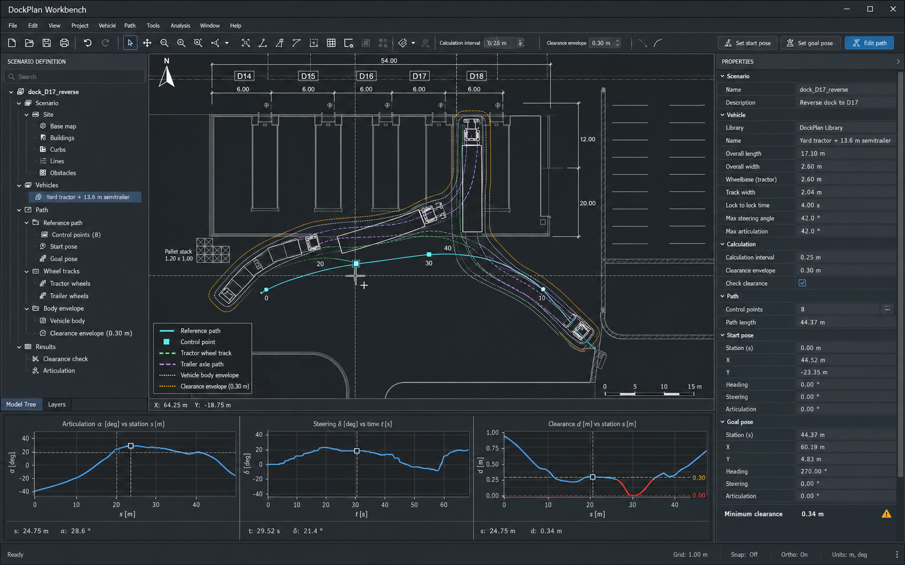
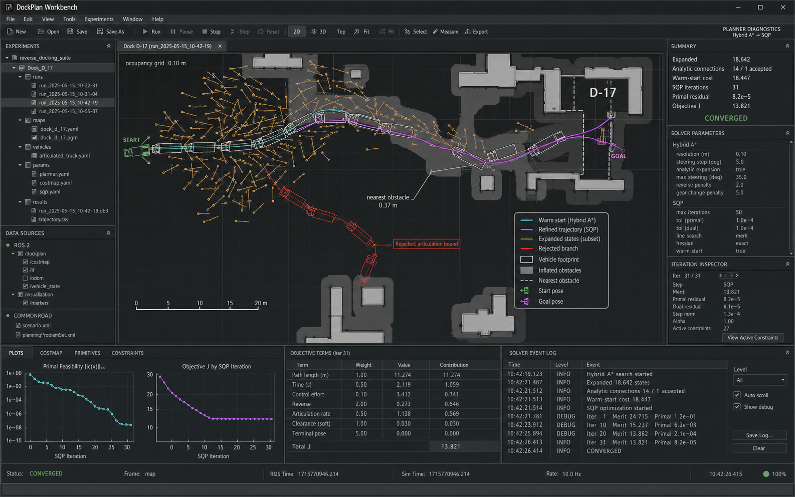
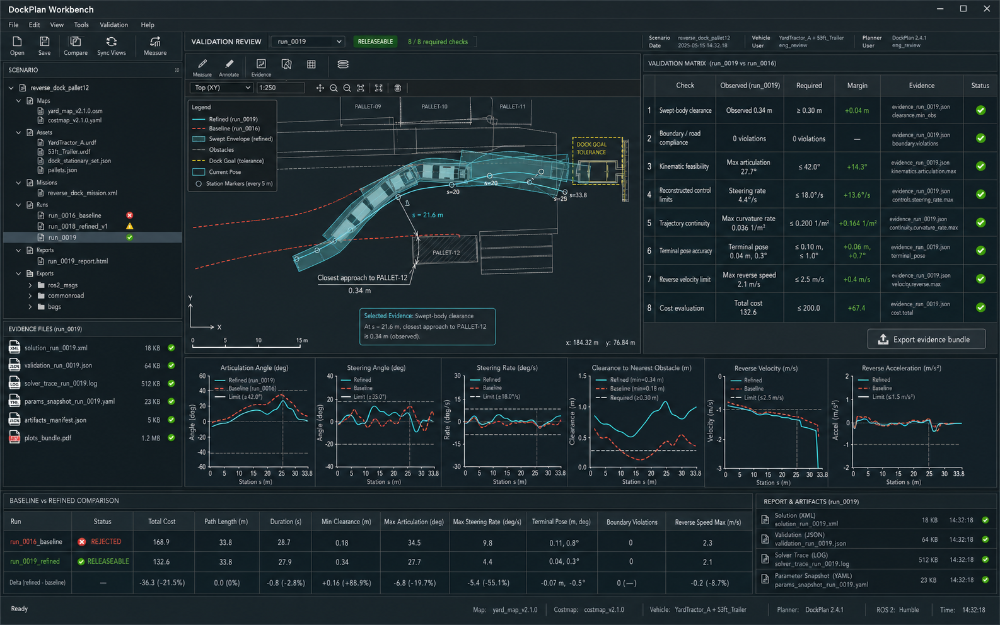

# DockPlan Workbench — High-Level Product Requirements Document

| Field | Value |
| --- | --- |
| Status | Final v1.1 — requirements baseline with interactive-mockup contract |
| Date | 2026-08-03, amended 2026-08-05 (Section 24) |
| Interactive mockup | [`../v2/`](../v2/) — normative shell and interaction reference, Section 12.1 |
| Portfolio position | Application 2 of 3 |
| Product | DockPlan Workbench (working title) |
| Product type | Desktop articulated-vehicle motion-planning and validation workbench |
| Primary users | Motion-planning, simulation, controls, and validation engineers |
| Primary platform | Desktop application on macOS and Windows |
| Purpose | Demonstrate that the UI Framework can generate a credible specialist engineering application with explicit ports, adapters, evidence, and high-density technical UI |

## 1. Product summary

DockPlan Workbench is a desktop engineering tool for defining, solving,
debugging, and validating low-speed articulated-vehicle manoeuvres in structured
yards and loading facilities.

The initial product focuses on one real problem: determining whether a specified
yard tractor and 13.6 m semitrailer can reverse into a particular loading dock
without colliding, exceeding articulation or steering limits, violating the
configured clearance envelope, or missing the terminal pose tolerance.

The tool combines three workflows that are commonly fragmented across CAD
swept-path software, robotics visualizers, planner logs, notebooks, and custom
validation scripts:

1. Scenario definition and swept-path authoring.
2. Free-space planner and optimizer diagnostics.
3. Trajectory validation, run comparison, and evidence export.

DockPlan Workbench is desktop-first. Mobile layouts are not a product target.

## 2. Problem statement

An engineer evaluating an articulated reverse-docking manoeuvre must currently
coordinate several kinds of information:

- site geometry and obstacle boundaries;
- vehicle dimensions, hitch geometry, steering, and articulation limits;
- start and goal poses;
- planner configuration and search diagnostics;
- optimized position, heading, velocity, and steering trajectories;
- swept-body and wheel envelopes;
- constraint margins and failure locations; and
- run metadata and evidence artifacts.

Existing tools are strong within their individual domains, but the analysis
often crosses tool boundaries. A path may look plausible in a visualizer while
violating a reconstructed steering-rate constraint. A planner may report
failure without exposing the spatial branch or active constraint that caused
it. A validation result may not retain a clear link to the exact map, vehicle,
parameters, solver version, and trajectory that produced it.

The result is slow iteration, weak traceability, and unnecessary dependence on
custom scripts or individual expert knowledge.

## 3. Product outcome

A motion-planning engineer can load a defined yard scenario and vehicle,
configure a reverse-docking problem, generate or edit a candidate path, run a
bounded planning and refinement pipeline, understand failures spatially and
numerically, validate the resulting trajectory, compare it with a baseline, and
export a reproducible evidence bundle.

The final decision is explicitly scoped:

> Releaseable for the configured scenario, vehicle model, operational limits,
> planner version, and validation policy.

It is not a claim of production-vehicle safety certification.

For the UI Framework, the product must prove that the same capability-led,
ports-and-adapters workflow used for conventional applications and the game
concept can also produce:

- a high-density desktop engineering shell;
- a synchronized technical canvas, inspectors, tables, plots, and logs;
- long-running planner operations with progress and cancellation;
- domain-specific file import and export;
- explicit adapter boundaries for solver and ecosystem integrations;
- evidence-backed validation and run provenance; and
- a specialist interface that is visually credible without imitating a game.

## 4. Target users and jobs

### 4.1 Primary users

**Motion-planning engineer**

- Configure and run a free-space planner.
- Understand search coverage, rejected branches, active constraints, and
  optimizer convergence.
- Compare parameter or algorithm changes without losing provenance.

**Simulation and validation engineer**

- Verify collision, boundary, kinematic, control, continuity, and terminal-pose
  requirements.
- Inspect the exact station, pose, object, and metric behind a failed check.
- Produce a reviewable artifact bundle.

**Vehicle dynamics or controls engineer**

- Confirm that reconstructed steering, steering rate, velocity, acceleration,
  and articulation remain within the configured model limits.
- Identify differences between a geometric path and a drivable trajectory.

### 4.2 Secondary users

- Yard and facility engineers assessing whether a dock approach is physically
  plausible for a specified vehicle.
- Robotics platform engineers integrating ROS 2, Autoware, CommonRoad, map, or
  solver outputs.
- Technical teams evaluating the UI Framework's ability to generate specialist
  desktop software.

### 4.3 Core jobs to be done

1. Can this vehicle execute this reverse-docking manoeuvre in the available
   space?
2. If planning fails, where and why did it fail?
3. If planning succeeds, is the result collision-free and kinematically
   feasible under the configured limits?
4. What changed between the rejected baseline and the accepted result?
5. Can another engineer reproduce and review the decision from retained
   artifacts?

## 5. Product principles

1. **Engineering evidence over spectacle.** Visual polish must improve spatial
   and numerical comprehension; it must not resemble a game or cinematic
   simulation.
2. **Desktop density is intentional.** The application is optimized for large
   displays, precise pointer input, keyboard shortcuts, and resizable panes.
3. **Orthographic truth is primary.** The authoritative view is a dimensioned
   2D plan/costmap view. A derived technical 3D context view may inspect the
   same geometry, but it cannot own measurements or decisions.
4. **Every number has units and provenance.** Frames, units, timestamps,
   versions, tolerances, and calculation intervals must remain explicit.
5. **Map, plots, tables, and logs stay synchronized.** Selecting a station,
   time, pose, check, or solver iteration must update the other relevant views.
6. **Failure must be inspectable.** The product must expose the object,
   constraint, station or iteration, observed value, required value, and margin.
7. **No false precision.** Results must state the vehicle model, geometric
   assumptions, sampling interval, and validation limitations.
8. **Use established engines and formats.** The product integrates planners,
   numerical optimizers, collision checkers, and ecosystem formats through
   adapters rather than recreating general-purpose services.
9. **A valid result is immutable.** Changing a bound, map, vehicle, or planner
   parameter makes affected results stale until recomputed.
10. **The initial problem remains bounded.** One tractor, one semitrailer,
    static obstacles, flat terrain, and low-speed reverse docking are sufficient
    for the first credible product.

## 6. Real-world workflow grounding

The product direction is informed by established engineering operations rather
than visual analogy alone:

- Vehicle Tracking-style workflows for vehicle selection, position, heading,
  steering, articulation, path creation, and swept/clearance envelopes.
- Autoware-style planning simulation and occupancy-grid free-space planning,
  including Hybrid A* search and planner diagnostics.
- CommonRoad-style collision, boundary, kinematic-feasibility, geometry, and
  cost evaluation.
- ROS 2-style frames, topics, timestamps, parameter snapshots, and rosbag-based
  evidence exchange.

DockPlan Workbench does not attempt to clone these products. It presents one
coherent workflow around a tightly scoped articulated-yard problem and exposes
their ecosystems through ports and adapters.

## 7. Initial vertical slice

### 7.1 Scenario: Dock D-17 reverse approach

The initial scenario contains:

- one dimensioned loading apron and warehouse frontage;
- loading bays D-14 through D-18;
- a designated goal at Dock D-17;
- kerbs, fixed building geometry, lane markings, and parking boundaries;
- one pallet stack positioned near the critical swept path;
- one yard tractor and one 13.6 m semitrailer;
- one reverse-only manoeuvre from a defined start pose; and
- one rejected baseline and one refined candidate run.

### 7.2 Vehicle model

The reference model is a low-speed articulated kinematic model with:

- tractor wheelbase and body envelope (reference: 3.80 m wheelbase, 2.50 m width,
  1.40 m front overhang, 1.00 m rear overhang);
- steerable front axle;
- hitch offset (reference: 0.42 m behind the rear axle);
- kingpin-to-trailer-axle distance (reference: 8.10 m kingpin to bogie center);
- trailer body envelope (reference: 13.60 m × 2.55 m, 1.70 m ahead of the
  kingpin, 3.80 m behind the bogie center);
- maximum steering angle (35.0°);
- maximum steering rate (18.0°/s);
- maximum articulation angle (42.0°);
- reverse-speed and acceleration limits (2.5 m/s, 1.5 m/s²); and
- terminal position and yaw tolerances (0.10 m, 1.0°).

The reference dimensions above were selected under Section 22 and are
implemented by the v2 interactive-mockup fixture (Section 12.1).

The model explicitly excludes tire slip, suspension, load transfer, surface
friction variation, and high-speed dynamics.

### 7.3 Authoritative vertical-slice question

Can the reference vehicle reverse from the supplied start pose into Dock D-17
while maintaining at least 0.30 m swept-body clearance, remaining within the
configured articulation and actuator limits, and terminating within the dock
pose tolerance?

## 8. Core workflow

1. Open the Dock D-17 scenario.
2. Confirm map scale, frame, layers, and obstacle classification.
3. Select or inspect the articulated vehicle definition.
4. Position the start pose and define the trailer goal pose.
5. Set clearance, articulation, steering, speed, and terminal-pose limits.
6. Author or import a reference path when a warm start is available.
7. Run the planning pipeline.
8. Inspect search coverage, rejected branches, solver convergence, and active
   constraints.
9. Scrub the accepted trajectory while map, plots, measurements, and vehicle
   footprint remain synchronized.
10. Execute the validation policy.
11. Compare the refined result with the rejected baseline.
12. Export the solution, parameters, validation report, solver trace, and
    artifact manifest.

## 9. Workspace requirements

### 9.1 Scenario Definition + Swept-Path Authoring

The workspace must support:

- import and display of supplied site geometry and occupancy data;
- a layer tree for buildings, kerbs, markings, obstacles, costmap, paths,
  footprints, envelopes, and annotations;
- selection of a vehicle definition from the project;
- dimensioned vehicle inspection;
- editing start location, heading, steering, and articulation;
- editing the trailer goal location, yaw, depth, and tolerance envelope;
- configurable calculation/storage interval;
- configurable body clearance envelope;
- manual path creation and control-point editing;
- undo and redo for authoring operations;
- station markers and coordinate readout;
- current, sampled, and swept vehicle outlines;
- tractor reference, trailer axle, wheel-track, body-envelope, and clearance
  layers;
- dimension and nearest-obstacle measurement tools; and
- synchronized articulation, steering, and clearance plots.

The user must be able to distinguish:

- imported geometry from derived geometry;
- the physical body envelope from the safety envelope;
- a geometric reference path from a validated trajectory; and
- a current result from a stale result.

### 9.2 Free-Space Planner Diagnostics

The initial planner pipeline is:

1. Normalize map, vehicle, start, goal, and constraint inputs.
2. Generate a collision-aware Hybrid A* warm start on an occupancy grid.
3. Reconstruct the articulated state and controls.
4. Refine the path with a nonlinear optimizer.
5. Apply time parameterization.
6. Run the configured validation policy.

The workspace must expose:

- occupancy-grid resolution and obstacle inflation;
- start and goal states;
- a bounded, filterable view of expanded states or motion primitives;
- accepted analytic connection and rejected branches;
- spatial failure labels such as collision, articulation bound, invalid goal
  approach, or search budget exhausted;
- warm-start and refined trajectories as distinct layers;
- selected iteration and active constraints;
- planner and optimizer parameters;
- expanded, generated, reopened, and analytic-connection counts;
- wall-clock and simulated timestamps;
- primal and dual residuals;
- objective value and weighted objective terms;
- iteration-by-iteration convergence plots;
- structured event and diagnostic logs; and
- run, cancel, re-run, and compare actions.

Planner visualization must be diagnostic rather than decorative. Expanded
states must be sampled or filtered when full rendering would obscure the map.

### 9.3 Trajectory Validation + Release Review

The workspace must support:

- a formal validation matrix;
- columns for check, observed value, required value, signed margin, evidence,
  and status;
- selection of a validation row to navigate the map and plots to its critical
  station or time;
- accepted trajectory and rejected baseline comparison;
- current pose, station marker, goal tolerance, swept envelope, and
  closest-approach witness line;
- synchronized articulation, steering angle, steering rate, clearance,
  velocity, and acceleration plots;
- a baseline-versus-refined metric table;
- retained solution, validation, solver, parameter, and manifest artifacts;
- a clear stale, rejected, or scenario-scoped releaseable decision; and
- export of an evidence bundle.

The release verdict must never appear without its scope, run identity, check
count, policy version, and artifact provenance.

## 10. Validation policy

The initial scenario policy contains eight required checks. These checks match
the approved Validation Review mockup. Composite checks retain their individual
observations and may not hide a failing subcheck behind a passing aggregate.

The reference observed values below come from the v2 interactive-mockup
fixture (Section 12.1), which computes them from the reference vehicle and
path. They are fixture results, not acceptance targets; the requirement
column defines acceptance, and the values change only when the fixture is
regenerated.

| ID | Check | Dock D-17 requirement | Reference observed value | Required evidence |
| --- | --- | --- | --- | --- |
| VAL-CHECK-001 | Swept-body clearance | Minimum distance to classified obstacles ≥ 0.30 m | 0.34 m; margin +0.04 m | Critical vehicle pose, obstacle identity, witness geometry, station, distance, calculation interval |
| VAL-CHECK-002 | Boundary or road compliance | Zero vehicle-envelope boundary violations | 0 violations | Boundary layer identity and violating geometry if present |
| VAL-CHECK-003 | Kinematic feasibility | Articulation ≤ 42.0° and road-wheel steering ≤ 35.0° | Articulation 30.0°; steering 15.0° | Reconstructed articulated state, steering trace, extrema, station/time |
| VAL-CHECK-004 | Reconstructed control limits | Steering rate ≤ 18.0°/s and acceleration ≤ 1.5 m/s² | Steering rate 10.0°/s; acceleration 0.57 m/s² | Time-parameterized controls, extrema, station/time |
| VAL-CHECK-005 | Trajectory continuity | No position or yaw gaps; curvature-rate proxy ≤ 0.200 1/m² | 0 gaps; 0.015 1/m² | Node interval, continuity result, curvature and curvature-rate traces |
| VAL-CHECK-006 | Terminal pose accuracy | Trailer lateral/longitudinal error ≤ 0.10 m and yaw error ≤ 1.0° | 0.03 m and 0.3° | Final and target poses, signed component errors, goal envelope |
| VAL-CHECK-007 | Reverse-motion ODD | Reverse speed ≤ 2.5 m/s and acceleration within configured bound | Speed 2.10 m/s; acceleration 0.57 m/s² | Velocity/acceleration traces and extrema |
| VAL-CHECK-008 | Cost evaluation | Total configured scenario cost ≤ 200.0 | 129.4; margin +70.6 | Cost policy version, weighted term table, total, comparison run |

Optimizer convergence is a prerequisite gate rather than a ninth validation
row. A run cannot enter validation unless the planner reports an accepted
solution, the nonlinear refinement status is `CONVERGED`, and the maximum
primal residual is ≤ 1.0e−3. Passing cost evaluation cannot override any failed
required check.

## 11. Interaction and desktop UX requirements

### 11.1 Application shell

- The application uses a persistent menu, compact toolbar, project tree,
  document tabs, central canvas, context inspector, bottom analysis dock, and
  status bar.
- Panes are resizable, collapsible, and restorable.
- The central plan view remains the largest single surface.
- Common actions have visible keyboard shortcuts.
- Long-running operations show phase, progress where measurable, elapsed time,
  and cancellation state.
- Project files and generated artifacts are visibly distinct.

### 11.2 Technical canvas

- Orthographic top view is the default and authoritative view.
- A derived technical 3D context view is required for the public demo. It uses
  the same map and vehicle geometry, supports orbit/fit/select, and is clearly
  marked non-authoritative for measurements and validation.
- Zoom extents, zoom selection, pan, measure, fit path, fit vehicle, and fit
  critical evidence are required.
- Snapping must be explicit and visible.
- Selection must work across vehicle poses, paths, obstacles, measurements, and
  evidence annotations.
- The current frame, coordinates, scale, grid, and units remain visible.
- Line weights and colors must retain meaning when multiple layers overlap.
- Color cannot be the only status indicator.

### 11.3 Plots and tables

- Every axis shows quantity and unit.
- Limits appear as labeled reference lines.
- A shared cursor synchronizes plots with the map and vehicle pose.
- Users can zoom, pan, reset, inspect exact values, and export data.
- Tables support column resizing, sorting where meaningful, selection, and copy.
- Scientific notation is used consistently for residuals and tolerances.

### 11.4 Visual language

- Matte graphite and neutral gray panes.
- Near-black plan/costmap canvas.
- Off-white imported geometry.
- Restrained cyan for selected or accepted reference geometry.
- Muted violet for refined or trailer-specific geometry.
- Amber for attention and thresholds.
- Red for failed requirements and rejected geometry.
- Green only for explicit passing or accepted states.
- Plain rectangular panes, one-pixel dividers, compact controls, and restrained
  typography.

The product must not use photorealistic yards, cinematic lighting, neon bloom,
game HUD styling, glassmorphism, oversized verdicts, or mobile-first card
layouts.

## 12. Normative visual references

These renders define the approved desktop composition and information hierarchy.
They are normative for product planning, not literal pixel specifications.

### Scenario Definition + Swept-Path Authoring

### Free-Space Planner Diagnostics

### Trajectory Validation + Release Review

The earlier mobile and cinematic concepts are non-normative and must not be
used to guide the product.

### 12.1 Interactive mockup role and fidelity contract

The [v2 interactive mockup](../v2/) is an approved, runnable reference for the
desktop shell. It implements the Dock D-17 reference fixture with computed
articulated kinematics, computed swept geometry, and computed validation
values, so its numbers and the tables in this PRD agree.

The interactive mockup is **normative** for:

- the shell composition of all three workspaces and the placement of the
  canvas, playback row, panels, dock, and status bar;
- the context rule in APP-013: which toolbar verbs, tree contents, and status
  facts belong to each workspace;
- synchronized selection between canvas, playback, plots, and the validation
  matrix, including evidence navigation from a matrix row to its critical
  station and witness geometry;
- run switching, baseline comparison presentation, and the verdict strip with
  its scope statement; and
- the truthful-state conventions: absent versus disabled controls, playback
  locked during a run, and no editable affordances beside immutable evidence.

The interactive mockup is **not normative** for:

- functional completeness: it does not import files, edit geometry, export
  bundles, or run a live planner;
- the Hybrid A* search cloud, the SQP iteration history, and the event log,
  which are authored replays with consistent numbers; and
- final visual assets, performance, or production code quality.

Where the static renders in Section 12 and the interactive mockup differ in
layout detail, the interactive mockup defines the shell; the renders remain
the reference for density and visual language.

## 13. Requirements baseline and visual-promise register

### 13.1 Requirement contract

This section is the binding feature baseline derived from the three approved
mockups. Sections 1–12 define intent and workflow; the requirement IDs below
define the implementation obligation.

| Level | Meaning |
| --- | --- |
| P0 | Required for vertical-slice acceptance. The product cannot be called complete without passing evidence. |
| P1 | Required for the public framework demonstration. It may follow the first usable vertical slice, but it is not optional and cannot be silently dropped. |
| P2 | Approved later-scope requirement. It is retained in the product backlog but is not required for the initial public demonstration. |
| Illustrative | Visual content that communicates density or hierarchy but does not prescribe a literal value, label, asset, or implementation. |

The following governance rules apply:

- Every delivered P0 or P1 requirement must link to automated test output,
  recorded interaction evidence, or an approved manual verification record.
- A static screenshot is not evidence of working behavior unless the
  requirement is purely visual.
- A visible mockup element may be replaced by a demonstrably equivalent
  interaction, but the relevant requirement ID and acceptance outcome must
  remain satisfied.
- Removing, deferring, or materially changing a P0 or P1 requirement requires a
  versioned PRD amendment. Absence from an implementation sprint is not a scope
  decision.
- Controls must reflect actual adapter capabilities. Unavailable actions are
  disabled or hidden with an explanation; the application must never fabricate
  a connection, solver state, metric, or evidence result.
- Example labels and values in the mockups are illustrative unless repeated in
  the Dock D-17 reference data or the requirements below.

### 13.2 Desktop shell and project requirements

| ID | Pri. | Requirement | Acceptance evidence |
| --- | --- | --- | --- |
| APP-001 | P0 | Provide a native-feeling macOS and Windows desktop application optimized for pointer, keyboard, and large displays; mobile and responsive-phone layouts are excluded. | Recorded execution on both target platforms at 1440 × 900 and 1920 × 1080. |
| APP-002 | P0 | Provide the approved shell: menu bar, compact toolbar, project/data tree, document tabs, central technical canvas, context inspector, bottom analysis dock, and status bar. | Layout inspection against all three normative compositions. |
| APP-003 | P0 | Make panes resizable and collapsible; persist and restore their sizes, visibility, and active document per project/user. | Resize, close, restart, and restore test. |
| APP-004 | P0 | Support New, Open, Save, and Save As for projects, with unsaved-change protection and visible separation of source files from generated artifacts. | Round-trip and unsaved-change tests. |
| APP-005 | P0 | Support undo and redo for scenario-authoring mutations without altering immutable run evidence. | Multi-step edit/undo/redo test. |
| APP-006 | P0 | Provide Select, Pan, Zoom, Fit, and Measure tools with visible active-tool state and keyboard shortcuts. | Tool interaction recording and shortcut test. |
| APP-007 | P0 | Show frame, cursor coordinates, scale, units, grid, snap, orthographic state, result freshness, and relevant time source in the status area. | State changes verified against canvas/project state. |
| APP-008 | P0 | Mark derived results stale immediately when a bound map, vehicle, start/goal, limit, policy, or planner input changes. Stale verdicts cannot be exported as current. | Mutation and stale-propagation tests. |
| APP-009 | P0 | Long-running work must expose phase, elapsed time, progress where measurable, cancellation, and a terminal success/failure/cancelled state without blocking the UI. | Run, cancel, timeout, and adapter-crash tests. |
| APP-010 | P0 | Bind every visible metric, layer, plot, table row, log event, and verdict to the active project or immutable run; placeholder demo values cannot appear as computed results. | Data-lineage inspection using two materially different runs. |
| APP-011 | P1 | Print the active dimensioned plan, diagnostic view, or review report with project/run identity, scale where applicable, and provenance. | Print preview and PDF printer output review. |
| APP-012 | P1 | Provide configurable keyboard shortcuts and a searchable command surface for primary actions. | Shortcut remap and command-search test. |
| APP-013 | P0 | Keep the shared shell spine fixed across workspaces (canvas, playback row, view tools, panel geometry) and rotate the periphery by context: toolbar verbs, tree contents, inspector detail, dock tabs, and status facts are workspace-specific. A control that is meaningless in a workspace is absent; a control that is situationally unavailable is disabled with an explanation. Editable affordances must not appear in the same context as an immutable verdict, and trajectory playback is disabled while a planning run is in progress. | Chrome inventory per workspace against the v2 interactive mockup (Section 12.1) and the three normative compositions; wrong-context control audit; playback-lock test during a run. |

### 13.3 Scenario Definition + Swept-Path Authoring requirements

| ID | Pri. | Requirement | Acceptance evidence |
| --- | --- | --- | --- |
| SCN-001 | P0 | Import and display the reference site, occupancy data, scale, coordinate frame, and classified obstacles, preserving source identity and units. | Dock D-17 import fixture and reference-dimension check. |
| SCN-002 | P0 | Provide a hierarchical layer tree for base map, buildings, kerbs, markings, obstacles, vehicle, reference path, control points, start/goal, wheel tracks, body envelope, clearance envelope, costmap, results, and annotations. | Visibility, selection, lock, and ordering tests for each layer class. |
| SCN-003 | P0 | Provide a vehicle library/definition selector and inspector for name, overall length, overall width, wheelbase, track width, hitch offset, kingpin-to-trailer-axle distance, lock-to-lock input, maximum steering, maximum steering rate, maximum articulation, and body envelopes. | Reference vehicle field/value and unit verification. |
| SCN-004 | P0 | Author and numerically edit tractor start position, heading, steering, and articulation, plus trailer goal position, yaw, dock depth, and terminal tolerance. | Canvas-drag and field-edit round-trip tests. |
| SCN-005 | P0 | Configure calculation/storage interval and body-clearance envelope; show the current values adjacent to the authoring workspace. | Recalculation test showing changed samples, envelope, and staleness. |
| SCN-006 | P0 | Create, import, select, move, insert, and delete reference-path control points; support Set Start Pose, Set Goal Pose, and Edit Path modes; report control-point count and path length in the inspector. | Author a path from an empty project and reopen it. |
| SCN-007 | P0 | The authoritative orthographic canvas must show the D-14–D-18 yard context, start and goal, control points, station labels, selected/current pose, reference path, scale, north arrow, legend, and relevant dimensions for the supplied project. | Visual and data inspection against the Dock D-17 fixture. |
| SCN-008 | P0 | Generate independently toggleable tractor reference, trailer axle, wheel-track, sampled-pose, physical-body, swept-body, and clearance-envelope geometry from the configured vehicle and path. | Geometry fixture and independent layer-toggle tests. |
| SCN-009 | P0 | Measure point-to-point distance, dimensions, path length, and nearest obstacle; nearest-obstacle measurement identifies both objects and renders witness geometry. | Known-distance and minimum-clearance fixture tests. |
| SCN-010 | P0 | Provide articulation versus station, steering versus time, and clearance versus station plots with labeled units, limits, exact-value inspection, zoom/pan/reset, and data export. | Plot series compared with exported numeric data. |
| SCN-011 | P0 | Synchronize selected path point, station/time cursor, vehicle pose, inspector values, plot cursors, and evidence annotations bidirectionally. | Select from both canvas and plots and verify all linked views. |
| SCN-012 | P0 | Provide explicit grid, snap, and orthographic controls; snapping affects authored geometry but never silently moves imported geometry. | Grid/snap/ortho behavior test. |
| SCN-013 | P0 | Save and reopen all authored geometry, vehicle bindings, views, parameters, and units without numeric drift or orphaned references. | Project round-trip/hash comparison. |

### 13.4 Free-Space Planner Diagnostics requirements

| ID | Pri. | Requirement | Acceptance evidence |
| --- | --- | --- | --- |
| PLN-001 | P0 | Execute the normalized pipeline: collision-aware Hybrid A* warm start, articulated state/control reconstruction, nonlinear refinement, time parameterization, convergence gate, and validation handoff. | End-to-end reference run with stage records and artifacts. |
| PLN-002 | P0 | Show an experiment tree containing run inputs, map YAML/image, vehicle definition, planner, costmap and optimizer parameters, plus result database/trajectory artifacts. | Tree-to-manifest identity inspection. |
| PLN-003 | P0 | Show offline data sources for imported ROS 2 artifacts and CommonRoad scenario/planning-problem data, with connected, disconnected, imported, stale, and error states represented truthfully. | Import fixtures and source-state tests. |
| PLN-004 | P0 | Inspect and edit obstacle inflation, grid resolution, search tolerances/budgets, motion-primitive settings, analytic expansion settings, optimizer weights/bounds, iteration limit, and convergence tolerances before a run. | Parameter mutation reflected in run snapshot and staleness. |
| PLN-005 | P0 | Run starts an eligible backend operation; Stop requests cancellation; Re-run creates a new immutable run. Backend failure or cancellation cannot produce an accepted result. | Run/stop/re-run lifecycle tests. |
| PLN-006 | P0 | Pause, Step, and Reset control playback of recorded or streaming solver/search trace iterations. They control a live solver only when its adapter explicitly declares live stepping; otherwise they are disabled during execution with an explanatory tooltip. | Capability-on and capability-off interaction tests. |
| PLN-007 | P0 | Render the authoritative occupancy/costmap with start, goal, obstacle inflation, current solver iteration, and selectable engineering geometry. | Costmap values/layers compared with input artifacts. |
| PLN-008 | P0 | Render warm-start, refined, and rejected trajectories as distinct, named, toggleable layers using the approved cyan/violet/red semantics plus non-color differentiation. | Three-layer reference run review. |
| PLN-009 | P0 | Render a bounded/filterable sample of expanded states and motion primitives, including accepted analytic connections, without overwhelming interaction performance. | Primitive filter and 10,000-visible-primitive performance test. |
| PLN-010 | P0 | A rejected branch or failure event must be selectable and show reason, iteration/state, station when defined, related object or constraint, and spatial annotation. | Supplied collision and articulation failure fixtures. |
| PLN-011 | P0 | Show expanded/generated/reopened/analytic-connection counts, warm-start cost, optimizer iteration, primal and dual residuals, objective, elapsed time, and explicit convergence status. | Summary values reconciled to backend trace. |
| PLN-012 | P0 | Provide an iteration inspector and Active Constraints view with constraint name, observed value, bound, signed margin, multiplier when available, and station/time/state reference. | Select a constrained iteration and reconcile values. |
| PLN-013 | P0 | Provide Plots, Costmap, Primitives, and Constraints analysis tabs; each preserves selection and cursor context when switched. | Tab-content and context-retention test. |
| PLN-014 | P0 | Plot primal/dual feasibility and objective versus iteration with limits, exact-value inspection, zoom/pan/reset, and synchronized iteration selection. | Plot-to-trace numeric comparison. |
| PLN-015 | P0 | Show objective terms in a table with raw value, weight, weighted contribution, unit/normalization, and total. | Table sum reconciled to objective within tolerance. |
| PLN-016 | P0 | Provide a structured event log with timestamp, level, stage/source, message, linked iteration/state when present, level filtering, auto-scroll, Show Debug, Save Log, and Clear View. Clearing the view cannot delete immutable run evidence. | Log filter/save/clear and retained-artifact tests. |
| PLN-017 | P1 | Provide 2D, 3D, Top, and Fit controls. The technical 3D view is derived from the same geometry, supports orbit/fit/select, labels itself non-authoritative, and cannot generate validation measurements. | Cross-view selection test and attempted-measurement guard. |
| PLN-018 | P0 | Show map frame, ROS/source time when available, simulation time, playback rate, and active timestamp. Unavailable time sources display `Unavailable`, not invented values. | Offline, bag-playback, and no-time-source tests. |
| PLN-019 | P0 | Export the selected run's trajectory, normalized inputs, parameter snapshot, diagnostic trace, plot data, and log with manifest identities. | Export/reopen/reconcile test. |

### 13.5 Trajectory Validation + Release Review requirements

| ID | Pri. | Requirement | Acceptance evidence |
| --- | --- | --- | --- |
| VAL-001 | P0 | Provide a run selector and show verdict, passed/required count, scenario, vehicle, planner/backend version, run date/time, reviewer identity, policy version, and staleness adjacent to the verdict. | Accepted, rejected, stale, and incomplete run fixtures. |
| VAL-002 | P0 | Execute and display exactly the eight checks in Section 10 for the Dock D-17 policy; composite rows retain every sub-observation and fail when any required subcheck fails. | Reference pass plus one failure fixture per row/subcheck. |
| VAL-003 | P0 | The validation matrix contains Check, Observed, Required, Margin, Evidence, and Status columns with quantity-aware units and signed margins. | Schema/UI inspection and numeric reconciliation. |
| VAL-004 | P0 | Selecting a validation row navigates canvas, synchronized plots, current vehicle pose, station/time, inspector, object, witness geometry, and source artifact to its critical evidence. | Minimum-clearance and terminal-pose navigation recordings. |
| VAL-005 | P0 | Provide Open, Save, Compare, Sync Views, and Measure actions. Compare uses two immutable runs; Sync Views can be explicitly enabled/disabled. | Two-run comparison and independent/synchronized navigation tests. |
| VAL-006 | P0 | The review canvas renders the refined result and rejected baseline, swept/clearance envelope, obstacle and boundary context, dock goal/tolerance, current pose, stations, selected evidence, closest-approach witness, and any violating geometry. | Accepted/rejected reference visual inspection tied to artifacts. |
| VAL-007 | P0 | Provide six synchronized plots: articulation, steering angle, steering rate, clearance, reverse velocity, and reverse acceleration. Each has units, limits, exact-value inspection, zoom/pan/reset, and data export. | Plot-to-trajectory and extrema reconciliation. |
| VAL-008 | P0 | Baseline-versus-refined comparison includes status, total cost, path length, duration, minimum clearance, maximum articulation, maximum steering rate, terminal pose error, boundary violations, and maximum reverse speed, with deltas and units. | Comparison table reconciled to both manifests. |
| VAL-009 | P0 | Provide an evidence tree grouped by maps/assets, missions or scenarios, runs, reports, exports, and bags/imports; source and generated artifacts remain visually distinct. | Tree-to-manifest identity review. |
| VAL-010 | P0 | Evidence rows show filename, artifact type, size, content-integrity/hash status, producing run, and availability; selection previews metadata and Open reveals the retained artifact with a suitable viewer or registered external application. | Missing, corrupt, valid, and externally opened file fixtures. |
| VAL-011 | P0 | Retain at minimum the trajectory/solution file, `validation.json`, `solver-trace.log`, `parameters.yaml`, normalized scenario and vehicle snapshots, numeric plot data, selected evidence geometry, and run manifest. A CommonRoad-compatible run also exposes its solution XML. | Bundle-content schema and hash verification. |
| VAL-012 | P0 | Export Evidence Bundle performs an atomic export with manifest, hashes, tool/backend versions, validation policy, comparison metadata when present, and explicit completeness result. | Export, corrupt, reopen, and completeness tests. |
| VAL-013 | P1 | Generate review-ready HTML and PDF reports containing the verdict scope, validation matrix, comparison, selected evidence views, plots, limitations, and artifact manifest. | HTML/PDF content and print review. |
| VAL-014 | P0 | A releaseable verdict is immutable and scenario-scoped. Changed inputs create a new run or stale state; users cannot relabel a failed/incomplete run as releaseable. | Mutation, permission, and manifest-integrity tests. |

### 13.6 Integration and adapter requirements

| ID | Pri. | Requirement | Acceptance evidence |
| --- | --- | --- | --- |
| INT-001 | P0 | Define versioned ports for site geometry, occupancy/costmap, vehicle definitions, planners, refiners, collision/clearance, control reconstruction, project storage, visualization, and evidence/report export. | Contract tests using at least one alternate test adapter. |
| INT-002 | P0 | Import/export supported ROS 2 messages and rosbag-derived artifacts offline, retaining topics, frames, message timestamps, QoS metadata when available, and source hashes. | Reference bag/message round-trip fixture. |
| INT-003 | P0 | Import a bounded CommonRoad scenario/planningProblemSet and export a compatible solution or validation handoff through an adapter; unsupported semantics fail with actionable diagnostics. | Supported and deliberately unsupported fixtures. |
| INT-004 | P1 | Connect read-only to configured live ROS 2 topics for map, pose, path, diagnostics, and clock where an environment provides them. Connection, freshness, topic, frame, and error state must be explicit; live data cannot silently overwrite project evidence. | Connected, disconnected, stale-topic, wrong-frame, and reconnect tests. |
| INT-005 | P0 | No adapter may command or control a physical vehicle. Live ROS 2 support is observation/import only in this product baseline. | Interface audit proving absence of command publishers/control ports. |
| INT-006 | P0 | Each backend adapter declares capabilities such as cancellation, progress, streaming diagnostics, trace replay, live stepping, deterministic seed, and supported formats. The UI is driven from this declaration. | Two adapters with different capability declarations. |
| INT-007 | P0 | Established libraries retain ownership of parsing, numerical optimization, collision primitives, plotting, and low-level rendering; product domains own workflow, constraint meaning, synchronization, evidence, and decisions. | Architecture review and dependency/port mapping. |

### 13.7 Visual-promise traceability

This register makes the visible promises of each approved mockup auditable. A
region is complete only when all linked P0 requirements pass; linked P1 items
must pass before the public demonstration.

| Normative visual region | Requirement coverage | Disposition |
| --- | --- | --- |
| Scenario top menu/toolbar: file, print, undo/redo, select/pan/zoom/measure/layers, calculation interval, clearance envelope, start/goal/path modes | APP-004–006, APP-011, SCN-005–006, SCN-009 | P0 except Print P1 |
| Scenario left project/layer tree: site, vehicle, path, wheel/body/clearance geometry, results | SCN-001–002, SCN-008, APP-010 | P0 |
| Scenario orthographic yard: D-14–D-18, pallet/obstacles, ghost poses, path/control points, stationing, dimensions, legend, scale/north | SCN-007–009, SCN-011–012 | P0; exact decorative arrangement illustrative |
| Scenario vehicle/path/start/goal inspector | SCN-003–006 | P0 |
| Scenario articulation, steering, and clearance plots | SCN-010–011 | P0 |
| Scenario grid/snap/ortho/units status | APP-007, SCN-012 | P0 |
| Planner top toolbar: file, Run/Pause/Stop/Step/Reset, 2D/3D/Top/Fit, select/measure/export | APP-004, APP-006, PLN-005–006, PLN-017, PLN-019 | P0; 3D P1 |
| Planner experiment and data-source trees: runs, maps, vehicle, parameters, results, ROS 2, CommonRoad | PLN-002–004, INT-002–004 | Offline P0; live ROS 2 P1 |
| Planner costmap: primitives, analytic connection, warm start, refined result, rejected branch/failure, start/goal, clearance witness, legend | PLN-007–010 | P0 |
| Planner summary, parameters, iteration inspector, active constraints | PLN-004, PLN-011–012 | P0 |
| Planner Plots/Costmap/Primitives/Constraints tabs, feasibility/objective plots, objective terms, event log controls | PLN-013–016 | P0 |
| Planner frame/ROS time/sim time/rate/timestamp status | PLN-018 | P0, with truthful unavailable state |
| Validation top toolbar, run selector, RELEASEABLE/8-of-8 state, metadata | VAL-001, VAL-005 | P0; labels reflect actual data |
| Validation asset/run/report/export/bag tree and evidence-file state | VAL-009–011 | P0 |
| Validation plan comparison, envelope, pose, stations, goal tolerance, closest-approach evidence | VAL-004, VAL-006 | P0 |
| Validation eight-row matrix and evidence navigation | VAL-002–004 | P0 |
| Validation six synchronized engineering plots | VAL-007 | P0 |
| Validation baseline-versus-refined metrics | VAL-008 | P0 |
| Validation solution/JSON/log/YAML artifacts and Export Evidence Bundle | VAL-010–013 | Bundle P0; HTML/PDF report P1 |

### 13.8 Acceptance-evidence contract

Before a requirement is marked complete, its evidence record must contain:

- requirement ID and implemented version;
- test or review method and environment;
- project/run fixture and input hashes;
- expected and observed outcome;
- automated output, recording, or approved manual-review reference;
- owner, date, and pass/fail result; and
- linked defect or approved PRD amendment for any deviation.

The release checklist is generated from this register. A mockup review is a
separate visual-quality gate and cannot substitute for functional acceptance.

## 14. System context and ports-and-adapters boundaries

### 14.1 Product-owned domains

**Scenario domain**

- Map layers, obstacle classification, frames, start/goal definitions, units,
  and authoring state.

**Vehicle domain**

- Articulated geometry, kinematic parameters, operating limits, footprints,
  and model identity.

**Planning-run domain**

- Input snapshot, pipeline orchestration, progress, cancellation, result state,
  diagnostics, and staleness.

**Trajectory domain**

- Stations, timestamps, poses, articulated state, reconstructed controls,
  sampling, and derived extrema.

**Validation domain**

- Requirements, observed values, margins, pass/fail decisions, critical
  evidence, policy version, and scenario-scoped verdict.

**Evidence domain**

- Immutable run manifest, source identities, hashes, generated artifacts,
  comparison records, and export bundles.

### 14.2 Required ports

- Site-geometry import port.
- Occupancy/costmap import port.
- Vehicle-definition import port.
- Planner backend port.
- Nonlinear-refinement backend port.
- Collision and clearance evaluation port.
- Kinematic-feasibility and control-reconstruction port.
- Project persistence port.
- ROS 2 artifact import/export port.
- CommonRoad scenario/solution import/export port.
- Report and evidence export port.
- Technical visualization port.
- Clock, cancellation, logging, and progress ports.

### 14.3 Initial adapters

- Project-native JSON/YAML scenario and vehicle adapters.
- Bounded DXF or derived-vector site-geometry adapter.
- OpenDRIVE or Lanelet-compatible map adapter where feasible for the vertical
  slice.
- Occupancy-grid image plus metadata adapter.
- Local Python planner process or service adapter.
- Existing numerical optimization library adapter.
- Existing computational-geometry/collision library adapter.
- CommonRoad drivability-checker adapter where vehicle-model compatibility
  permits.
- ROS 2 bag/message artifact adapter for offline import and export.
- Desktop file-system project and evidence adapter.
- Canvas/WebGL technical renderer adapter.

### 14.4 Explicitly delegated services

The product must not create framework services that merely rename capabilities
already owned by mature libraries:

- CAD/vector parsers own format decoding.
- Computational-geometry libraries own polygon operations and spatial indexes.
- Collision libraries own primitive intersection algorithms.
- Numerical optimizers own nonlinear programming algorithms and linear algebra.
- Plotting/rendering libraries own low-level drawing, hit testing, and resource
  management.
- ROS 2 and CommonRoad libraries own their native serialization formats.

DockPlan Workbench owns workflow meaning, orchestration, domain constraints,
evidence, validation policy, synchronized interaction, and adapter contracts.

## 15. Data and artifact model

Each planning run must bind immutably to:

- scenario identity and content hash;
- map and costmap identity;
- vehicle-model identity and parameters;
- start and goal states;
- requirement and tolerance snapshot;
- planner, optimizer, and time-parameterization parameters;
- backend versions;
- calculation and sampling intervals;
- timestamp and run identity; and
- generated trajectory, diagnostics, validation results, and evidence files.

Changing a bound input creates a new run or marks the existing run stale. The
application must not silently reuse a prior release verdict.

The evidence bundle should contain, at minimum:

- run manifest;
- normalized scenario snapshot;
- vehicle and parameter snapshots;
- trajectory or solution artifact;
- solver trace;
- validation report;
- plot data;
- selected critical evidence geometry; and
- content hashes and tool versions.

## 16. Technical and product boundaries

### 16.1 Included in the initial product

- One tractor and one semitrailer.
- Flat 2D site geometry.
- Static obstacles.
- Low-speed forward and reverse kinematic primitives, with the vertical-slice
  manoeuvre constrained to reverse operation.
- Hybrid A* warm start or equivalent search backend.
- Nonlinear geometric/kinematic refinement.
- Time parameterization sufficient to evaluate steering rate, velocity, and
  acceleration limits.
- Offline planning and validation.
- Deterministic project artifacts and run comparison.
- A non-photorealistic technical 3D context view derived from the authoritative
  2D geometry.
- Read-only live ROS 2 observation for the P1 public demonstration when a
  configured environment is available; offline operation remains fully
  supported.

### 16.2 Not included in the initial product

- Production vehicle control or actuation.
- Safety certification or homologation.
- Perception, sensor simulation, or dynamic-object prediction.
- Multi-agent traffic behavior.
- High-speed or tire-force dynamics.
- Friction, grade, suspension, load transfer, or deformable terrain.
- Multi-trailer combinations.
- General road-network route planning.
- General-purpose CAD editing.
- Photorealistic 3D simulation.
- Hardware-in-the-loop operation.
- Live ROS 2 control of a vehicle.
- Cloud collaboration, fleet management, or shared project editing.
- Mobile or tablet application support.

## 17. Non-functional requirements

### 17.1 Accuracy and reproducibility

- Identical normalized inputs and backend versions must produce the same
  scenario-scoped decision and materially equivalent trajectory metrics.
- Geometry fixtures must be verified against independently calculated reference
  cases.
- Clearance results for the vertical-slice fixtures should agree with the
  independent reference within 0.02 m or a stricter documented tolerance.
- Imported scale and unit conversions must be explicit and testable.
- No result may omit its frame, unit, sampling interval, or provenance.

### 17.2 Performance

- Pan, zoom, selection, synchronized cursor, and playback should target 60 FPS
  on the agreed reference desktop configuration.
- The authoritative canvas must remain interactive with at least 10,000 visible
  engineering primitives and 100 sampled vehicle poses.
- A normal vertical-slice planner run should target completion within 5 seconds
  on reference hardware; longer runs must remain cancellable and responsive.
- Opening an existing result and its evidence should take less than 2 seconds
  after project load.

### 17.3 Reliability

- Planner failure, cancellation, timeout, adapter crash, malformed input, and
  partial artifact writes must fail closed.
- Evidence export must be atomic or clearly report incomplete output.
- Project recovery must not convert stale or failed results into accepted ones.
- Long-running backend processes must not block the desktop UI thread.

### 17.4 Accessibility

- All primary authoring, run, inspection, and export actions are keyboard
  reachable.
- Status never depends on color alone.
- Tables and plots expose accessible names and textual values.
- Font size and pane zoom can be increased without corrupting the engineering
  view.
- Motion can be reduced; ghost-pose playback can be disabled.

### 17.5 Platform compatibility

- Initial target: current supported macOS and Windows desktop releases.
- The product may use a web-technology rendering surface inside the desktop
  shell, but browser deployment is not the primary experience.
- Linux may be supported for engineering development but is not an initial
  acceptance platform.

## 18. Vertical-slice acceptance criteria

The initial product is accepted when a representative engineer can:

1. Open the supplied Dock D-17 project.
2. Inspect the map scale, vehicle geometry, frames, and units.
3. Edit the start or goal pose and see dependent results become stale.
4. Restore the reference configuration and run the planner pipeline.
5. Distinguish the Hybrid A* warm start from the refined trajectory.
6. Select a rejected branch and identify the associated failure reason.
7. Select the minimum-clearance validation row and navigate to the correct
   vehicle pose, obstacle, station, plot cursor, and measured margin.
8. Confirm the eight required checks and their evidence.
9. Compare the rejected baseline with the refined result.
10. Export an evidence bundle and reopen it without manual data repair.

The product also requires automated and recorded evidence that:

- the baseline is rejected for the configured policy;
- the refined reference run passes all eight configured checks;
- changing the clearance requirement above the observed minimum invalidates the
  release verdict;
- solver cancellation leaves no accepted partial result;
- run inputs and evidence hashes remain bound; and
- the UI remains responsive through planning, playback, and evidence selection.

Before the public framework demonstration, all P1 requirements must also pass,
including technical 3D context, print/report output, command discovery, and a
truthful read-only live ROS 2 connection demonstration using a controlled test
environment. P1 completion cannot weaken any P0 evidence.

## 19. Success measures

The vertical slice succeeds when:

- at least 80% of representative technical users can configure and run the
  supplied manoeuvre without facilitator intervention;
- at least 80% can correctly identify the primary cause of a supplied planner
  or validation failure;
- at least 90% can locate the evidence supporting the minimum-clearance and
  articulation decisions;
- users can distinguish scenario inputs, generated runs, stale results, and
  immutable evidence artifacts;
- the accepted reference run reproduces its scenario-scoped verdict across
  repeated executions on the same backend versions;
- the implemented product is recognizably consistent with the normative
  desktop concepts; and
- the complete Define → Plan → Diagnose → Validate → Compare → Export workflow
  completes without manual script execution or artifact repair.

## 20. Delivery stages

### Stage 0 — domain and geometry proof

- Confirm the reference vehicle model and numerical assumptions.
- Prove articulated footprint generation and swept-envelope calculation.
- Validate clearance against independent reference fixtures.
- Prove synchronized canvas and plot cursor behavior.
- Select the planner, optimizer, collision, and map-format libraries through
  bounded technical spikes.

### Stage 1 — scenario-authoring vertical slice

- Desktop application shell and project model.
- Dock D-17 scenario import.
- Vehicle, start, goal, constraints, layers, measurements, and plots.
- Manual path editing and staleness propagation.

### Stage 2 — planner diagnostics

- Planner backend adapter.
- Hybrid A* warm start, nonlinear refinement, and time parameterization.
- Search layers, parameters, convergence plots, active constraints, logs,
  cancellation, and failure inspection.

### Stage 3 — validation and evidence

- Eight-check validation policy.
- Synchronized evidence selection.
- Baseline comparison.
- Immutable run manifest and evidence bundle export.
- CommonRoad and ROS 2 offline artifact adapters.

### Stage 4 — public framework demonstration

- Final desktop polish against normative renders.
- Technical 3D context view and cross-view selection.
- Read-only live ROS 2 topic observation with truthful connection state.
- HTML/PDF review reports and print output.
- Performance, accessibility, recovery, and cross-platform validation.
- Recorded end-to-end evidence.
- Packaged demonstration project and explanatory material.

## 21. Principal risks

| Risk | Mitigation |
| --- | --- |
| Tool looks technical but calculations are superficial | Establish independent geometry and feasibility fixtures before UI polish; bind every visible metric to computed evidence |
| Scope expands into a general AV simulator | Enforce the single reverse-docking problem, static obstacles, low-speed model, and explicit non-goals |
| Planner backend fails to converge reliably | Preserve manual/reference-path authoring, use a bounded reference scenario, expose failure honestly, and evaluate mature optimizer libraries |
| Imported CAD or map scale is wrong | Require explicit units, scale confirmation, source metadata, and reference dimensions |
| Swept-envelope sampling misses a collision | Bound the interval, adaptively resample high-curvature sections, and verify against independent reference cases |
| Dense desktop UI becomes unreadable | Preserve the three-workspace information hierarchy, resizable panes, synchronized selection, and task-specific defaults |
| Releaseable verdict is mistaken for safety certification | Keep scenario scope, assumptions, policy, model limitations, and provenance adjacent to the verdict |
| ROS 2 or CommonRoad integration dominates the MVP | Start with offline file adapters and project-native formats; gate live integration behind vertical-slice acceptance |
| Framework abstractions duplicate solver or geometry libraries | Maintain coarse ports and audit proposed services against library ownership before implementation |
| Generated mockups are treated as exact implementation | Treat the renders as information-hierarchy references; validate actual usability with working data and representative users |

## 22. Controlled implementation decisions

These decisions may select technologies or tune reference fixtures, but they
cannot remove or weaken a P0/P1 requirement without a PRD amendment.

- Final product name and visual identity.
- Exact reference tractor and trailer dimensions within the single-articulated-
  vehicle model in Section 7.2.
- Primary site-map source format for the vertical slice; the normalized project
  representation and provenance requirements remain fixed.
- Selected Hybrid A* implementation or reference backend.
- Selected nonlinear optimizer and transcription approach.
- Collision and swept-envelope geometry library.
- Internal implementation of the CommonRoad adapter while preserving INT-003.
- Live ROS 2 topic subset and demonstration environment while preserving the
  read-only scope and INT-004 acceptance states.
- Independent numerical reference authority and any stricter tolerances; the
  Section 10 policy cannot be relaxed without amendment.
- Reference desktop hardware and planner performance budget.

## 23. Research sources

- [Autodesk Vehicle Tracking — creating swept paths](https://help.autodesk.com/cloudhelp/2023/ENU/Autodesk-VehicleTracking-Help/files/GUID-D34F766C-87D4-4AFF-A6BA-785A666D3D40.htm)
- [Autodesk Vehicle Tracking — vehicle positioning](https://help.autodesk.com/cloudhelp/2022/ENU/Autodesk-VehicleTracking-Help/files/GUID-27BAAA9F-4B94-49C0-B723-8B7B7B8DC0F2.htm)
- [Autodesk Vehicle Tracking — path model and articulation limits](https://help.autodesk.com/cloudhelp/PTB/Autodesk-VehicleTracking-Help/files/GUID-64EBAAD9-40FA-4A22-B9A5-31358B565644.htm)
- [Autodesk Vehicle Tracking — clearance envelopes and predictive turning](https://help.autodesk.com/cloudhelp/2022/ENU/Autodesk-VehicleTracking-Help/files/GUID-0EA11510-D7CE-4D63-85CC-47E9D689A88B.htm)
- [Autoware — planning simulation](https://autowarefoundation.github.io/autoware-documentation/main/demos/planning-sim/)
- [Autoware — free-space planning algorithms](https://autowarefoundation.github.io/autoware_universe/main/planning/autoware_freespace_planning_algorithms/index.html)
- [Autoware — planning validator](https://autowarefoundation.github.io/autoware_universe/main/planning/planning_validator/autoware_planning_validator/)
- [CommonRoad Drivability Checker](https://commonroad.in.tum.de/tools/drivability-checker)
- [MathWorks Automated Driving Toolbox — planning and control](https://www.mathworks.com/help/driving/planning-and-control.html)

## 24. Change record

| Version | Date | Change |
| --- | --- | --- |
| v1.0 | 2026-08-03 | Requirements baseline from the three approved mockups. |
| v1.1 | 2026-08-05 | Added the v2 interactive mockup as a normative shell reference with a fidelity contract (Section 12.1). Added APP-013: fixed shell spine, workspace-specific periphery, absent-versus-disabled rule, no editable affordances beside immutable evidence, playback lock during a run. Recorded the Section 22 reference vehicle dimensions in Section 7.2. Replaced the Section 10 reference observed values with the computed v2 fixture results; requirement limits are unchanged. |

Open decision: this document uses British English spellings (for example
"manoeuvre", "kerb"), while the repository writing profile based on
ASD-STE100 requires American English. Product interface text follows the
writing profile. A decision on the PRD prose spelling is recorded here and
remains open.
