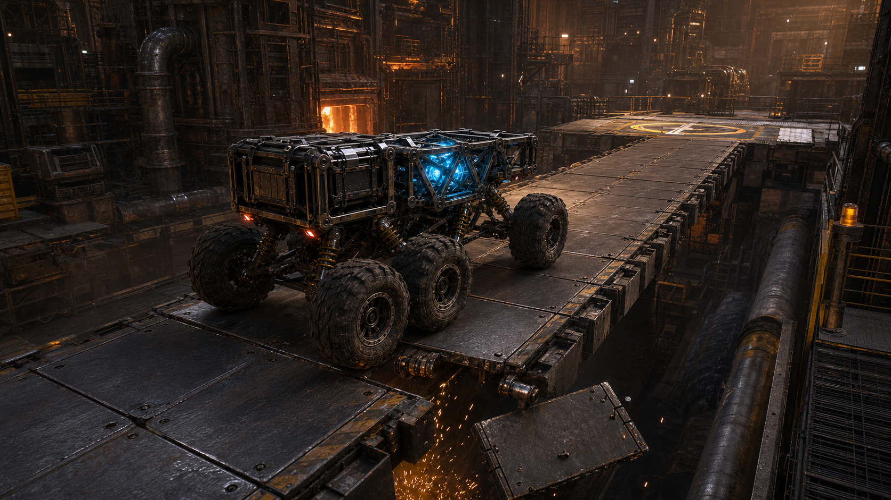
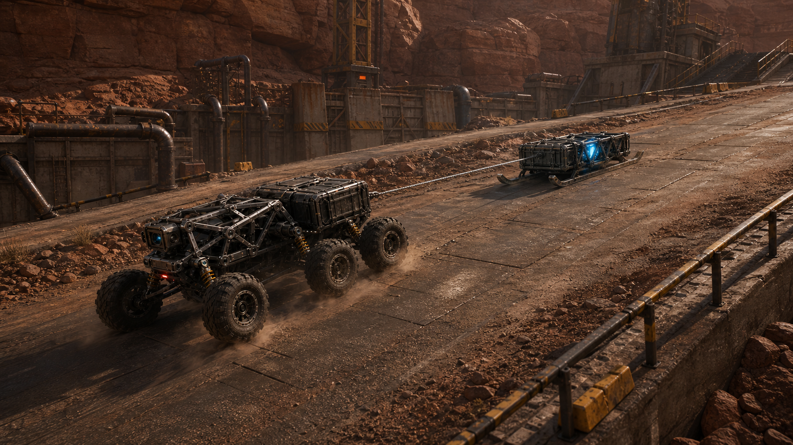
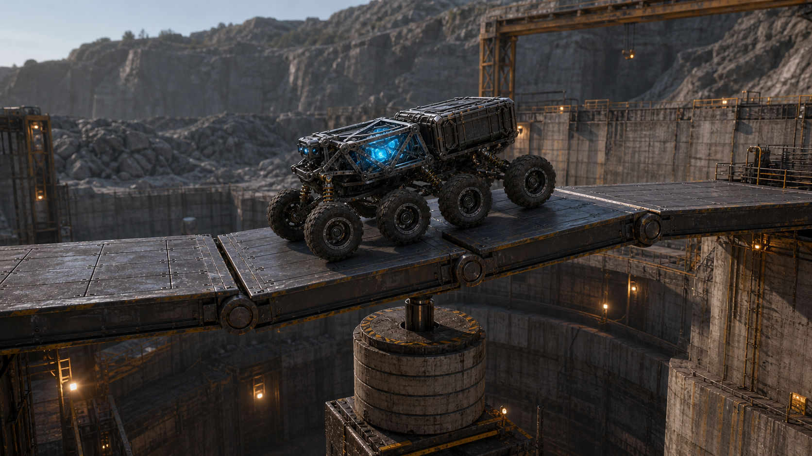

# Kinetic Forge — High-Level Product Requirements Document

| Field | Value |
| --- | --- |
| Status | Concept approved for planning |
| Date | 2026-08-03 |
| Product | Kinetic Forge (working title) |
| Product type | Browser-based 3D physics construction game |
| Primary technology | TypeScript, React, Three.js, existing browser physics engine |
| Purpose | Public demonstration of the UI Framework's ability to generate a visually impressive, non-business application with explicit ports and adapters |

## 1. Product summary

Kinetic Forge is a browser-based physics construction game in which the player
builds and tunes one modular six-wheel rover, drives it through contained
industrial challenges, observes physically legible success or failure, and
iterates using replay evidence.

The initial product is deliberately narrow. It has one rover family, one
foundry environment, one cargo-delivery challenge, and a bounded catalog of
parts. Visual spectacle comes from convincing weight, suspension, traction,
lighting, camera direction, and a few authored physical events—not from a
general destruction system or an unbounded game engine.

## 2. Product outcome

A new player can assemble or modify a rover, test it in a visually polished
industrial challenge, understand why it succeeded or failed, improve the
design, and produce a replay worth sharing.

For the UI Framework, the product must prove that the same capability-led,
ports-and-adapters workflow can produce:

- a real-time 3D experience rather than a conventional data application;
- domain-owned construction and gameplay behavior;
- replaceable rendering and physics integrations;
- deterministic or checkpoint-corrected replay;
- a visually distinctive React interface around a Three.js scene; and
- evidence-backed verification of behavior, performance, and visual quality.

## 3. Target audience

### Primary

- Players who enjoy building, tuning, and testing mechanical contraptions.
- Players who enjoy learning through visible physical cause and effect.
- People who share satisfying successes, failures, and replays.

### Secondary

- Developers and technical product teams evaluating the UI Framework.
- Three.js and browser-game communities interested in sophisticated web-native
  interactive experiences.

## 4. Product principles

1. **The rover is the product.** Scenario variety must come from terrain,
   objectives, cargo, and constraints—not unrelated vehicle families.
2. **Physics must be readable.** The player should see load, traction,
   suspension travel, balance, and failure causes.
3. **Spectacle must be causal.** Motion and effects should follow understandable
   physical events rather than decorative explosions.
4. **Every promotional frame must be real.** Public captures must come from the
   running game, not an offline render that the product cannot reproduce.
5. **Use mature libraries.** The product must not recreate services already
   supplied by Three.js or the selected physics engine.
6. **Build the game before extracting an engine.** Reusable engine boundaries
   may emerge from the vertical slice; a general-purpose game engine is not the
   initial deliverable.

## 5. Core player loop

1. Select the available challenge.
2. Inspect the objective and environmental constraints.
3. Build or adjust the rover using the bounded part catalog.
4. Review mass, power, balance, and predicted stability indicators.
5. Enter simulation and drive the rover.
6. Observe success, failure, or partial progress.
7. Rewind and inspect the replay.
8. Change the construction or driving approach and retry.
9. Capture or export the successful or interesting run.

## 6. Initial vertical slice

### 6.1 Environment

One carefully authored industrial foundry containing:

- a construction bay;
- a short traversal route;
- a modular steel bridge;
- one delivery platform;
- static environmental dressing and lighting; and
- one bridge plate with two authored breakaway hinges.

### 6.2 Rover

One six-wheel rover architecture with a bounded catalog of approximately
10–12 part types, including:

- structural frame and brace modules;
- wheels;
- suspension modules;
- motor or drive modules;
- power module;
- cargo cradle;
- ballast;
- control or sensor module; and
- cosmetic shell options only where they do not affect behavior.

The initial challenge does not require a winch. A winch is reserved for the
first post-MVP scenario.

### 6.3 Challenge: Foundry Delivery

The player must deliver one energy core from the construction bay to the marked
platform. The route tests ground clearance, stability, traction, suspension,
and cargo placement. A single bridge plate may detach after the rover crosses
it; this is an authored rigid-body event, not procedural destruction.

### 6.4 Modes

**Build**

- Add, remove, and configure allowed rover parts.
- Attach parts only at valid connection points.
- Show mass, power, balance, and stability summaries.
- Reject invalid or disconnected assemblies with clear guidance.

**Simulate**

- Drive using keyboard and supported controller input.
- Use a fixed simulation timestep with interpolated rendering.
- Show only essential objective and vehicle-condition information.
- Detect delivery success, rover immobilization, cargo loss, and reset.

**Replay**

- Pause, play, scrub, and change playback speed.
- Show important events such as cargo loss, bridge release, and completion.
- Reproduce the observed run using an input journal plus periodic correction
  snapshots when necessary.
- Capture a still image and export a replay artifact.

## 7. Post-MVP rover scenarios

These scenarios are authorized extensions only after the initial vertical
slice meets its visual, behavioral, and performance gates.

### Winch Recovery

The same rover pulls one cargo sled up a controlled incline using one powered
winch and one taut constraint. The scenario tests traction, gearing, anchor
position, and weight distribution.

### Bridge Balance

The same rover crosses three rigid platform segments connected by hinge
constraints and influenced by one counterweight. The scenario tests wheelbase,
speed, suspension, balance, and cargo placement. Nothing breaks.

## 8. User experience requirements

### Build Bay

- The vehicle remains the dominant visual object.
- The part catalog is narrow, visual, and easy to scan.
- Valid connection points are visible without covering the vehicle in effects.
- The selected part exposes only settings that materially change behavior.
- Test Build is the clear primary action.

### Gameplay

- The 3D viewport occupies nearly the full available surface.
- The camera makes wheel contact, suspension travel, cargo, and route hazards
  readable.
- The HUD remains sparse and does not resemble an engineering dashboard.
- Visual and audio feedback communicate traction loss, impacts, strain, and
  success without exaggerating the underlying simulation.

### Replay

- The timeline identifies a small number of meaningful events.
- Slow motion must preserve understandable motion and camera tracking.
- Any load or stress indication must be described as an approximation derived
  from physics observations, not finite-element analysis.

## 9. Visual direction

The product uses worn industrial science fiction rather than fantasy,
military, or glossy space-opera imagery:

- carbon black, graphite, gunmetal, safety amber, furnace orange, and restrained
  cyan energy accents;
- physically based worn metal, rubber, concrete, dust, soot, and heat staining;
- practical industrial light sources with restrained bloom and atmospheric
  haze;
- cinematic but physically believable cameras; and
- modest dust, sparks, and debris tied to specific events.

The following renders are the normative concept references:

### Foundry Delivery — initial gameplay target

### Winch Recovery — post-MVP scenario

### Bridge Balance — post-MVP scenario

Earlier Kinetic Forge explorations are non-normative and must not be used to
expand the approved scope.

## 10. Technical boundaries

### Game-owned domains

- **Construction:** parts, connection points, assembly validity, mass and power
  summaries.
- **Gameplay:** challenge objectives, success, failure, scoring, and reset.
- **Simulation orchestration:** fixed-step policy, commands, observations, and
  game-event derivation.
- **Replay:** input journal, checkpoints, event markers, playback, and export.
- **Presentation intent:** renderer-neutral visual roles, effects cues, and
  camera intent.

### Required ports and adapters

- A coarse presentation port implemented by one Three.js adapter.
- A game-oriented physics port implemented using an existing browser physics
  engine.
- Input adapters for keyboard and supported controllers.
- Local persistence for configurations, settings, and replays.
- Capture/export adapters for still images and replay artifacts.
- A headless or reduced-presentation test adapter where needed for behavioral
  verification.

### Three.js owns

The Three.js adapter must use Three.js directly for the scene graph, renderer,
cameras, materials, lighting, asset loading, animation, raycasting, controls,
instancing, post-processing, spatial audio where selected, and graphics-resource
disposal. The product must not create framework services that merely rename
those APIs.

### Physics engine owns

The selected physics engine owns collision detection, rigid-body integration,
constraint solving, and wheel/contact calculations. Kinetic Forge owns game
meaning, configuration limits, challenge rules, replay policy, and the mapping
of physics observations to game events.

## 11. Feasibility limits

The approved product supports:

- rigid bodies;
- wheel suspension and traction;
- fixed, hinge, and breakable constraints;
- one winch/tether constraint in the post-MVP recovery scenario;
- static terrain and environment collision;
- a small number of pooled debris bodies; and
- event-driven dust, sparks, and effects.

It does not support:

- soft bodies or deformable vehicles;
- finite-element structural simulation;
- general rope simulation;
- fluids;
- procedural fracturing or general destruction;
- arbitrary user scripting;
- spacecraft or zero-gravity gameplay;
- combat, weapons, or characters;
- multiplayer or a shared persistent world;
- an open world;
- a user-generated-content marketplace; or
- a general-purpose game engine product.

## 12. Non-functional requirements

### Performance

- The vertical slice should target sustained 60 FPS at 1080p on an agreed
  reference desktop configuration.
- Frame-time, draw-call, triangle, texture-memory, and active-physics-body
  budgets must be recorded before visual production expands.
- Level restart must release obsolete Three.js and physics resources without
  unbounded memory growth.

### Replay integrity

- A replay must reproduce the same meaningful game outcome on the same runtime,
  engine version, level version, rover configuration, and seed.
- Cross-browser bitwise floating-point determinism is not required.
- Periodic checkpoints may correct numeric drift while preserving the recorded
  input sequence and event provenance.

### Accessibility

- Keyboard controls must be remappable.
- Important status must not rely on color alone.
- Reduced camera motion and reduced effects modes must be available.
- Build controls must be keyboard accessible wherever practical.

### Compatibility

- The initial release targets current desktop browsers with WebGL 2 support.
- WebGPU may improve rendering where supported but is not required for core
  gameplay or acceptance.

## 13. Success measures

The vertical slice succeeds when:

- at least 80% of representative trial users can modify the rover, start the
  challenge, and complete or meaningfully diagnose a failed attempt without
  facilitator intervention;
- players can correctly identify the primary reason for failure in at least
  80% of observed trial runs;
- the approved rover, environment, lighting, and material hierarchy are
  recognizably reproduced by the running application;
- every visible gameplay claim in public screenshots is backed by running
  behavior;
- the application meets the agreed performance budget on reference hardware;
- replay reproduces the same success or failure outcome across repeated runs;
  and
- the complete Build → Simulate → Replay → Improve loop runs without a crash or
  manual data repair.

## 14. Delivery stages

### Stage 0 — technical proof

- Select the physics engine through a bounded comparison.
- Render one rover with working suspension and input.
- Prove fixed-step simulation and render interpolation.
- Establish asset, lighting, performance, and disposal pipelines.

### Stage 1 — playable vertical slice

- Build Bay with bounded parts.
- Foundry Delivery challenge.
- Success, failure, reset, and replay.
- First visual and performance validation against the normative render.

### Stage 2 — public demo polish

- Final materials, lighting, audio, effects, and camera behavior.
- Capture and replay export.
- Accessibility and compatibility pass.
- Recorded end-to-end evidence and public demo package.

### Stage 3 — rover scenario expansion

- Winch Recovery.
- Bridge Balance.
- Reuse audit confirming that new scenarios extend the same domains and
  adapters without introducing a second vehicle platform.

## 15. Principal risks

| Risk | Mitigation |
| --- | --- |
| Generated prototype looks technically correct but visually generic | Establish the asset and lighting pipeline during Stage 0; reserve a deliberate art and effects pass |
| Vehicle feels unstable or frustrating | Tune a bounded rover model and part catalog; do not expose every physics parameter |
| Construction freedom creates invalid assemblies | Use authored connection points, bounded parts, and deterministic validation |
| Replay drifts due to floating-point behavior | Record versions and seeds; use periodic correction checkpoints |
| Three.js abstractions duplicate library capabilities | Keep a single coarse adapter and audit every proposed graphics service against Three.js first |
| Scope expands into a general engine or destruction sandbox | Enforce the non-goals and require vertical-slice acceptance before adding scenarios |

## 16. Open decisions

- Final product name and visual identity.
- Selected browser physics engine.
- Reference desktop hardware and measurable rendering budgets.
- Asset production and licensing approach.
- Exact replay-sharing mechanism for the public demo.
- Whether controller support is required for the first public release or added
  during polish.
