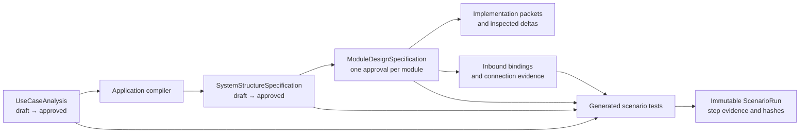

# Polished workflow — app integration gap analysis

## Outcome

The polished use-case-led workflow now has one app entry point:
**Capabilities**, which opens the unified workflow. Plan, Design, Build,
Connect, Verify, and Evidence use the
canonical records and operations in `packages/core/src/capabilities/design/`.
The app no longer presents canonical Design as a second, unrelated navigation
item beside Capabilities.

This analysis compares the interactive workflow mockup in
`docs/use-case-led-workflow/mockup.html` with the application on remote `main`
before this integration.

## Gap matrix

| Workflow concern | Before integration | Risk | Integrated result | Evidence |
| --- | --- | --- | --- | --- |
| One visible workflow | The app exposed separate **Capabilities** and **Design** entries backed by different presentation models. | Users could not tell which surface was authoritative. | One **Capabilities** entry opens the canonical design store and service. The old `design` view ID remains only as a compatibility alias. | `App.tsx`, `appState.ts`; screenshot 01 |
| Project context | Canonical Design project mode depended on an open Build & Test run. Selecting a project in Capabilities did not select it in Design. | The workflow could silently open sample data for a real project or use the wrong project. | The workflow owns its project selector. The selected project creates a project-scoped `DesignStore`; no open build run is required. | `App.tsx`, `DesignWorkspaceView.tsx` |
| Plan / use-case analysis | Core supported draft, review, approval, and application compilation, but the canonical app workspace started at Design and offered no Plan UI. | Use cases existed in storage/API but could not drive a normal human workflow. | Plan shows the canonical analysis, actors, main flow, alternate/failure/recovery scenarios, evidence expectations, material questions, review actions, the Plan gate, and approval. Approval uses `approveUseCaseAnalysis`, which compiles the application specification. | `UseCasePlanView.tsx`; screenshot 01 |
| System design lifecycle | The system canvas rendered an existing structure, but the app had no create/approve controls for a live project. | A project could not progress from approved use cases to module design without CLI/API intervention. | Design shows the source chain and calls `createSystemDesignDraft` and `approveSystemStructure` through the canonical bridge. | `SystemDesignGate.tsx`; screenshot 02 |
| Module traceability | Module records contained `trace.useCaseIds`, but the workflow did not explain their upstream source. | Module designs appeared detached from use-case analysis. | The global status, Plan detail, system gate, module context, module diagrams, Verify, and Evidence expose the same use-case IDs and revisions. | `DesignWorkspaceView.tsx`, `ModuleDiagrams.tsx` |
| UML presentation | Dense component projections were laid out as one very wide BFS layer; the renderer scaled the result into a narrow panel. Connector hit targets had no separate visible stroke, labels shared one collector position, and every UML element used the same rectangle. | Components, ports, sockets, actors, connectors, and labels were not review quality. | Component layout is semantic: module center, consumers above, dependencies below, provided interfaces at left, required interfaces at right. Nodes use UML-specific component, lollipop, socket, actor, use-case, state, decision, initial/final, lifeline, and fragment symbols. Visible connector paths have relationship-specific line styles and arrowheads; hit targets remain separate; labels use per-route channels. Diagram review expands the main column. | `diagramLayout.ts`, `ModuleDiagrams.tsx`; screenshot 03; EUC-08/EUC-09 tests |
| Connect | Production executors existed, but the canonical GUI had no Connect phase. | Users could not configure or verify a canonical workflow binding from the polished workflow. | Connect validates JSON, calls `configureBinding`, persists the adapter-owned binding, calls `verifyConnection`, and shows the exact executor response. Sample mode explicitly refuses to invent a passing connection. | `WorkflowConnectView.tsx`, `designState.ts` |
| Scenario execution | Core could run an approved scenario, but Verify only summarized already-recorded runs. | Scenario automation could not be initiated from the human workflow. | Verify lists every generated scenario automation target, its latest result and evidence counts, and calls `runScenario` / `approveVerification` for live projects. | `DesignVerifyView.tsx`; screenshot 04 |
| Live-project evidence | The GUI explicitly said Evidence Explorer was unavailable for live projects. | Real screenshots and structured evidence were hidden while sample defect content looked complete. | `getWorkflowStatus` returns canonical immutable scenario runs. Evidence shows run identity, upstream revisions, step outcomes, screenshot references, structured-evidence references, and hashes for sample and live projects. Sample-only defects are separated in a closed gallery. | `operations.ts`, `WorkflowEvidenceView.tsx`; screenshot 05 |
| Navigation and copy | The sidebar tip described four stages and said entry points lived in Build. | Product copy contradicted the polished workflow. | Navigation and help copy name Plan, Design, Build, Connect, Verify, and immutable Evidence as one path. | `App.tsx` |

## Canonical data flow

Generated diagrams, summaries, and prompts remain projections. Approved
records remain the sources of truth.

## Verification evidence

- Core, GUI, and desktop TypeScript builds pass.
- EUC-08 diagram-semantics tests: 21 passed.
- EUC-09 diagram-layout tests: 28 passed, including the dense Package Export
  connector/port regression.
- EUC-12 verification-planner tests: 19 passed.
- EUC-16 operation tests: 22 passed.
- GUI workflow, bridge-routing, diagram, Verify, accessibility, and session
  suites pass with a unique Node local-storage file.
- Browser QA ran against the actual Vite application, not the HTML mockup.

Screenshots:

1. `screenshots/01-plan-use-case-analysis.png`
2. `screenshots/02-system-design.png`
3. `screenshots/03-module-uml-diagrams.png`
4. `screenshots/04-scenario-verification.png`
5. `screenshots/05-evidence-explorer.png`

## Honest boundary

Plain-browser development mode has no Electron bridge and therefore uses the
clearly labelled synthetic DO-178C sample. It never claims to configure a
real binding or execute a real project command. In the desktop app, selecting
a project switches the same UI to project mode and routes all changes through
`design:operation` to the filesystem-backed service and configured executors.
