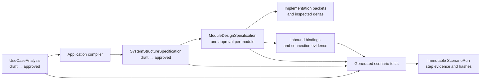

# Polished workflow application integration gap analysis

## Purpose

This document records the baseline gap between the polished workflow proposal
and the Capabilities application, plus the integration result delivered against
that baseline.

The HTML mockup is a visual reference only. The application records in
`packages/core`, the desktop IPC operations, and the React views in `apps/gui`
are authoritative.

## Status vocabulary

- **Integrated** — backed by a canonical record and used by the real workflow.
- **Compatibility** — integrated for rich records while legacy 1.0 workspaces
  remain readable and are not retroactively blocked.
- **Reference only** — visual mockup behavior deliberately not copied because
  the application already has an equivalent canonical workflow.

## Executive summary

Before this work, the application integrated only the compact chain:

`named use case` → `workflow trace` → `module manifest` → `implementation`

The polished mockup's detailed paths, UML, scenario runs, and screenshots were
hard-coded demonstrations. The application now uses this canonical chain:

`UseCaseDefinition` → `ArchitectureSpecification.workflowTraces.stepAllocations`
→ `ModuleDesignSpecification` → `ImplementationBrief` →
`ScenarioRunRecord` + immutable evidence.

The mockup remains a reference; the React screens render and mutate the real
records through the same core services, persistence, and desktop bridge as the
rest of Capabilities.

## Gap matrix

| Area | Baseline gap | Result | Integration evidence |
| --- | --- | --- | --- |
| Application aggregate | Use cases and scenarios were display-only named text. | Integrated | `ApplicationSpecification` now owns detailed use cases and compiled scenario definitions while retaining compact fields for compatibility. |
| Detailed analysis | No trigger, actor allocation, paths, steps, rules, I/O, acceptance, sources, or evidence policy. | Integrated | The Application workbench edits every field with stable use-case, path, and step IDs; the product gate validates references and completeness. |
| Plan interview/import | Rich fields could not survive packet export/import or approval. | Integrated | Interview packets, response starters, import normalization, field deltas, and canonical hashes carry the complete analysis. |
| Architecture planning | Architecture received only use-case names. | Integrated | Planning packets include detailed workflow facts; trace gates require every step to be allocated exactly once and preserve entry/output semantics. |
| Architecture UI | No visible step-to-module proof. | Integrated | Workflow trace cards show the ordered module route, entry, output, and stable step allocations from the approved architecture. |
| Module design | No canonical record between an approved manifest and implementation. | Integrated | `ModuleDesignSpecification` stores trace, boundary, behavior, data, runtime, contracts, checks, UML projections, unresolved items, gates, hashes, and approval provenance. |
| Design session | Six polished design steps existed only in mockup state. | Integrated | `ModuleDesignSession` persists current/completed steps, source context, answers, diagnostics, and revision state. Approval is immutable; revision creates a new draft. |
| Implementation handoff | Handoffs could not prove which design they implemented. | Integrated | Rich use-case workspaces require a current approved module design. Packets and run scope pin its revision/hash and embed the approved design. Legacy workspaces use the prior path. |
| UML semantics | Five diagrams existed only as hard-coded SVG. | Integrated | Component, activity, state-machine, sequence, and use-case projections are generated from approved records. Actors, system boundaries, initial/final nodes, lifelines, components, provided lollipops, required sockets, and relationship arrows use semantic symbols. |
| UML connectors/labels | Lines, ports, and labels were decorative and poorly joined. | Integrated | Component dependencies meet the corresponding operation port; connectors use source-derived relations, orthogonal routing where appropriate, wrapped state/sequence labels, centered layouts, and a full-width responsive canvas. |
| UML trace/impact | Mock symbols did not identify application records. | Integrated | Every selectable node/edge carries a source record ID and trace IDs. The inspector routes proposed changes to the canonical impact/delta queue; the diagram remains a read-only projection and regenerates only after source-record change. |
| Scenario definitions | No executable main/failure/recovery records. | Integrated | Approved use-case paths compile into stable `ScenarioDefinition` records with ordered step IDs and evidence policies. |
| Scenario execution | “Run” produced simulated outcomes. | Integrated | A run starts as unverified, pins build/source/environment/data/runner identity, executes configured commands through the desktop command runner, and requires an observed result per step. |
| Screenshot evidence | Mock cards showed placeholder filenames. | Integrated | Original uploaded bytes are stored in the capability workspace, content-hashed, referenced by artifact ID, and reopened through the bridge. No screenshot is generated or marked passed by the UI. |
| Structured evidence | Structured results were not associated with scenario steps. | Integrated | Command output or uploaded structured artifacts are hash-backed step evidence; `not-applicable` is explicit and policy-checked. |
| Finalization | A scenario could appear passed without complete evidence. | Integrated | Core finalization rejects fabricated passes, missing observed results, missing required evidence, invalid hashes, and incomplete source identity. |
| Verify UI | Only module/connection verification was visible. | Integrated | Verify now includes scenario totals, paths, run identity, per-step expected/observed result, evidence controls/previews, and finalization alongside existing verification. |
| Persistence/API parity | New mockup state had no durable API. | Integrated | Core persistence, desktop IPC, preload, GUI bridge, and browser mock expose the same module-design, scenario-run, and evidence operations. |
| Migration | Existing approvals risked becoming invalid. | Compatibility | Rich fields are optional on schema 1.0 reads. Legacy named use cases materialize as explicitly incomplete drafts, and legacy implementation handoffs are not retroactively blocked. |
| Tests | No coverage for the new record chain. | Integrated | Core tests cover analysis, allocations, five UML projections, evidence hashes, and persistence; bridge parity, GUI, desktop typechecks, builds, and browser QA cover the application surfaces. |

## Canonical integration target

The integrated workflow will use these record relationships:

1. `ApplicationSpecification` owns detailed use cases and scenario definitions.
2. `ArchitectureSpecification.workflowTraces` references approved use-case IDs
   and ordered module paths.
3. `ModuleDesignSpecification.trace` references use cases and scenario steps.
4. UML projections read only from approved or explicitly selected draft
   records.
5. `ScenarioRunRecord` pins all source revisions and owns immutable
   `ScenarioStepResult` records.
6. Screenshot and structured artifacts use `ArtifactReference`; scenario steps
   reference artifact IDs instead of display filenames.
7. Impact analysis follows the same IDs from use case → architecture path →
   module design → contract → implementation → verification.

## Completion criteria

Integration completion evidence:

- editing and approving a detailed use case changes the canonical application
  record;
- architecture and module views consume that approved revision;
- every allocated module is traceable to use cases and scenario steps;
- UML diagrams are projections of those same records;
- diagram changes enter the existing impact workflow and update canonical
  records before projection regeneration;
- approved scenarios compile into real runs;
- every scenario step contains real screenshot or structured evidence, or a
  recorded not-applicable reason;
- Verify can open the original evidence and link back to the exact approved
  design revisions;
- restarting the application preserves the complete workflow;
- contract, behavioral, accessibility, migration, and end-to-end tests pass.

## Browser evidence

These are screenshots of the running React application using the seeded
PlantOps records, not the HTML mockup:

- `screenshots/01-use-case-analysis.png`
- `screenshots/02-architecture-trace.png`
- `screenshots/03-component-diagram.png`
- `screenshots/04-state-machine-diagram.png`
- `screenshots/05-sequence-diagram.png`
- `screenshots/06-scenario-verification.png`

## Canonical workspace reconciliation

## Outcome

The polished use-case-led workflow now has one app entry point:
**Capabilities**, which opens the unified workflow. Plan, Design, Build,
Connect, Verify, and Evidence use the
canonical records and operations in `packages/core/src/capabilities/design/`.
The app no longer presents canonical Design as a second, unrelated navigation
item beside Capabilities.

This analysis compares the interactive workflow mockup in
`docs/use-case-led-workflow/mockup.html` with the application on remote `main`
before this integration.

## Gap matrix

| Workflow concern | Before integration | Risk | Integrated result | Evidence |
| --- | --- | --- | --- | --- |
| One visible workflow | The app exposed separate **Capabilities** and **Design** entries backed by different presentation models. | Users could not tell which surface was authoritative. | One **Capabilities** entry opens the canonical design store and service. The old `design` view ID remains only as a compatibility alias. | `App.tsx`, `appState.ts`; screenshot 01 |
| Project context | Canonical Design project mode depended on an open Build & Test run. Selecting a project in Capabilities did not select it in Design. | The workflow could silently open sample data for a real project or use the wrong project. | The workflow owns its project selector. The selected project creates a project-scoped `DesignStore`; no open build run is required. | `App.tsx`, `DesignWorkspaceView.tsx` |
| Plan / use-case analysis | Core supported draft, review, approval, and application compilation, but the canonical app workspace started at Design and offered no Plan UI. | Use cases existed in storage/API but could not drive a normal human workflow. | Plan shows the canonical analysis, actors, main flow, alternate/failure/recovery scenarios, evidence expectations, material questions, review actions, the Plan gate, and approval. Approval uses `approveUseCaseAnalysis`, which compiles the application specification. | `UseCasePlanView.tsx`; screenshot 01 |
| System design lifecycle | The system canvas rendered an existing structure, but the app had no create/approve controls for a live project. | A project could not progress from approved use cases to module design without CLI/API intervention. | Design shows the source chain and calls `createSystemDesignDraft` and `approveSystemStructure` through the canonical bridge. | `SystemDesignGate.tsx`; screenshot 02 |
| Module traceability | Module records contained `trace.useCaseIds`, but the workflow did not explain their upstream source. | Module designs appeared detached from use-case analysis. | The global status, Plan detail, system gate, module context, module diagrams, Verify, and Evidence expose the same use-case IDs and revisions. | `DesignWorkspaceView.tsx`, `ModuleDiagrams.tsx` |
| UML presentation | Dense component projections were laid out as one very wide BFS layer; the renderer scaled the result into a narrow panel. Connector hit targets had no separate visible stroke, labels shared one collector position, and every UML element used the same rectangle. | Components, ports, sockets, actors, connectors, and labels were not review quality. | Component layout is semantic: module center, consumers above, dependencies below, provided interfaces at left, required interfaces at right. Nodes use UML-specific component, lollipop, socket, actor, use-case, state, decision, initial/final, lifeline, and fragment symbols. Visible connector paths have relationship-specific line styles and arrowheads; hit targets remain separate; labels use per-route channels. Diagram review expands the main column. | `diagramLayout.ts`, `ModuleDiagrams.tsx`; screenshot 03; EUC-08/EUC-09 tests |
| Connect | Production executors existed, but the canonical GUI had no Connect phase. | Users could not configure or verify a canonical workflow binding from the polished workflow. | Connect validates JSON, calls `configureBinding`, persists the adapter-owned binding, calls `verifyConnection`, and shows the exact executor response. Sample mode explicitly refuses to invent a passing connection. | `WorkflowConnectView.tsx`, `designState.ts` |
| Scenario execution | Core could run an approved scenario, but Verify only summarized already-recorded runs. | Scenario automation could not be initiated from the human workflow. | Verify lists every generated scenario automation target, its latest result and evidence counts, and calls `runScenario` / `approveVerification` for live projects. | `DesignVerifyView.tsx`; screenshot 04 |
| Live-project evidence | The GUI explicitly said Evidence Explorer was unavailable for live projects. | Real screenshots and structured evidence were hidden while sample defect content looked complete. | `getWorkflowStatus` returns canonical immutable scenario runs. Evidence shows run identity, upstream revisions, step outcomes, screenshot references, structured-evidence references, and hashes for sample and live projects. Sample-only defects are separated in a closed gallery. | `operations.ts`, `WorkflowEvidenceView.tsx`; screenshot 05 |
| Navigation and copy | The sidebar tip described four stages and said entry points lived in Build. | Product copy contradicted the polished workflow. | Navigation and help copy name Plan, Design, Build, Connect, Verify, and immutable Evidence as one path. | `App.tsx` |

## Canonical data flow

Generated diagrams, summaries, and prompts remain projections. Approved
records remain the sources of truth.

## Verification evidence

- Core, GUI, and desktop TypeScript builds pass.
- EUC-08 diagram-semantics tests: 21 passed.
- EUC-09 diagram-layout tests: 28 passed, including the dense Package Export
  connector/port regression.
- EUC-12 verification-planner tests: 19 passed.
- EUC-16 operation tests: 22 passed.
- GUI workflow, bridge-routing, diagram, Verify, accessibility, and session
  suites pass with a unique Node local-storage file.
- Browser QA ran against the actual Vite application, not the HTML mockup.

Screenshots:

1. `screenshots/01-plan-use-case-analysis.png`
2. `screenshots/02-system-design.png`
3. `screenshots/03-module-uml-diagrams.png`
4. `screenshots/04-scenario-verification.png`
5. `screenshots/05-evidence-explorer.png`

## Honest boundary

Plain-browser development mode has no Electron bridge and therefore uses the
clearly labelled synthetic DO-178C sample. It never claims to configure a
real binding or execute a real project command. In the desktop app, selecting
a project switches the same UI to project mode and routes all changes through
`design:operation` to the filesystem-backed service and configured executors.
